# 后端技术说明文档

> **面向读者**：初级开发工程师
> **编写视角**：高级开发工程师自上而下地拆解架构与实现
> **项目代号**：Scraper Flow Studio（crawler-workflow）
> **技术栈**：Python 3.13 + FastAPI + MySQL + Redis + Playwright + LLM（OpenAI / vLLM）

---

## 目录

1. [全局架构总览](#1-全局架构总览)
2. [启动流程与生命周期](#2-启动流程与生命周期)
3. [配置体系](#3-配置体系)
4. [数据库层](#4-数据库层)
5. [认证与授权体系](#5-认证与授权体系)
6. [API 路由层](#6-api-路由层)
7. [工作流引擎](#7-工作流引擎)
8. [AI 辅助服务](#8-ai-辅助服务)
9. [任务管理](#9-任务管理)
10. [LLM 客户端](#10-llm-客户端)
11. [Prompt 工程](#11-prompt-工程)
12. [日志与审计](#12-日志与审计)
13. [核心执行时序图](#13-核心执行时序图)
14. [开发者速查表](#14-开发者速查表)

---

## 1. 全局架构总览

### 1.1 系统定位

本后端是一个 **浏览器爬虫工作流编排平台的 API 服务**，核心能力包括：

- **DSL 工作流编排**：用户在可视化画布上编排节点（打开页面、选择列表、提取字段、翻页等），后端将其编译为确定性执行计划
- **LLM 驱动的脚本生成**：基于执行计划 + Prompt 工程，调用大模型生成可运行的 Playwright 爬虫脚本
- **AI 辅助分析**：通过 LLM 推断字段选择器、优化选择器、分析翻页模式
- **任务持久化与资产管理**：用户创建爬虫任务，保存工作流图、脚本、Prompt 等版本化资产
- **OAuth2 认证与多租户隔离**：对接用户中心，实现登录态管理和任务所有权隔离

> **💡 补充说明：什么是"DSL 工作流"？**
>
> DSL（Domain-Specific Language）工作流是指用户在 React Flow 画布上拖拽节点、连线形成的一张**有向图**。前端将这张图序列化为 `WorkflowGraph`（包含 `nodes[]` 和 `edges[]`）发送给后端。后端不做图形渲染，只负责**验证 → 编译 → 生成脚本**。
>
> 典型的列表页爬虫工作流示例：`open_page → select_list → extract_field → paginate → emit_record`，对应"打开目标URL → 定位列表项 → 提取每条记录的字段 → 点击下一页 → 输出保存"。
>
> 用户在画布上的操作最终都会转化为 `POST /api/workflows/generate-crawler` 请求中的 `graph` 字段——这就是 DSL 的完整形态。

### 1.2 分层架构

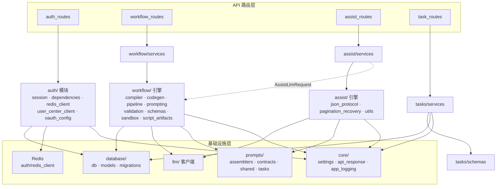

> **💡 补充说明：如何阅读这张架构图**
>
> **四条竖直链路**是请求的主路径，每条请求只穿透一条链路：
>
> | 链路 | 路由 | 服务/模块 | 领域引擎 | 基础设施依赖 |
> |------|------|-----------|----------|-------------|
> | 认证 | `auth_routes` | `auth/*`（无独立服务层，路由即服务） | — | database + Redis + core |
> | 工作流 | `workflow_routes` | `workflow/services` | `compiler · codegen · pipeline · prompting · validation · schemas · sandbox · script_artifacts` | database + llm + prompts + core |
> | AI辅助 | `assist_routes` | `assist/services` | `json_protocol · pagination_recovery · utils` | llm + prompts + core |
> | 任务 | `task_routes` | `tasks/services` | `tasks/schemas`（无深层引擎，CRUD 直接 SQL） | database + core |
>
> **auth 链路特殊性**：`auth_routes` 没有独立的 service 层——它直接编排 `auth/` 下的模块（session、user_center_client、redis_client 等）。这是因为认证流程的状态转换（login → callback → session）天然适合在路由层直接编排，无需再抽象一层。
>
> **跨域虚线**：`assist/services` 虚线引用 `workflow/schemas` 中的 `AssistLlmRequest` / `AssistLlmResponse`。这是当前唯一一处跨域依赖——辅助服务的请求/响应模型定义在工作流模块中。如果未来辅助服务独立演进，应将这两个模型下沉到共享层。
>
> **基础设施层的差异化依赖**：不是所有领域都依赖所有基础设施。工作流引擎是依赖最重的（DB + LLM + Prompts + Core），任务管理最轻（仅 DB + Core）。这种差异化正是真实架构的特征——如果画成"所有层都依赖所有基础设施"，就失去了信息量。

### 1.3 目录结构一览

```
backend/
├── app.py                          # FastAPI 应用入口
├── core/                           # 基础设施
│   ├── settings.py                 # 配置管理（.env + 环境变量）
│   ├── api_response.py             # 统一 API 响应信封
│   └── app_logging.py              # 日志与审计
├── database/                       # MySQL 持久化
│   ├── db.py                       # 连接池管理
│   ├── models.py                   # DDL 定义（表结构）+ ensure_schema()
├── auth/                           # 认证与授权
│   ├── oauth_config.py             # OAuth2 客户端配置
│   ├── redis_client.py             # Redis 连接管理
│   ├── session.py                  # 会话管理（Redis）
│   ├── user_center_client.py       # 用户中心 API 对接
│   └── dependencies.py             # FastAPI 依赖注入
├── api/                            # HTTP 路由
│   ├── auth_routes.py              # /api/auth/*
│   ├── workflow_routes.py          # /api/workflows/*
│   ├── assist_routes.py            # /api/assist/*
│   └── task_routes.py              # /api/tasks/*
├── workflow/                       # 工作流引擎（核心领域）
│   ├── schemas.py                  # Pydantic 数据模型
│   ├── validation.py               # DSL 图校验
│   ├── compiler.py                 # 图 → 执行计划
│   ├── codegen.py                  # 执行计划 → 确定性骨架脚本
│   ├── prompting.py                # Prompt 组装
│   ├── generation_pipeline.py      # LLM 脚本生成管线
│   ├── detail_batch_codegen.py     # 详情批处理脚本代码生成
│   ├── detail_batch_generation_pipeline.py  # 详情批处理生成管线
│   ├── detail_batch_prompting.py   # 详情批处理 Prompt 组装
│   ├── detail_batch_validation.py  # 详情批处理脚本校验
│   ├── script_artifacts.py         # 脚本格式化与持久化
│   ├── script_sandbox.py           # 脚本沙箱执行
│   ├── output_defaults.py          # 输出配置默认值
│   ├── services.py                 # 工作流服务门面
│   └── _shared.py                  # 内部共享工具
├── assist/                         # AI 辅助服务
│   ├── services.py                 # 辅助服务主逻辑
│   ├── json_protocol.py            # JSON 协议（解析/修复）
│   ├── pagination_recovery.py      # 翻页分析恢复
│   └── utils.py                    # HTML 工具函数
├── tasks/                          # 任务管理
│   ├── schemas.py                  # 任务 Pydantic 模型
│   └── services.py                 # 任务 CRUD 业务逻辑
├── llm/                            # LLM 客户端
│   └── client.py                   # OpenAI / vLLM 客户端
└── prompts/                        # Prompt 工程模块
    ├── crawler_prompt.py           # 爬虫 Prompt 生成器
    ├── assemblers/                 # Prompt 组装器
    │   ├── workflow.py             # 工作流 Prompt 组装
    │   └── assist.py               # 辅助 Prompt 组装
    ├── contracts/                  # 响应契约定义
    │   └── assist_contracts.py     # AI 辅助的 JSON 契约
    ├── shared/                     # 共享规则片段
    │   └── rules.py                # 通用 Prompt 规则
    └── tasks/                      # 任务级 Prompt 模板
        ├── crawler_system.py       # 爬虫系统提示词
        ├── assist_tasks.py         # 辅助任务提示词模板
        └── detail_batch_runner_system.py  # 详情批处理系统提示词
```

### 1.4 外部依赖关系

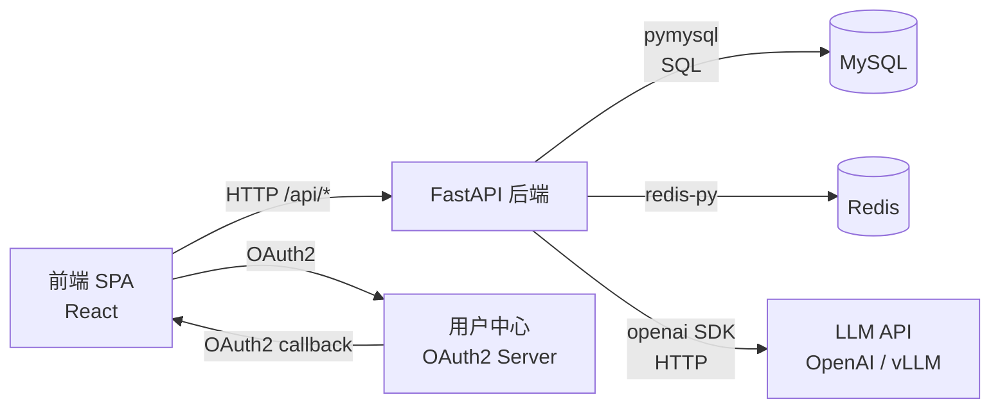

---

## 2. 启动流程与生命周期

### 2.1 入口链路

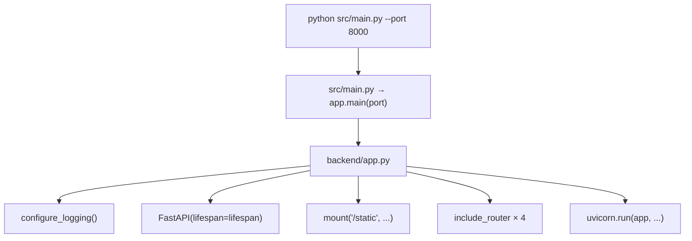

### 2.2 Lifespan 生命周期

```
@asynccontextmanager
async def lifespan(app):
    # ── Startup ──
    ensure_schema()           # 创建所有表（CREATE TABLE IF NOT EXISTS，幂等）
    yield
    # ── Shutdown ──
    close_connection()       # 关闭 MySQL 连接池
    close_redis()            # 关闭 Redis 连接
```

**要点**：
- `ensure_schema()` 在每次启动时执行，通过 `CREATE TABLE IF NOT EXISTS` 保证幂等，无版本号追踪
- 关闭操作确保资源正确释放

---

## 3. 配置体系

### 3.1 配置加载优先级

```
环境变量 > .env 文件 > 内置默认值
```

实现位于 `backend/core/settings.py`，核心函数 `_read_value` 按以下顺序查找：

1. `os.environ.get(candidate)` — 最高优先级
2. `.env` 文件中的值
3. 函数参数中的 `default` — 最低优先级

### 3.2 配置项分类

| 分类 | 关键配置项 | 默认值 |
|------|-----------|--------|
| **服务** | `BACKEND_HOST` / `BACKEND_PORT` | `127.0.0.1:8000` |
| **浏览器** | `BROWSER_HEADLESS` | `false` |
| **LLM** | `LLM_PROVIDER` / `API_BASE_URL` / `API_TOKEN` / `MODEL_NAME` | `openai` / `""` / `""` / `gpt-4` |
| **脚本沙箱** | `SCRIPT_SANDBOX_ENABLED` / `SCRIPT_SANDBOX_TIMEOUT_SECONDS` | `true` / `60` |
| **MySQL** | `DB_HOST` / `DB_PORT` / `DB_USER` / `DB_PASSWORD` / `DB_NAME` / `DB_POOL_SIZE` | `127.0.0.1:3306/root/''/crawler_workflow/10` |
| **Redis** | `REDIS_URL` / `REDIS_SENTINEL_NODES` / `REDIS_PASSWORD` | `redis://127.0.0.1:6379/0` |
| **认证** | `USER_CENTER_BASE_URI` / `USER_CENTER_CLIENT_ID` / `SESSION_TTL_HOURS` | `""` / `""` / `24` |

### 3.3 LLM Provider 自动识别

```python
# settings.py 中的逻辑
if provider == "vllm" or (api_base_url and "vllm" in api_base_url.lower()):
    provider = "vllm"
    model_name = "qwen3-30b-a3b-instruct"  # vLLM 默认模型
```

系统通过 URL 中的 `vllm` 关键字自动切换 provider，无需手动指定。

### 3.4 配置数据模型

所有配置被封装为不可变 `dataclass`：

```python
@dataclass(frozen=True)
class CrawlerWorkflowSettings:
    backend_host: str = "127.0.0.1"
    backend_port: int = 8000
    # ... 40+ 配置项
```

通过 `get_settings()` 获取配置实例。

> **💡 补充说明：为什么不用 pydantic-settings？为什么 get_settings() 不缓存？**
>
> 本项目选择了**手动解析 .env** 而非 `pydantic-settings`，原因是项目启动初期配置需求简单，手动方式更轻量、无额外依赖、且对 `.env` 文件的解析逻辑可以完全自定义（如支持别名、vLLM 自动识别等）。
>
> `get_settings()` 当前不缓存，每次调用重新解析 `.env`。在当前请求量下这不是性能瓶颈（`.env` 文件小、解析快），但如果你需要优化，可以在 `get_settings()` 中添加模块级缓存变量。注意：缓存后运行时修改环境变量将不会反映到配置中——这是一个**特性而非缺陷**，生产环境不应依赖运行时配置变更。

---

## 4. 数据库层

### 4.1 连接池管理

```
backend/database/db.py
```

使用 `DBUtils.PooledDB` + `pymysql` 实现线程安全的连接池：

> **💡 补充说明：为什么用 DBUtils.PooledDB 而不是 SQLAlchemy？**
>
> 本项目的数据库操作以**手写 SQL**为主（没有 ORM 需求），表结构简单且查询模式固定。SQLAlchemy 的 ORM 层会增加学习成本和抽象复杂度，而 PooledDB + 原生 SQL 的组合更轻量、更透明、调试更容易。`maxshared=0` 意味着每个线程从池中获取的连接是独占的，不会被其他线程共享——这避免了 MySQL 连接的线程安全问题，代价是可能需要更多连接数。

```python
PooledDB(
    creator=pymysql,
    maxconnections=10,        # 最大连接数
    maxshared=0,              # 不共享连接（每线程独占）
    blocking=True,            # 连接池耗尽时阻塞等待
    cursorclass=DictCursor,   # 返回字典而非元组
    autocommit=False,         # 手动事务控制
)
```

**核心接口**：

```python
@contextmanager
def get_cursor() -> Generator[DictCursor, None, None]:
    """自动提交/回滚的游标上下文管理器"""
    conn = pool.connection()
    cursor = conn.cursor()
    try:
        yield cursor
        conn.commit()        # 正常退出 → 提交
    except Exception:
        conn.rollback()      # 异常退出 → 回滚
        raise
    finally:
        cursor.close()
        conn.close()         # 归还连接到池
```

> **开发规范**：所有数据库操作必须通过 `get_cursor()` 获取游标，不要手动管理连接。

### 4.2 表结构

#### users 表 — 用户本地镜像

```sql
CREATE TABLE users (
    id              INT UNSIGNED AUTO_INCREMENT PRIMARY KEY,
    external_id     VARCHAR(128) NOT NULL UNIQUE,  -- 用户中心 openId
    display_name    VARCHAR(200) NOT NULL DEFAULT '',
    email           VARCHAR(320) NULL,
    avatar_url      VARCHAR(2048) NULL,
    synced_at       DATETIME(3) NOT NULL DEFAULT CURRENT_TIMESTAMP(3),
    created_at      DATETIME(3) NOT NULL DEFAULT CURRENT_TIMESTAMP(3)
);
```

**设计意图**：`users` 表是用户中心的本地镜像，`external_id` 关联 OAuth2 返回的 `openId`，通过 `upsert` 语义同步。

#### tasks 表 — 爬虫任务

```sql
CREATE TABLE tasks (
    id                  INT UNSIGNED AUTO_INCREMENT PRIMARY KEY,
    owner_user_id       INT UNSIGNED NOT NULL,          -- 所属用户
    name                VARCHAR(200) NOT NULL,
    description         TEXT NULL,
    target_url          VARCHAR(2048) NULL,
    status              VARCHAR(20) NOT NULL DEFAULT 'draft',  -- draft/active/archived
    updated_by_user_id  INT UNSIGNED NULL,              -- 最后修改者
    created_at / updated_at ...
    FOREIGN KEY (owner_user_id) REFERENCES users(id) ON DELETE RESTRICT
);
```

#### task_assets 表 — 版本化资产

```sql
CREATE TABLE task_assets (
    id          INT UNSIGNED AUTO_INCREMENT PRIMARY KEY,
    task_id     INT UNSIGNED NOT NULL,
    asset_type  VARCHAR(50) NOT NULL,   -- workflow_graph/compile_plan/list_script/prompt/...
    content     LONGTEXT NULL,           -- JSON 字符串
    version     INT UNSIGNED NOT NULL DEFAULT 1,
    UNIQUE KEY (task_id, asset_type, version)  -- 复合唯一键
);
```

**资产类型枚举**：

| asset_type | 含义 |
|------------|------|
| `workflow_graph` | 工作流 DSL 图 |
| `compile_plan` | 编译后的执行计划 |
| `list_script` | 生成的列表页爬虫脚本 |
| `prompt` | 使用的 Prompt |
| `detail_batch_config` | 详情批处理配置 |
| `detail_batch_script` | 详情批处理脚本 |

### 4.3 Schema 启动机制

```
backend/database/models.py → ensure_schema()
```

每次应用启动时，`ensure_schema()` 遍历 `ALL_DDL` 列表，通过 `CREATE TABLE IF NOT EXISTS` 确保所有表存在：

```python
def ensure_schema() -> None:
    conn = get_connection()
    cursor = conn.cursor()
    try:
        for ddl in ALL_DDL:
            cursor.execute(ddl)
        conn.commit()
    finally:
        cursor.close()
        conn.close()
```

**幂等保证**：所有 DDL 使用 `CREATE TABLE IF NOT EXISTS`，可安全重复调用。Schema 变更时直接修改 `ALL_DDL` 中的 `CREATE TABLE` 语句，清除数据库后重启应用即可。

---

## 5. 认证与授权体系

### 5.1 整体认证流程

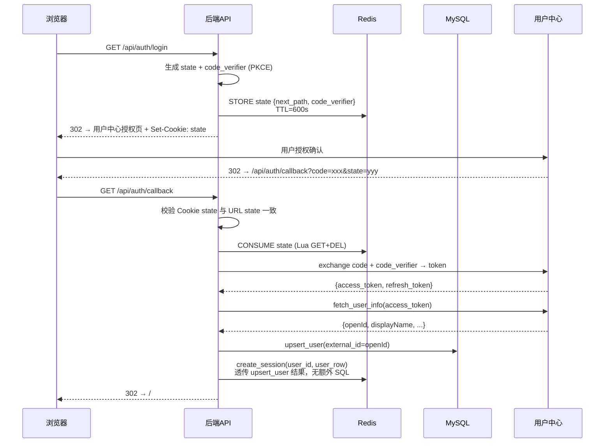

> **💡 补充说明：为什么 state 既存 Redis 又设 Cookie？**
>
> 这是 **CSRF 防护** 的双重校验机制：Redis 存储 state 的真实值，Cookie 存储的是 state 的"认领凭证"。Callback 时必须同时满足：①URL 中的 state 与 Cookie 中的 state 匹配（证明请求来自同一浏览器），②Redis 中能找到该 state（证明 state 未被伪造或过期）。仅靠 Cookie 容易被跨站攻击伪造，仅靠 Redis 无法关联到发起请求的浏览器。

### 5.2 Session 管理（Redis）

Session 数据结构（存储在 Redis 中）：

```json
{
  "session_id": "随机 256 位 token",
  "user_id": 1,
  "external_id": "用户中心 openId",
  "display_name": "张三",
  "email": "zhang@example.com",
  "avatar_url": "https://...",
  "access_token": "用户中心 access_token",
  "refresh_token": "用户中心 refresh_token",
  "access_token_expires_at": "2026-05-14T12:00:00+00:00",
  "token_status": "active",
  "token_checked_at": "...",
  "created_at": "...",
  "last_seen_at": "..."
}
```

**Redis Key 格式**：`{prefix}:auth:session:{session_id}`

**TTL**：默认 24 小时（`SESSION_TTL_HOURS`），每次访问刷新 `last_seen_at` 但不续期 TTL。

> **💡 补充说明：为什么 Session 用 Redis 而不是 JWT？TTL 不续期会不会过早过期？**
>
> **Redis Session vs JWT**：选择 Redis 的原因是 Session 中包含 `access_token` 和 `refresh_token` 等敏感凭据。如果用 JWT 存在客户端，这些凭据就会被暴露在浏览器中（JWT 是 base64 可解码的）。Redis Session 的 sessionId 本身是一个不透明令牌，不包含任何业务数据，即使被截获也无法反推用户信息。此外 Redis 还支持主动吊销（删除 key 即可），JWT 在过期前无法吊销。
>
> **TTL 不续期**：这是有意为之的设计——避免"永不过期"的 Session。24 小时后用户需要重新登录。如果业务需要更长的会话时间，调大 `SESSION_TTL_HOURS` 即可。`last_seen_at` 仅用于审计追踪，不影响 TTL。

**OAuth State 格式**：`{prefix}:auth:state:{state_value}`，TTL 默认 600 秒，使用后立即删除（原子 GET+DELETE via Lua 脚本）。

### 5.3 Token 刷新机制

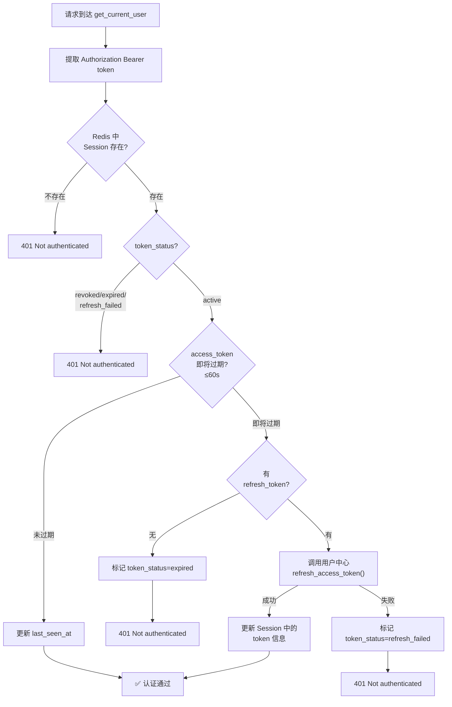

> **💡 补充说明：60 秒的刷新偏移量为什么这样设？**
>
> 60 秒（`skew_seconds`）是一个**安全余量**，确保在 token 真正过期之前提前刷新。这个值不宜太大（会导致频繁刷新增加用户中心负载），也不宜太小（网络延迟可能导致刷新请求到达时 token 已经过期）。60 秒在大多数网络环境下是合理的。如果你发现用户中心响应慢，可以适当增大这个值。

### 5.4 授权依赖注入

```python
# 三级依赖

# Level 1: 仅验证登录态
CurrentUser = Annotated[AuthenticatedUser, Depends(require_auth)]

# Level 2: 验证任务所有权（返回 404 而非 403 防止 ID 枚举）
TaskAccessUser = Annotated[AuthenticatedUser, Depends(require_task_access)]
```

> **💡 补充说明：CurrentUser 和 TaskAccessUser 什么时候用哪个？**
>
> - **CurrentUser**：只需要知道"当前用户是谁"的端点用这个。例如 `GET /api/auth/me`、`POST /api/workflows/generate-crawler`——这些操作和特定任务无关，只要登录即可。
> - **TaskAccessUser**：需要访问**特定任务**的端点用这个。例如 `GET /api/tasks/{id}`、`POST /api/tasks/{id}/assets`——这些操作必须确保当前用户是该任务的所有者。
>
> 当前代码中 `task_routes.py` 并没有使用 `TaskAccessUser`，而是在 `tasks/services.py` 的 `_check_task_owner()` 中手动做了同样的校验。两者是等效的，区别在于 `TaskAccessUser` 作为 FastAPI 依赖注入更声明式，而 `_check_task_owner()` 更灵活（可以在 service 层内部多次调用）。

**安全设计**：
- `require_task_access` 对"任务不存在"和"非任务所有者"统一返回 404，防止通过 403 推测其他用户的任务 ID
- Session ID 使用 32 字节（256 位）密码学安全随机数生成

### 5.5 Redis 客户端

`backend/auth/redis_client.py` 支持 **Standalone** 和 **Sentinel** 两种模式：

```
REDIS_SENTINEL_NODES 有值 → Sentinel 模式（生产推荐）
REDIS_SENTINEL_NODES 为空 → Standalone 模式（REDIS_URL）
```

所有返回值使用 `decode_responses=True`，直接获得 `str` 类型。

---

## 6. API 路由层

### 6.1 统一响应信封

所有 API 响应遵循统一信封格式：

```json
{
  "success": true,
  "error_code": null,
  "error": null,
  "data": { ... },
  "warnings": [],
  "meta": {}
}
```

通过 `backend/core/api_response.py` 中的 `api_response()` 函数构建，自动将 Pydantic 模型转换为字典。

### 6.2 路由总览

| 路由组 | 前缀 | 认证 | 说明 |
|--------|------|------|------|
| `auth_routes` | `/api/auth` | 部分公开 | OAuth2 登录/回调/登出/用户信息 |
| `workflow_routes` | `/api/workflows` | ✅ 全部 | DSL 验证/编译/脚本生成 |
| `assist_routes` | `/api/assist` | ✅ 全部 | AI 辅助分析 |
| `task_routes` | `/api/tasks` | ✅ 全部 | 任务 CRUD + 资产管理 |

### 6.3 Auth 路由详细说明

| 端点 | 方法 | 认证 | 说明 |
|------|------|------|------|
| `/api/auth/login` | GET | ❌ | 发起 OAuth2 授权，重定向到用户中心 |
| `/api/auth/callback` | GET | ❌ | OAuth2 回调，换 token，创建 session |
| `/api/auth/me` | GET | ✅ | 获取当前用户信息 |
| `/api/auth/logout` | POST | ✅ | 删除本地 session，返回用户中心登出 URL |
| `/api/auth/logout` | GET | ❌ | 浏览器发起的登出重定向 |

**Login 流程细节**：

```
1. 生成 code_verifier (PKCE)
2. 生成 state，将 {next_path, code_verifier} 存入 Redis
3. 设置 HttpOnly Cookie（state 值）
4. 302 重定向到用户中心授权 URL
```

**Callback 流程细节**：

```
1. 校验 Cookie 中的 state 与 URL 参数一致
2. 消费 Redis 中的 state（原子 GET+DELETE）
3. 用 code + code_verifier 换取 token（PKCE 增强）
4. 从 token 或用户中心 /user/get 获取 openId
5. upsert_user() 同步用户到本地 MySQL
6. create_session(user_row=user) 创建 Redis 会话（透传上一步结果，无需额外 SQL）
7. 302 重定向到前端 /#/auth/callback?sessionId=xxx&nextPath=xxx
```

### 6.4 Workflow 路由详细说明

| 端点 | 说明 | 核心流程 |
|------|------|---------|
| `POST /validate` | 校验 DSL 图 | validation.py |
| `POST /to-prompt` | 图 → Prompt | compiler + prompting |
| `POST /compile-plan` | 图 → 执行计划 | compiler.py |
| `POST /generate-skeleton` | 生成确定性骨架脚本 | compiler + codegen |
| `POST /generate-crawler` | LLM 生成爬虫脚本 | generation_pipeline（完整管线） |
| `POST /generate-detail-batch-runner` | 生成详情批处理脚本 | detail_batch_generation_pipeline |
| `POST /run-script-sandbox` | 沙箱执行脚本 | script_sandbox.py |
| `POST /format-script` | 格式化脚本 | script_artifacts.py |
| `POST /save-script` | 保存脚本到项目 | script_artifacts.py |

### 6.5 Assist 路由详细说明

| 端点 | 说明 | LLM 任务 |
|------|------|---------|
| `POST /infer-fields` | 推断字段选择器 | `infer_fields` |
| `POST /optimize-selector` | 优化选择器 | `optimize_selector` |
| `POST /analyze-pagination` | 分析翻页模式 | `analyze_pagination` |

### 6.6 Task 路由详细说明

| 端点 | 方法 | 说明 |
|------|------|------|
| `/api/tasks` | GET | 分页列表（仅返回当前用户的任务） |
| `/api/tasks` | POST | 创建任务 |
| `/api/tasks/{id}` | GET | 获取详情（含资产元数据） |
| `/api/tasks/{id}` | PUT | 部分更新 |
| `/api/tasks/{id}` | DELETE | 软删除（status → archived） |
| `/api/tasks/{id}/assets` | POST | 保存版本化资产 |
| `/api/tasks/{id}/assets/{type}` | GET | 获取最新版本资产 |

---

## 7. 工作流引擎

工作流引擎是本项目的核心领域，负责将用户在画布上编排的 DSL 图转化为可执行的 Playwright 爬虫脚本。

### 7.1 DSL 图模型

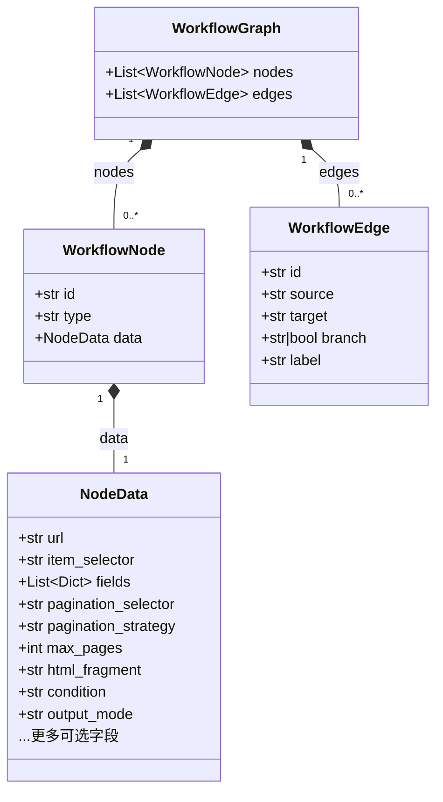

> **💡 补充说明：一个完整的 WorkflowGraph 长什么样？**
>
> 以下是一个典型的列表页爬虫 DSL 图的 JSON 示例：
>
> ```json
> {
>   "nodes": [
>     {"id": "n1", "type": "open_page", "data": {"url": "https://news.example.com"}},
>     {"id": "n2", "type": "select_list", "data": {"item_selector": "ul.list > li"}},
>     {"id": "n3", "type": "extract_field", "data": {
>       "fields": [
>         {"name": "title", "selector": "h3 a", "type": "text"},
>         {"name": "link", "selector": "h3 a", "type": "attr:href"}
>       ]
>     }},
>     {"id": "n4", "type": "paginate", "data": {"pagination_selector": "a.next", "pagination_strategy": "click_next", "max_pages": 5}},
>     {"id": "n5", "type": "emit_record", "data": {"output_mode": "sqlite"}}
>   ],
>   "edges": [
>     {"id": "e1", "source": "n1", "target": "n2"},
>     {"id": "e2", "source": "n2", "target": "n3"},
>     {"id": "e3", "source": "n3", "target": "n4"},
>     {"id": "e4", "source": "n4", "target": "n5"}
>   ]
> }
> ```
>
> **条件分支如何工作？** 当节点类型为 `condition` 时，从它出发的边可以带 `branch` 字段标记分支方向：`branch=true` 表示条件为真的走向，`branch=false` 或 `branch="default"` 表示条件为假的走向。编译器会根据 `branch` 值构建不同的执行路径。

**支持的节点类型**：

| 节点类型 | 功能 | 必需配置 |
|---------|------|---------|
| `open_page` | 打开页面 | `url` |
| `select_list` | 选择列表项 | `item_selector` |
| `extract_field` | 提取字段 | `fields[]`（每项需 `selector`） |
| `paginate` | 翻页 | `pagination_selector` |
| `emit_record` | 输出记录 | `output_mode`, 持久化配置 |
| `loop` | 循环 | — |
| `condition` | 条件分支 | `condition` 表达式 |
| `end` | 终止 | — |

### 7.2 校验（validation.py）

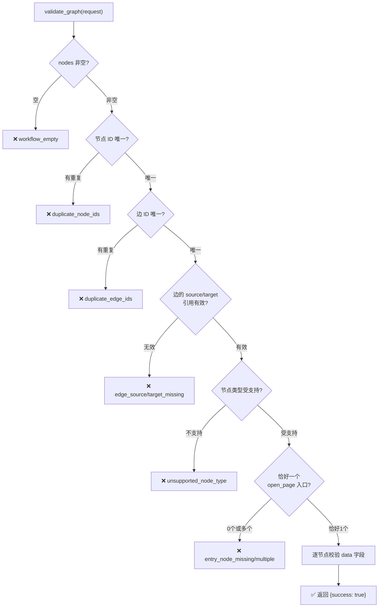

**字段规范化**：`normalize_field_payload()` 将旧的字段别名（`field_name`→`name`, `css`→`selector`）标准化为规范格式，并拒绝已废弃的别名。

### 7.3 编译（compiler.py）

编译器将 DSL 图转换为 **确定性执行计划**（ExecutionPlan）：

```
WorkflowGraph ──compile_graph_to_plan()──► ExecutionPlan
```

**ExecutionPlan 结构**：

```python
@dataclass
class ExecutionPlan:
    entry_url: str                  # 入口 URL
    node_types: list[str]           # 节点类型序列
    item_selector: str              # 列表项选择器
    field_specs: list[dict]         # 字段规格列表
    pagination: dict                # 翻页配置
    output: dict                    # 输出配置
    limits: dict                    # 执行限制
    edges: list[dict]               # 边信息
    conditions: list[dict]          # 条件分支
```

**编译逻辑**：遍历所有节点，按类型提取配置，聚合为统一的计划对象。关键规则：

- `open_page` → 提供 `entry_url`
- `select_list` → 提供 `item_selector`
- `extract_field` → 规范化 `field_specs`
- `paginate` → 合并翻页配置和页数限制
- `emit_record` → 合并输出配置（模式/路径/去重/批次大小）

> **💡 补充说明：如果有多个相同类型的节点会怎样？**
>
> 当前编译器采用**覆盖策略**——后出现的节点会覆盖前一个同类型节点的配置。例如两个 `open_page` 节点，最终 `entry_url` 取最后一个的值。这在校验阶段已被阻止（只允许一个 `open_page`），但对于 `extract_field` 等允许多个的类型，后出现的字段列表会完全覆盖前面的。这不是 bug，而是当前 MVP 的简化设计——实际使用中，一个工作流通常只有一组提取字段。

### 7.4 确定性代码生成（codegen.py）

`generate_playwright_skeleton()` 将 ExecutionPlan 直接转换为完整的 Playwright Python 脚本，**不调用 LLM**，完全确定性。

> **💡 补充说明：什么是"确定性骨架"？为什么要先生成骨架再让 LLM 增强？**
>
> "确定性"意味着相同的输入（ExecutionPlan）永远产生相同的输出代码——没有任何随机性。骨架脚本包含了所有"机械性"的逻辑：常量定义、数据库建表、去重、翻页检测、持久化模板等。这些部分不需要 LLM 的"创造力"。
>
> LLM 增强的价值在于处理**需要判断力的部分**：更智能的等待策略、更健壮的错误处理、页面特定的适配逻辑等。骨架作为参考基线，约束 LLM 在已有框架上"做手术"而非"从零重写"，大幅降低了 LLM 产出不可控代码的风险。

**生成脚本的核心结构**：

```python
# 1. 常量区 — 从 ExecutionPlan 直接映射
ENTRY_URL = "..."
ITEM_SELECTOR = "..."
FIELD_SPECS = [...]
MAX_PAGES = 10
PAGINATION_SELECTOR = "..."
OUTPUT_MODE = "memory" | "json_file" | "sqlite"

# 2. 工具函数
resolve_artifact_path()     # 解析输出路径
record_hash()               # 记录哈希（去重）
record_identity_key()       # 记录唯一键
merge_records()             # 合并记录（upsert）
persist_json_records()      # JSON 文件持久化
persist_sqlite_records()    # SQLite 持久化（含动态建表）
extract_record()            # 从 ElementHandle 提取字段

# 3. 翻页控制
click_next_page()           # 点击下一页 + 等待内容更新
pagination_state_changed()  # 检测翻页后列表变化

# 4. 主执行函数
def run() -> list[dict]:
    with sync_playwright() as p:
        browser = p.chromium.launch(...)
        page.goto(ENTRY_URL)
        for page_idx in range(MAX_PAGES):
            items = page.query_selector_all(ITEM_SELECTOR)
            for item in items:
                record = extract_record(item, page.url)
            persist_records(page_records, page.url)  # 每页持久化
            if not click_next_page(page):
                break
```

**关键设计决策**：

1. **每页持久化**：每翻一页就持久化已提取的记录，避免中断丢失全部数据
2. **沙箱感知**：通过 `CRAWLER_SANDBOX_MODE` 环境变量控制 headless 模式和超时
3. **SQLite 动态建表**：根据实际提取的字段自动创建/扩展表结构
4. **去重机制**：支持基于 `dedupe_keys` 的确定性去重，无配置时使用 SHA-256 哈希
5. **翻页验证**：点击翻页后等待内容实际变化，而非仅依赖固定延时

> **💡 补充说明：为什么骨架脚本用 `query_selector_all` 而不是 `locator`？**
>
> Playwright Python 有两套 API：①`Page.locator()` / `Locator` —— 现代推荐 API，自动等待和重试；②`Page.query_selector_all()` / `ElementHandle` —— 底层 API，一次性查询不重试。
>
> 骨架脚本选择 `ElementHandle` 的原因是：在列表项循环中，`item` 变量是一个 `ElementHandle`，而 `ElementHandle.locator()` 方法在 Playwright Python sync API 中**不存在**。如果你对 `ElementHandle` 调用 `.locator()`，运行时会直接抛出 `AttributeError`。这是 LLM 最常犯的错误，所以才有专门的兼容性检查来拦截。

### 7.5 LLM 脚本生成管线（generation_pipeline.py）

这是最复杂的业务流程，分为两种模式：

#### Lite 模式（单次生成）

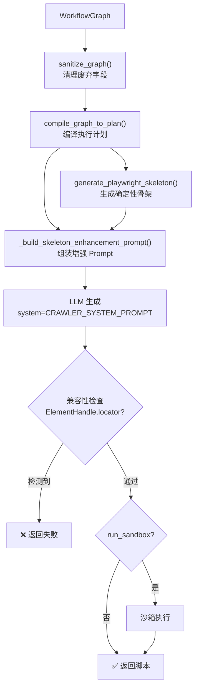

#### Pro 模式（生成 → 审查 → 修订）

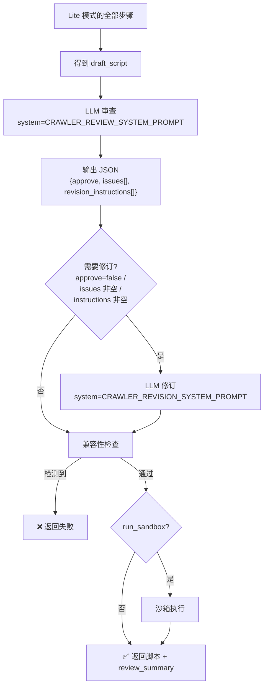

> **💡 补充说明：editable_prompt vs prompt 的区别是什么？**
>
> - **`prompt`（final_prompt）**：发送给 LLM 的**完整**用户提示，包含执行计划 JSON、输出策略、模型护栏、质量门禁和用户意图。这是 LLM 实际看到的。
> - **`editable_prompt`**：用户可以编辑的部分。如果用户提供了 `prompt_override`，则使用用户的覆盖内容；否则使用 `CrawlerPromptGenerator` 生成的基础 Prompt。
>
> 区分的意义在于：`final_prompt` 中的执行计划和护栏部分是**系统强制附加**的，用户不应绕过；而 `editable_prompt` 代表用户可以自定义的"意图描述"。在 API 响应中同时返回两者，前端可以让用户只看到和编辑 `editable_prompt` 部分。

**兼容性检查**：正则扫描生成的脚本，检测以下 Playwright Python API 误用模式：

```python
# 检测这些禁止模式
item.locator(...)     # ElementHandle 无 .locator()
first.locator(...)    # ElementHandle 无 .locator()
element.locator(...)  # ElementHandle 无 .locator()
```

### 7.6 详情批处理生成（detail_batch_*）

详情批处理是一个独立的代码生成管线，用于生成 **从列表结果数据库中提取详情页的批处理调度脚本**。

> **💡 补充说明：什么是"详情批处理"？什么时候需要它？**
>
> 爬虫工作通常分两阶段：①**列表页采集**（通过工作流引擎生成脚本）——抓取列表页中每条记录的 URL；②**详情页采集**——对每条记录的详情 URL 进行深度抓取。详情批处理脚本就是第二阶段的调度器。
>
> 它从 SQLite 数据库中读取列表页采集的结果（包含 `detail_url`），通过 `ThreadPoolExecutor` 并发调度外部 CLI 工具（`page-extractor`）来处理每个详情页，并将任务状态写回数据库。
>
> **为什么详情页采集用外部 CLI 而不是内嵌在脚本中？** 因为详情页的结构千差万别，用外部 CLI 工具可以将"调度逻辑"和"抽取逻辑"解耦——批处理脚本只负责调度和状态管理，具体的页面解析交给 `page-extractor` CLI 处理。

```
GenerateDetailBatchRunnerRequest
    │
    ├── database 配置（SQLite 路径、表名、字段映射）
    ├── detail_task 配置（任务表名、状态枚举、最大重试）
    ├── detail_cli 配置（CLI 可执行文件、命令前缀、子命令）
    ├── execution_policy 配置（并发数、批次大小、超时）
    │
    ▼
generate_detail_batch_runner_pipeline()
    │
    ├── build_detail_batch_runner_prompt()    # 组装 Prompt
    │       ├── build_detail_batch_generation_payload()  # 结构化 JSON 载荷
    │       └── generate_detail_batch_runner_skeleton()  # 确定性骨架
    │
    ├── [skeleton_enhancement 模式] → 直接使用确定性骨架 + 校验
    │
    └── [llm_skeleton_enhancement 模式] → LLM 增强 + 校验
```

**生成的脚本架构**：

```
run_detail_batch.py
    │
    ├── Config              # 配置数据类（从 CLI 参数构建）
    ├── TaskRepository      # SQLite 任务仓库（CRUD + 任务领取）
    ├── CliInvoker          # 子进程调用器（构建命令 + 执行 + 结果分类）
    ├── TaskRunner          # 单任务执行器
    ├── BatchExecutor       # 批处理执行器（主循环 + ThreadPoolExecutor）
    │
    └── main()              # CLI 入口（argparse）
```

**校验**：`validate_generated_detail_batch_runner()` 检查：
- Python 语法正确
- 包含必需的类（Config/TaskRepository/CliInvoker/TaskRunner/BatchExecutor）
- 包含必需的函数（main）
- 引用了必需的运行时（ThreadPoolExecutor/subprocess.run/sqlite3）
- 包含契约值（表名、字段名、CLI 可执行文件、状态枚举）

### 7.7 脚本沙箱（script_sandbox.py）

沙箱为生成的脚本提供安全的执行环境：

> **💡 补充说明：沙箱能防止恶意代码吗？**
>
> 当前沙箱是基于 `subprocess.run` 的**进程级隔离**，提供的是**资源约束**（超时、独立工作目录）而非**安全沙箱**。它能防止：无限循环（超时杀进程）、文件随处写入（工作目录隔离）、输出爆炸（stdout/stderr 截断）。
>
> 它**不能**防止：删除系统文件、访问网络、读取环境变量等。当前的安全假设是：脚本来源可信（由 LLM 生成且经过兼容性检查），用户不会故意注入恶意代码。如果需要更强的安全隔离，应考虑 Docker 容器或 Firecracker 微虚拟机。

```
run_generated_script_sandbox(script, filename, timeout_seconds)
    │
    ├── 创建独立运行目录: logs/script-sandbox/runs/{run_id}/
    ├── 写入脚本文件
    ├── 设置环境变量:
    │   ├── CRAWLER_SANDBOX_MODE=1        # 通知脚本处于沙箱模式
    │   ├── CRAWLER_SANDBOX_TIMEOUT_SECONDS=60
    │   └── CRAWLER_SANDBOX_DIR=...       # 运行目录
    │
    ├── subprocess.run([sys.executable, script_path])
    │   ├── 捕获 stdout/stderr
    │   └── 超时控制
    │
    └── 返回 ScriptSandboxResult
            ├── success: bool
            ├── exit_code: int | None
            ├── timed_out: bool
            ├── duration_seconds: float
            ├── stdout_tail: str (截断到 20KB)
            ├── stderr_tail: str (截断到 20KB)
            └── log_path: str
```

### 7.8 脚本格式化与持久化（script_artifacts.py）

**格式化**：`format_script()` 对脚本文本进行规范化（行尾/缩进/空格），如果安装了 `black` 则使用 black 格式化。

**持久化**：`save_script()` 将脚本保存到项目工作区，有路径安全校验：

```python
# 安全检查
1. 相对路径不能为空
2. 不能是绝对路径
3. 解析后的路径不能超出项目根目录（防路径穿越）
4. 已存在文件默认不覆盖（需显式 overwrite=True）
```

---

## 8. AI 辅助服务

AI 辅助服务提供三个核心能力，均通过 LLM 返回结构化 JSON：

### 8.1 通用执行框架

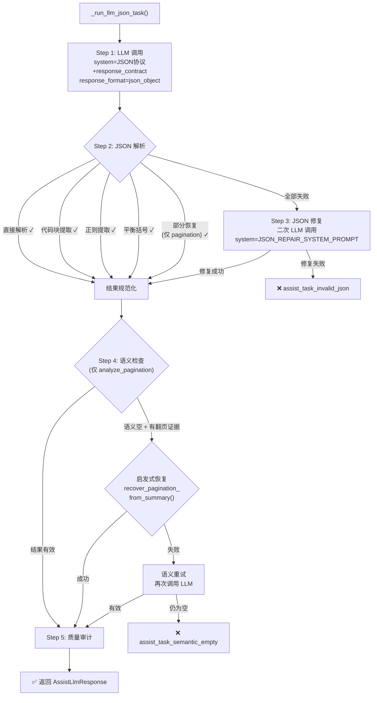

> **💡 补充说明：什么是 response_contract？为什么需要 5 个阶段解析 JSON？**
>
> **response_contract** 是一段自然语言描述，告诉 LLM "你必须返回什么形状的 JSON"。例如字段推断的契约是"返回 `{item_selector, fields[], confidence, reason}`"。这个契约同时用于：①组装 system prompt 约束 LLM 输出格式，②作为 JSON 修复 LLM 的参考。
>
> **为什么 5 个阶段？** 因为 LLM 并不总是乖乖返回纯 JSON。常见问题包括：用 ` ```json ``` ` 包裹（阶段 2 代码块提取）、返回 JSON 前后带文字说明（阶段 2 正则提取）、输出被截断导致 JSON 不完整（阶段 3 修复）、返回的 JSON 结构正确但内容全是空值（阶段 4 语义检查）。每个阶段处理不同类型的 LLM 输出异常，逐层降级。

### 8.2 字段推断（infer_fields）

**输入**：HTML 片段（截断到 6000 字符）

**输出**：
```json
{
  "item_selector": "ul.news-list > li.news-item",
  "fields": [
    {"name": "title", "selector": ":scope h3 a.title", "type": "text", "confidence": 0.95},
    {"name": "link", "selector": ":scope h3 a.title", "type": "attr:href", "confidence": 0.93}
  ],
  "confidence": 0.88,
  "reason": "..."
}
```

**启发式后备**：当 LLM 返回空结果时，`_heuristic_infer_fields()` 使用确定性规则提取字段：

```
1. 从 <!-- ITEM_SAMPLES --> 提取重复样本
2. 查找标题（h1-h6 或含 title/tit 类名的元素）
3. 查找图片（img 标签）
4. 查找链接（a 标签）
5. 查找日期（含 date/time 类名或日期格式的文本）
6. 查找摘要（长文本的 p 标签）
7. 推断 item_selector（样本间共享的标签+类名）
```

### 8.3 选择器优化（optimize_selector）

**输入**：初始选择器 + HTML 片段

**输出**：
```json
{
  "optimized_selector": "nav.pagination > a.next",
  "confidence": 0.92,
  "reason": "..."
}
```

**启发式后备**：`_heuristic_optimize_selector()` 清理不稳定类名：

```python
# 移除不稳定类
re.sub(r"\.(?:clearfix|active|current|selected)\b", "", selector)
re.sub(r"\.item-\d+\b", "", selector)          # 数字后缀
re.sub(r"\.w-node-[a-zA-Z0-9_-]+\b", "", selector)  # Webflow 节点 ID

# 重复 ID 检测
# 如果 ID 在 HTML 中出现多次 → 替换为基于样本的共享选择器
```

### 8.4 翻页分析（analyze_pagination）

**输入**：HTML 片段 + 翻页组件 HTML + 简化 Body

**输出**：
```json
{
  "pagination_strategy": "click_next|infinite_scroll|load_more|none",
  "next_button_selector": "nav.pagination > a[rel='next']",
  "page_number_selectors": ["nav.pagination > a.page-num"],
  "confidence": 0.9,
  "reason": "..."
}
```

**这是三个辅助任务中最复杂的**，因为它有：

1. **多层恢复机制**：部分 JSON 恢复 → LLM 修复 → 启发式恢复 → 语义重试
2. **PAGINATION_CONTROL_SUMMARY**：前端可以传递结构化的翻页控件摘要，辅助选择器构建
3. **逐级收敛选择器规则**：从最近稳定祖先向下定位，避免宽泛选择器
4. **中英文文本支持**：识别"下一页"/"加载更多"/"Next"/"Load More"

> **💡 补充说明：PAGINATION_CONTROL_SUMMARY 是什么？它从哪来？**
>
> 前端在检测到用户选中了翻页区域时，会将该区域的关键信息序列化为结构化摘要，嵌入 HTML 注释标记 `<!-- PAGINATION_CONTROL_SUMMARY -->` 中。摘要格式为 `|` 分隔的键值对：`tag=a | class=next | parent_tag=nav | parent_class=pagination | text=下一页 | rel=next`。
>
> 这个摘要的作用是：即使 LLM 没有正确分析翻页结构，后端也可以从摘要中提取 `tag`、`class`、`parent_tag` 等信息，**确定性**地构建选择器（如 `nav.pagination > a[rel="next"]`）。这就是 `recover_pagination_from_summary()` 的工作原理——它是一个不依赖 LLM 的确定性后备方案。

---

## 9. 任务管理

### 9.1 数据模型

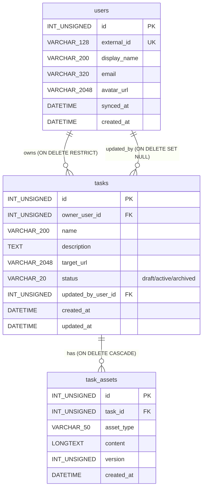

> **💡 补充说明：status 字段的值流转和 ON DELETE 策略**
>
> `status` 字段只有三个有效值：`draft`（新建）→ `active`（用户开始使用）→ `archived`（软删除）。注意 `DELETE /api/tasks/{id}` 并不真的删除行，而是将 status 设为 `archived`。这样保证资产和外键引用不会断裂。
>
> `ON DELETE RESTRICT`（owner_user_id）：如果有任务属于某用户，该用户不能被删除。`ON DELETE SET NULL`（updated_by_user_id）：用户被删除时只清除"谁最后修改"的记录，不影响任务本身。`ON DELETE CASCADE`（task_assets）：任务被删除时（虽然是软删除，但若物理删除），其资产自动级联删除。

### 9.2 所有权隔离

所有任务操作都强制 `owner_user_id` 校验：

```python
def _check_task_owner(cursor, task_id, owner_user_id):
    row = cursor.execute("SELECT ... FROM tasks WHERE id = %s", (task_id,))
    if row is None:
        raise TaskNotFoundError(...)     # 不存在 → 404
    if row["owner_user_id"] != owner_user_id:
        raise TaskNotFoundError(...)     # 非所有者 → 也是 404
    return row
```

### 9.3 资产版本化

```python
# 保存资产时使用行级锁防止并发版本冲突
cursor.execute(
    "SELECT MAX(version) AS max_ver FROM task_assets "
    "WHERE task_id = %s AND asset_type = %s FOR UPDATE",
    (task_id, asset_type),
)
new_version = (row["max_ver"] or 0) + 1
cursor.execute(
    "INSERT INTO task_assets (task_id, asset_type, content, version, created_at) "
    "VALUES (%s, %s, %s, %s, %s)",
    (task_id, asset_type, content, new_version, now),
)
```

> **💡 补充说明：为什么用 `FOR UPDATE` 行级锁？**
>
> `FOR UPDATE` 是 MySQL 的**悲观锁**，在被 `SELECT` 的行上加排他锁，直到事务提交或回滚才释放。这确保了在并发请求中，两个请求不会读到相同的 `max_ver` 然后插入相同的版本号。
>
> **场景**：用户快速点击两次"保存"，两个请求几乎同时到达。如果没有锁：请求 A 读到 max_ver=3，请求 B 也读到 max_ver=3，两者都插入 version=4，违反唯一约束或产生数据不一致。有了 `FOR UPDATE`：请求 A 先获得锁，插入 version=4 后提交；请求 B 此时才能读到 max_ver=4，正确插入 version=5。
>
> 注意：因为 `get_cursor()` 的整个 `with` 块是一个事务，`FOR UPDATE` 的锁会在 `conn.commit()` 时自动释放。

---

## 10. LLM 客户端

### 10.1 客户端架构

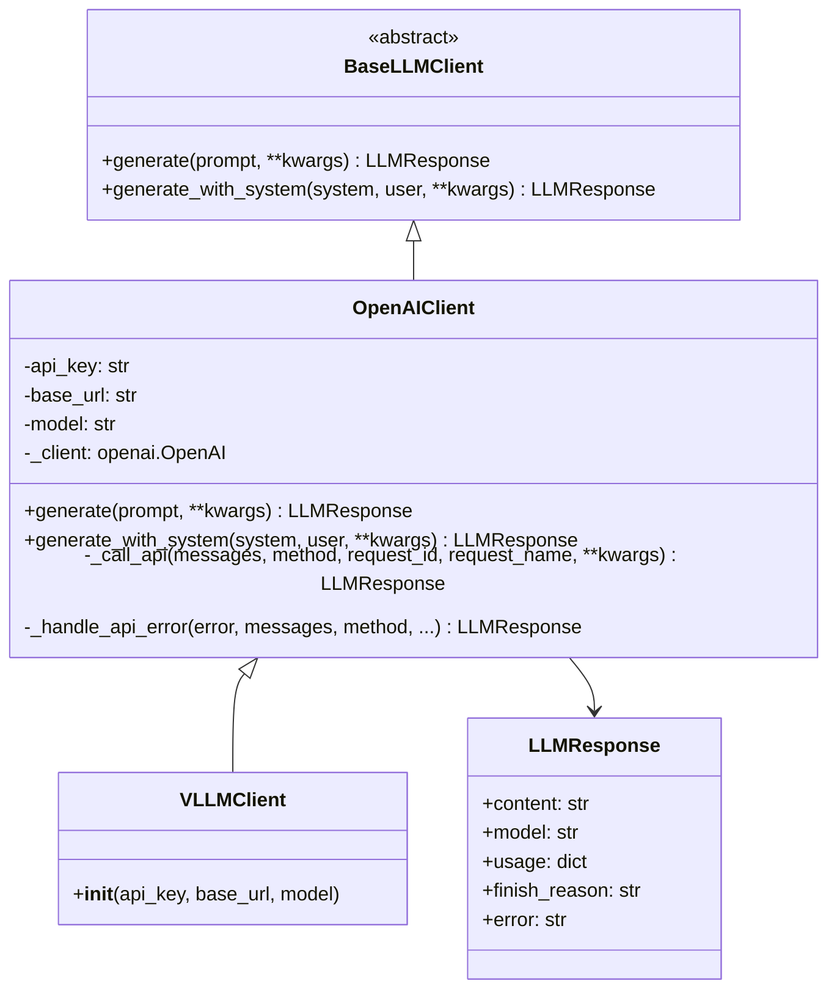

### 10.2 响应格式降级

```python
def _should_retry_without_response_format(error):
    """检测 response_format 不被 provider 支持的错误"""
    markers = ("response_format", "json_object", "json_schema",
               "unsupported", "extra_forbidden", ...)
    return any(marker in str(error).lower() for marker in markers)
```

当 LLM 返回 `response_format` 不支持的错误时，自动移除该参数重试。

> **💡 补充说明：什么情况下 response_format 不被支持？**
>
> `response_format={"type": "json_object"}` 是 OpenAI 的专有参数，要求模型输出合法 JSON。但 vLLM 或其他 OpenAI 兼容 API 可能不支持此参数，返回错误如 `"Extra inputs are not permitted"` 或 `"Unknown parameter: response_format"`。`_should_retry_without_response_format()` 通过检测错误消息中的关键词来判断这类错误，自动移除 `response_format` 后重新调用。这是一种**优雅降级**策略——虽然没有了 JSON 模式约束，但 LLM 通常仍能根据 system prompt 中的契约描述返回 JSON。

### 10.3 审计日志

每次 LLM 调用都会记录两条审计事件：

```
1. llm_request  — 请求发起
   ├── request_id, request_name, method
   ├── model, temperature, max_tokens
   └── prompt / system + user

2. llm_response / llm_error — 响应/错误
   ├── request_id, request_name
   ├── model, usage, finish_reason
   └── content / error
```

---

## 11. Prompt 工程

Prompt 模块采用 **分层组装** 架构：

### 11.1 模块组织

```
prompts/
├── crawler_prompt.py          # 爬虫 Prompt 生成器（面向执行计划）
├── assemblers/
│   ├── workflow.py            # 工作流 Prompt 片段组装
│   └── assist.py              # 辅助 Prompt 片段组装
├── contracts/
│   └── assist_contracts.py    # JSON 响应契约定义
├── shared/
│   └── rules.py               # 跨任务共享规则片段
└── tasks/
    ├── crawler_system.py      # 爬虫/审查/修订 系统提示词
    ├── assist_tasks.py        # 辅助任务用户提示词模板
    └── detail_batch_runner_system.py  # 详情批处理系统提示词
```

### 11.2 Prompt 组装流程（爬虫生成）

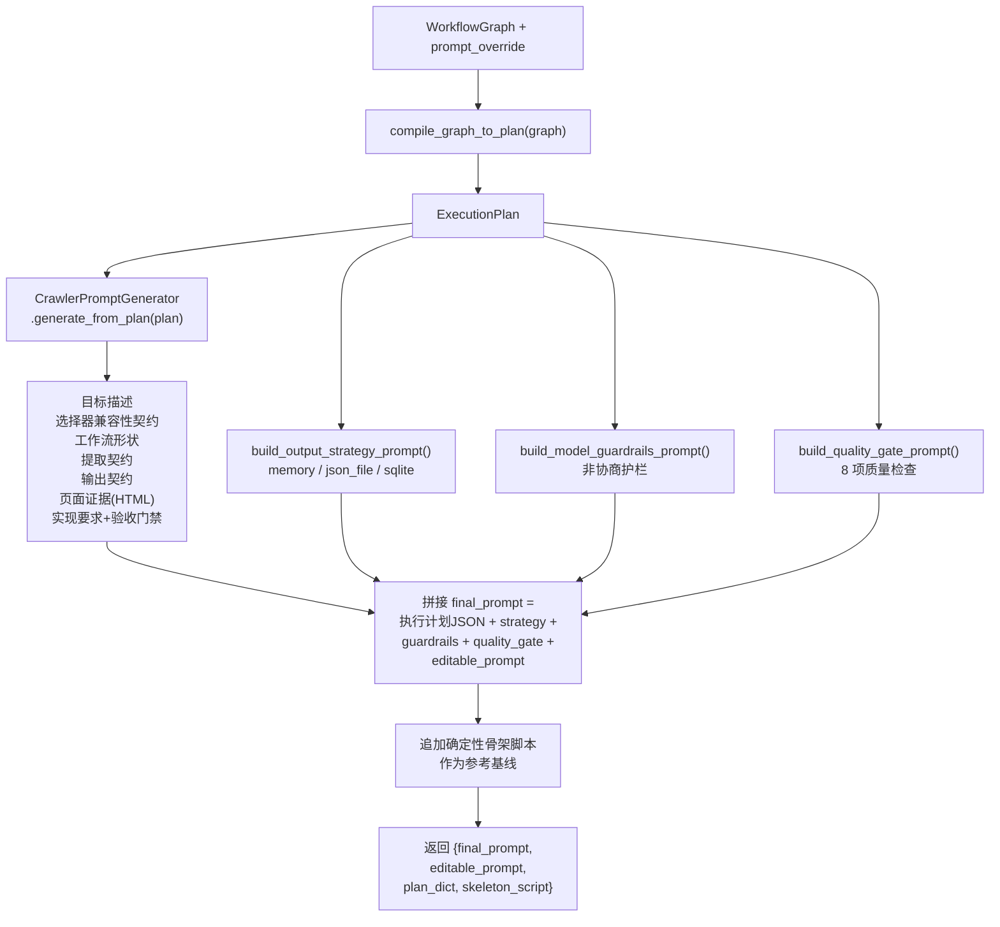

> **💡 补充说明：Prompt 为什么这么复杂？Token 预算是多少？**
>
> Prompt 的复杂性源于一个核心矛盾：**LLM 倾向于"自由发挥"**，但爬虫脚本必须**严格遵循执行计划**。每一层 Prompt 都是在给 LLM 加约束：
> - 执行计划 JSON → 告诉 LLM "这是你必须遵守的控制流"
> - 输出策略 → "你必须用这种持久化方式"
> - 模型护栏 → "你不许发明 Playwright 不支持的 API"
> - 质量门禁 → "如果任何检查不通过，你需要自己修改后再返回"
> - 骨架脚本 → "在这个基础上改，不要从零重写"
>
> 典型的 final_prompt 长度在 3000-8000 tokens（取决于 HTML 片段大小），加上骨架脚本可能达到 10000-15000 tokens。`SCRIPT_GENERATION_MAX_TOKENS` 配置项控制 LLM 输出的最大 token 数，默认不限（由模型自行决定）。

### 11.3 共享规则片段（rules.py）

这些规则片段被多个 Prompt 复用：

| 规则 | 用途 |
|------|------|
| `PLAYWRIGHT_CSS_SELECTOR_COMPATIBILITY_RULES` | 选择器兼容性规则（禁止 jQuery 伪类等） |
| `SELECTOR_PRESERVATION_RULES` | 保留已验证选择器的规则 |
| `SCRIPT_OUTPUT_LOCK` | 只返回脚本，不返回 Markdown 包裹 |
| `JSON_OUTPUT_LOCK` | 只返回 JSON，不返回 Markdown 包裹 |
| `PLAYWRIGHT_ELEMENT_HANDLE_RULES` | ElementHandle 与 Page locator 的区别 |
| `MINIMAL_CHANGE_POLICY` | 最小变更策略 |
| `LOW_CONFIDENCE_FALLBACK_POLICY` | 低置信度时的降级策略 |
| `EVIDENCE_FIRST_POLICY` | 证据优先策略 |

---

## 12. 日志与审计

### 12.1 日志架构

```
logs/
├── app-2026-05-14.log          # 应用日志（标准格式）
└── audit-2026-05-14.jsonl      # 审计日志（JSON Lines）
```

### 12.2 日志文件轮转

`DailyNamedFileHandler` 实现按日期自动切换日志文件：

```python
class DailyNamedFileHandler(logging.Handler):
    """轻量级按日期轮转的文件 Handler"""
    def _ensure_stream(self):
        today = dt.date.today()
        if self._current_date != today:
            # 关闭旧文件，打开新文件
            self._stream.close()
            path = LOG_DIR / f"{self.prefix}-{today.isoformat()}.{self.extension}"
            self._stream = open(path, "a", encoding="utf-8")
            self._current_date = today
```

### 12.3 审计事件

`audit_event()` 写入结构化审计日志，用于 LLM 调用追踪和安全审计：

```python
audit_event("llm_request", request_id=..., model=..., prompt=...)
audit_event("llm_response", request_id=..., usage=..., content=...)
audit_event("script_sandbox_started", run_id=..., timeout=...)
audit_event("assist_task_completed", task_name=..., result=...)
audit_event("workflow_generate_crawler_completed", ...)
```

`serialize_for_log()` 确保大文本被截断（默认 50K 字符），嵌套深度有限制（默认 20 层）。

---

## 13. 核心执行时序图

### 13.1 OAuth2 登录完整时序

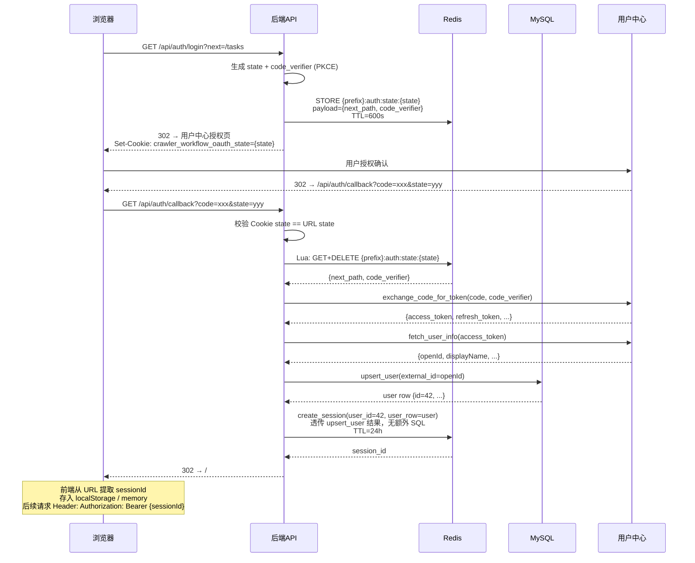

### 13.2 爬虫脚本生成时序（Pro 模式）

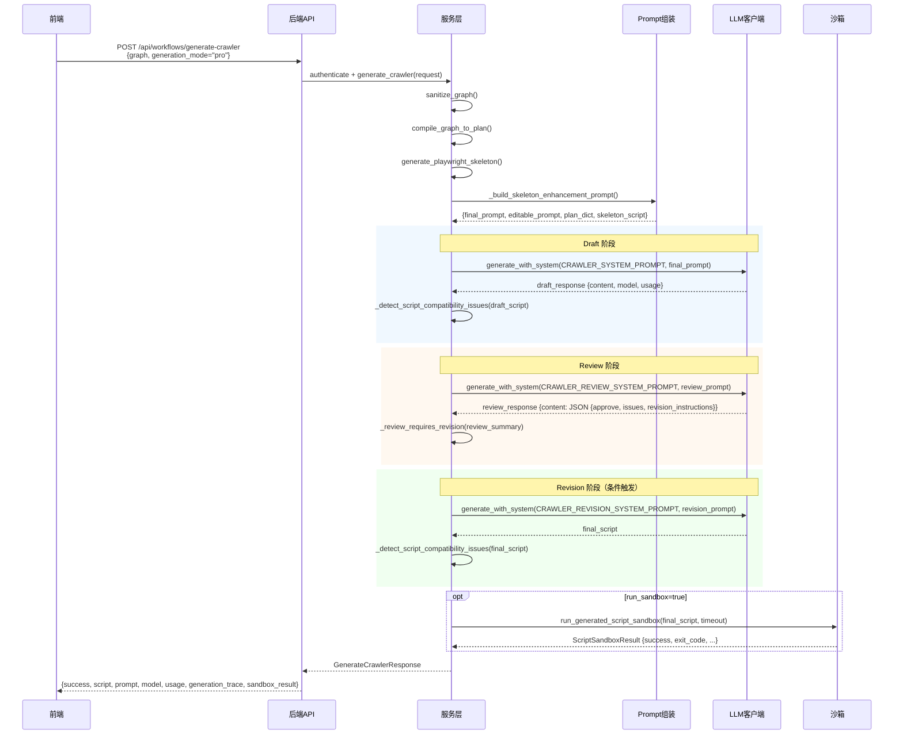

### 13.3 AI 辅助分析时序（以 analyze_pagination 为例）

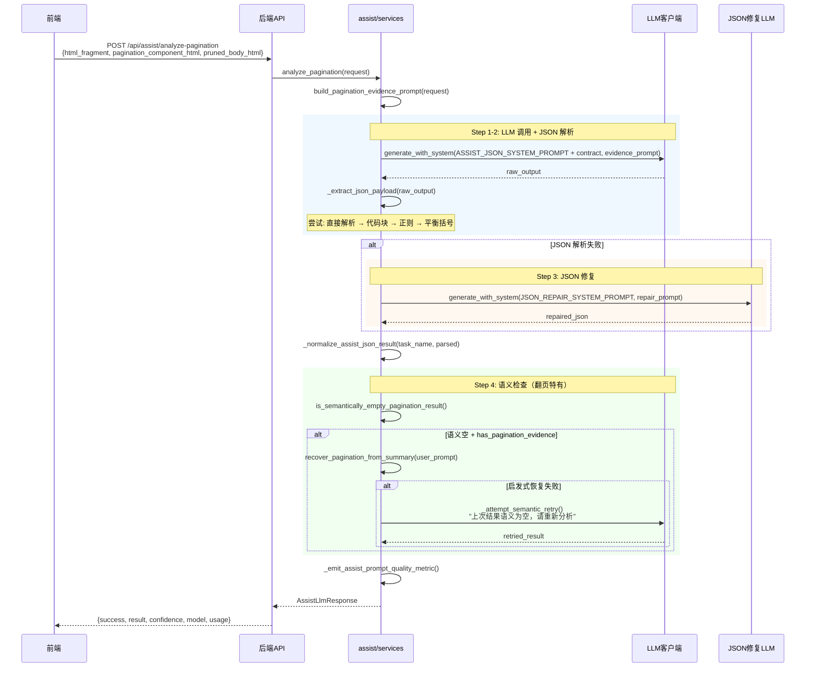

---

## 14. 开发者速查表

### 14.1 新增 API 端点

1. 在 `backend/api/` 下对应路由文件中添加路由函数
2. 使用 `CurrentUser` 或 `TaskAccessUser` 依赖注入认证
3. 在 `backend/workflow/schemas.py` 或 `backend/tasks/schemas.py` 定义请求/响应模型
4. 业务逻辑放在 `services.py`，路由层只做参数校验和响应格式化
5. 使用 `api_response()` 构建统一响应

### 14.2 新增工作流节点类型

1. 在 `backend/workflow/schemas.py` 的 `SUPPORTED_EXECUTABLE_NODE_TYPES` 添加类型
2. 在 `backend/workflow/validation.py` 的 `validate_node_data()` 添加校验规则
3. 在 `backend/workflow/compiler.py` 的 `compile_graph_to_plan()` 添加编译逻辑
4. 在 `backend/workflow/codegen.py` 的 `generate_playwright_skeleton()` 添加代码生成

### 14.3 新增 AI 辅助能力

1. 在 `backend/prompts/tasks/assist_tasks.py` 添加 Prompt 模板
2. 在 `backend/prompts/contracts/assist_contracts.py` 添加响应契约
3. 在 `backend/prompts/assemblers/assist.py` 添加 Prompt 组装函数
4. 在 `backend/assist/services.py` 添加服务函数（复用 `_run_llm_json_task` 框架）
5. 在 `backend/api/assist_routes.py` 添加路由

### 14.4 数据库变更

1. 在 `backend/database/models.py` 修改对应的 DDL 语句
2. 清除数据库（删除旧表），重启应用让 `ensure_schema()` 重建
3. 当前阶段不保留历史数据，无需增量迁移

### 14.5 常见错误排查

| 现象 | 可能原因 | 排查方法 |
|------|---------|---------|
| 401 Not authenticated | Session 过期或不存在 | 检查 Redis 中 key 是否存在、TTL |
| 401 token refresh failed | 用户中心 refresh_token 失效 | 检查 `access_token_expires_at` 和 `refresh_token` |
| 400 assist_task_invalid_json | LLM 返回非 JSON | 查看 `audit-*.jsonl` 中的 `assist_task_repair_attempt` |
| 400 draft_generation_compatibility | 脚本含 ElementHandle.locator | 检查 LLM 输出中的 `item.locator`/`element.locator` |
| 沙箱超时 | 脚本执行时间超限 | 检查 `SCRIPT_SANDBOX_TIMEOUT_SECONDS` 配置 |
| MySQL 连接池耗尽 | 并发请求过高 | 检查 `DB_POOL_SIZE` 和 `DB_MAX_OVERFLOW` |

### 14.6 关键配置调优

| 场景 | 配置项 | 建议值 |
|------|--------|--------|
| 生产部署 | `BROWSER_HEADLESS=true` | headless 模式 |
| 大型脚本 | `SCRIPT_GENERATION_MAX_TOKENS=16384` | 增大 token 上限 |
| vLLM 部署 | `LLM_PROVIDER=vllm` + `API_BASE_URL` | 自动切换 provider |
| Redis 高可用 | `REDIS_SENTINEL_NODES=host1:26379,host2:26379` | Sentinel 模式 |
| 长时间任务 | `SESSION_TTL_HOURS=72` | 延长会话有效期 |
