# 完整采集产品线规划方案

## 1. 文档定位

本文是一份面向产品、研发、平台建设与实施协同团队的完整产品线规划方案，用于系统说明从“用户提出采集需求”到“数据最终落盘并进入下游使用”的全流程。

本文覆盖的范围包括：

- 业务需求是如何进入系统的
- 本应用在产品线里承担什么职责
- 云端平台如何承担脚本版本管理与采集任务管理
- 采集任务如何被执行、重试、追踪、沉淀结果
- 数据如何落盘、归档、进入后续消费链路

本文中的“本应用”指当前仓库实现的 `crawler-workflow` 端侧工作台。
本文中的“云端平台”指未来产品线中负责脚本资产管理、任务管理、调度与状态回流的平台系统。

建议配合阅读：

- [本应用产品规划说明](./product-planning-guide.md)
- [本应用技术开发说明](./technical-development-guide.md)

---

## 2. 产品线一句话定义

这是一条围绕“网页采集任务设计、脚本资产沉淀、云端任务执行与数据资产落盘”的完整产品线。

其中：

- 端侧应用负责把采集需求转成结构化采集方案与可执行脚本资产
- 云端平台负责脚本版本管理、任务编排、执行治理与结果回流
- 执行环境负责运行采集任务
- 数据层负责沉淀列表数据、详情数据、运行日志与任务元数据

---

## 3. 产品线目标

完整产品线的建设目标不是“做一个脚本生成器”，也不是“做一个单纯调度平台”，而是要形成一条稳定、可治理、可交付的采集生产链。

### 3.1 核心目标

1. 让非平台底层研发也能定义采集任务
2. 让采集方案在执行前具备结构化表达与可验证过程
3. 让脚本成为可管理、可版本化、可复用的资产
4. 让任务执行具备明确的状态机、监控与重试机制
5. 让数据产出能够标准化落盘并进入后续消费链路

### 3.2 设计原则

1. 设计与执行解耦：采集设计放在端侧应用，任务治理放在云端平台
2. 资产优先：平台管理的是“采集资产”，而不只是临时脚本
3. 数据链路可追踪：从需求、脚本、任务到数据结果必须可回溯
4. 列表与详情分层：列表采集与详情采集既协同又分治
5. 平台职责清晰：本应用负责“设计正确”，云端平台负责“投放正确”，执行环境负责“运行正确”

---

## 4. 产品线总体结构

### 4.1 全景架构图

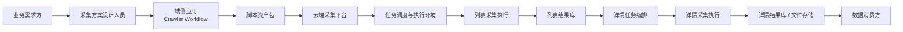

### 4.2 五层职责模型

| 层级 | 主要职责 | 典型系统 |
| --- | --- | --- |
| 需求定义层 | 定义采集目标、字段、范围、时效 | 业务方、产品、运营 |
| 采集设计层 | 设计工作流、验证逻辑、生成脚本 | 本应用 |
| 资产与任务管理层 | 管理脚本版本、任务定义、任务调度 | 云端采集平台 |
| 执行层 | 实际运行列表脚本和详情采集任务 | 执行环境 |
| 数据沉淀与消费层 | 落盘数据、归档日志、供下游使用 | 数据库、对象存储、BI、业务系统 |

---

## 5. 用户角色与核心需求

### 5.1 角色划分

| 角色 | 核心目标 | 主要关注点 |
| --- | --- | --- |
| 业务需求方 | 获取目标站点数据 | 数据完整性、时效性、准确率 |
| 产品经理/采集策略人员 | 把采集目标变成可执行方案 | 字段、频率、范围、异常边界 |
| 采集研发 | 快速落地与验证采集逻辑 | 选择器、分页、脚本、执行结果 |
| 平台研发 | 建设稳定的云端任务平台 | 版本管理、任务状态、调度、治理 |
| 运维/实施人员 | 保证任务持续运行 | 成功率、告警、重试、资源 |
| 数据消费方 | 使用最终数据 | 数据表结构、质量、可用性 |

### 5.2 需求分层

从产品线角度看，用户需求通常会分成四类：

1. 采集定义需求：采什么、从哪采、采哪些字段
2. 执行治理需求：多久采一次、失败怎么处理、谁审批发布
3. 数据结果需求：数据写到哪里、怎么查、给谁用
4. 运营保障需求：如何监控、如何追责、如何快速修复

---

## 6. 从需求到数据落盘的完整业务链路

### 6.1 全链路总流程

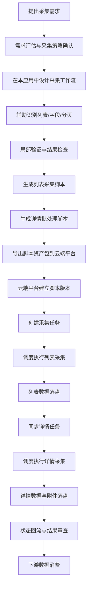

### 6.2 业务链路分阶段解释

#### 阶段一：需求进入

业务方提出采集需求，核心会明确以下内容：

- 目标网站或目标网址范围
- 希望采集的字段
- 是否需要翻页
- 是否需要进入详情页继续采集
- 数据频率与更新策略
- 数据最终的交付形态

#### 阶段二：采集方案设计

采集研发或策略人员在本应用中完成：

- 配置入口页
- 配置列表项选择器
- 配置字段提取规则
- 配置分页策略
- 配置输出方式
- 视情况生成详情批处理逻辑

#### 阶段三：脚本资产生成

本应用根据设计结果生成：

- 列表采集脚本
- 详情批处理脚本
- 相关 DSL、编排计划、输出契约等中间资产

#### 阶段四：云端任务管理

云端平台接收脚本资产后负责：

- 建立脚本版本
- 建立采集任务
- 绑定执行环境
- 配置执行频率、并发、超时、告警

#### 阶段五：执行与数据落盘

执行环境负责：

- 执行列表页脚本
- 输出列表结果
- 生成详情任务
- 调用详情采集 CLI
- 输出详情内容、附件、PDF、日志、状态

#### 阶段六：结果回流与数据消费

最终数据会进入：

- 结构化数据库
- 明细文件目录
- 对象存储
- 数据分析或业务使用系统

---

## 7. 本应用在完整产品线中的定位

### 7.1 本应用的职责

本应用在整个产品线中承担“采集设计中心”的角色，负责：

- 采集逻辑建模
- 采集方案验证
- 列表采集脚本生成
- 详情批处理脚本生成
- 脚本产物初步校验与保存
- 形成可交付给云端平台的采集资产包

### 7.2 本应用不承担的职责

本应用不负责：

- 脚本版本审批流
- 多任务统一管理
- 生产调度与资源编排
- 任务执行监控大盘
- 大规模失败重试编排
- 平台级租户与权限体系

### 7.3 本应用在产品线中的位置图

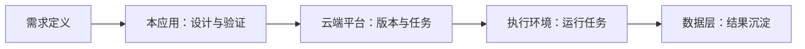

---

## 8. 云端平台的职责规划

云端平台是本方案中的“生产治理中枢”。

### 8.1 云端平台的核心职责

1. 管理脚本资产与版本
2. 管理采集任务与调度策略
3. 管理执行记录与任务状态
4. 管理失败重试、超时与告警
5. 管理数据结果与产物链接

### 8.2 云端平台功能模块划分

| 模块 | 主要职责 |
| --- | --- |
| 脚本资产中心 | 管理脚本内容、脚本版本、关联 DSL 与编排计划 |
| 任务定义中心 | 管理任务名称、目标站点、执行频率、环境配置 |
| 调度中心 | 定时/触发式调度任务 |
| 运行监控中心 | 跟踪运行状态、日志、告警、成功率 |
| 结果中心 | 管理输出数据表、详情产物路径、运行元数据 |
| 权限与审计中心 | 管理发布权限、修改记录、操作历史 |

### 8.3 云端平台总架构图

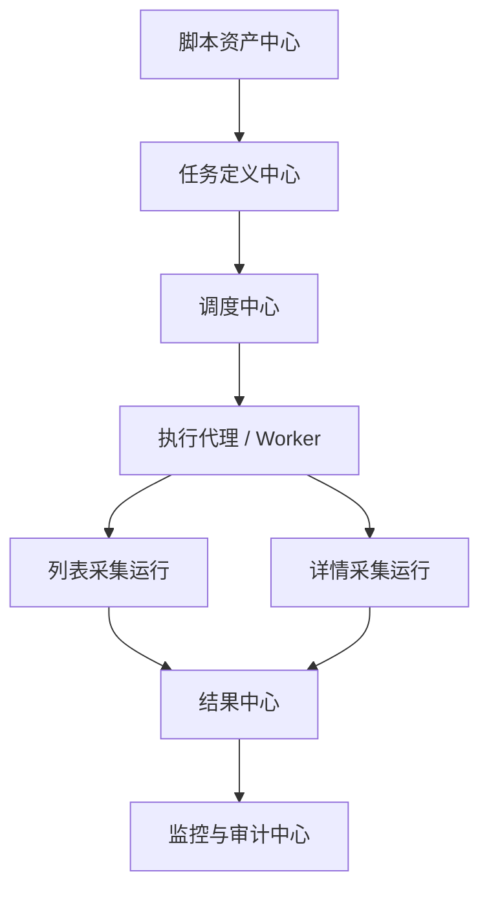

---

## 9. 脚本版本管理方案

这是云端平台最关键的职责之一。

### 9.1 为什么要做版本管理

如果云端平台只接收“最新一份脚本”，会导致：

- 不知道当前任务跑的是哪一版
- 无法回滚到历史稳定版本
- 出现异常时无法快速定位变更来源
- 无法审查脚本与采集逻辑是否一致

### 9.2 版本管理对象

平台应管理的并不只是脚本文本，还包括脚本背后的设计资产：

| 资产类型 | 说明 |
| --- | --- |
| 列表采集脚本 | 主执行脚本 |
| 详情批处理脚本 | 详情任务编排脚本 |
| Workflow Graph | 原始工作流 DSL |
| Compile Plan | 确定性计划 |
| Prompt / Effective Prompt | 生成上下文 |
| 输出契约 | 数据表、字段与输出模式 |
| 详情任务契约 | `detail_url`、任务表、CLI 配置 |

### 9.3 版本生命周期

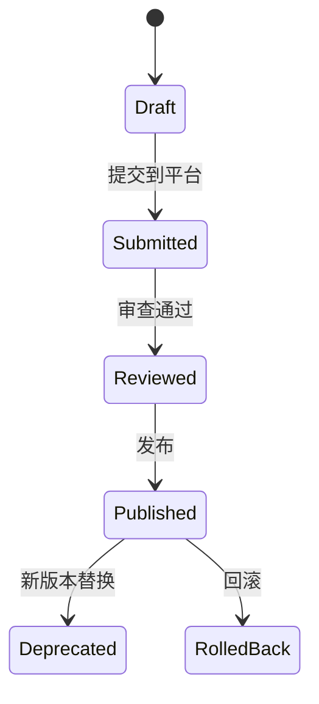

### 9.4 建议的版本字段

| 字段 | 说明 |
| --- | --- |
| `asset_id` | 资产唯一标识 |
| `asset_type` | `list_crawler` / `detail_batch_runner` |
| `version` | 版本号 |
| `status` | 草稿、待审、已发布、已废弃 |
| `workflow_graph` | 原始 DSL |
| `compile_plan` | 编译计划 |
| `script_content` | 脚本内容 |
| `created_by` | 创建人 |
| `source_app` | 来源端侧应用 |
| `change_summary` | 变更摘要 |
| `warnings` | 已知风险 |
| `published_at` | 发布时间 |

---

## 10. 采集任务管理方案

### 10.1 任务管理的目标

平台应把“脚本资产”与“任务实例”分开管理：

- 资产回答“怎么采”
- 任务回答“什么时候采、在哪采、由谁采、采多少次”

### 10.2 任务对象分层

| 层级 | 说明 |
| --- | --- |
| 任务模板 | 绑定某个脚本版本与默认执行策略 |
| 任务实例 | 某次真实执行记录 |
| 子任务 | 详情采集、分页采集、分片任务等更细粒度执行单元 |

### 10.3 任务生命周期

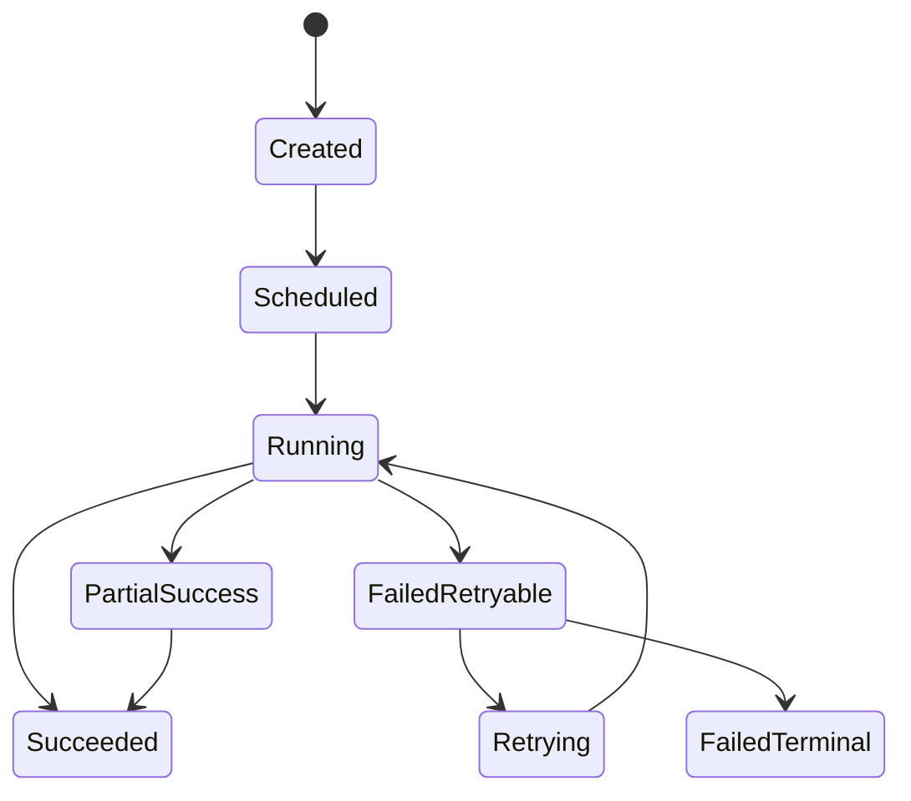

### 10.4 任务定义关键字段

| 字段 | 说明 |
| --- | --- |
| `task_id` | 任务定义 ID |
| `asset_version_id` | 绑定脚本版本 |
| `target_scope` | 目标网址或目标站点范围 |
| `schedule_type` | 手动、定时、事件触发 |
| `cron_or_policy` | 调度规则 |
| `execution_env` | 执行环境标识 |
| `timeout_policy` | 超时策略 |
| `retry_policy` | 重试策略 |
| `result_sink` | 数据落盘位置 |
| `notification_policy` | 告警配置 |

---

## 11. 从端侧到云端的交接机制

### 11.1 交接对象不是脚本文件，而是资产包

建议本应用向云端平台交付“任务资产包”。

### 11.2 资产包结构建议

```json
{
  "asset_bundle_id": "bundle_xxx",
  "list_crawler_asset": {
    "workflow_graph": {},
    "compile_plan": {},
    "script_content": "",
    "script_filename": "crawler.py",
    "output_contract": {}
  },
  "detail_batch_asset": {
    "script_content": "",
    "script_filename": "run_detail_batch.py",
    "detail_contract": {}
  },
  "metadata": {
    "source_app": "crawler-workflow",
    "created_by": "user_xxx",
    "created_at": "2026-05-06T00:00:00Z"
  }
}
```

### 11.3 交接时序图

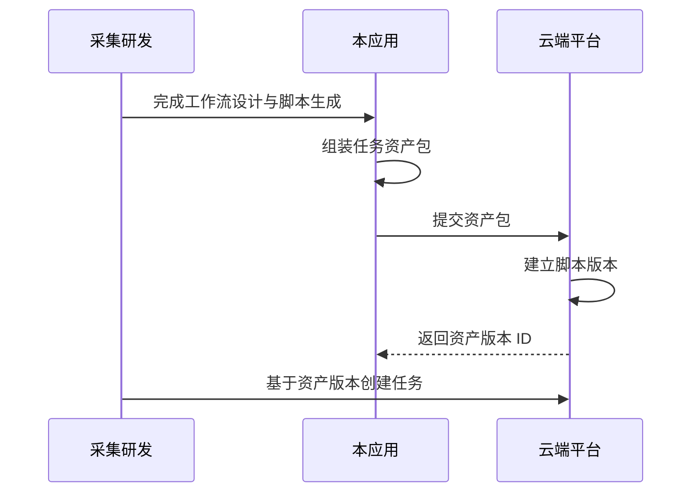

---

## 12. 列表采集执行链路

### 12.1 列表采集在产品线中的作用

列表采集承担两个角色：

1. 输出业务关注的基础数据
2. 为详情采集提供任务源

### 12.2 列表采集时序图

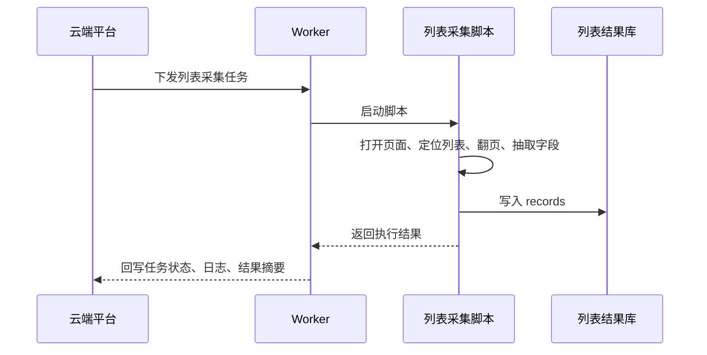

### 12.3 列表落盘建议

列表采集结果建议至少包含：

- 业务字段
- `record_id`
- `source_url`
- `detail_url`
- `crawl_run_id`
- `emitted_at`
- `asset_version_id`

这样后续详情任务与数据审计都能追溯。

---

## 13. 详情采集执行链路

### 13.1 详情采集在产品线中的作用

详情采集不是列表脚本的附属步骤，而是完整产品线中的第二阶段采集任务体系。

### 13.2 详情采集全链路

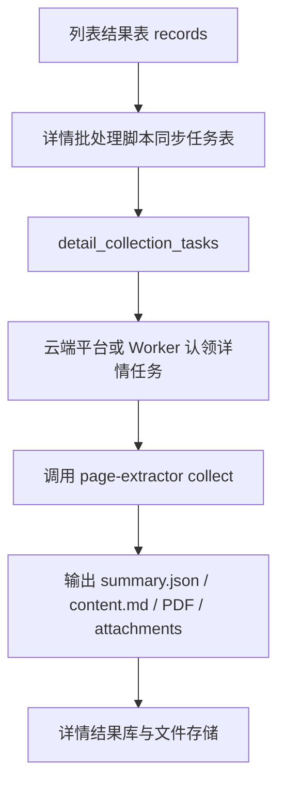

### 13.3 详情采集时序图

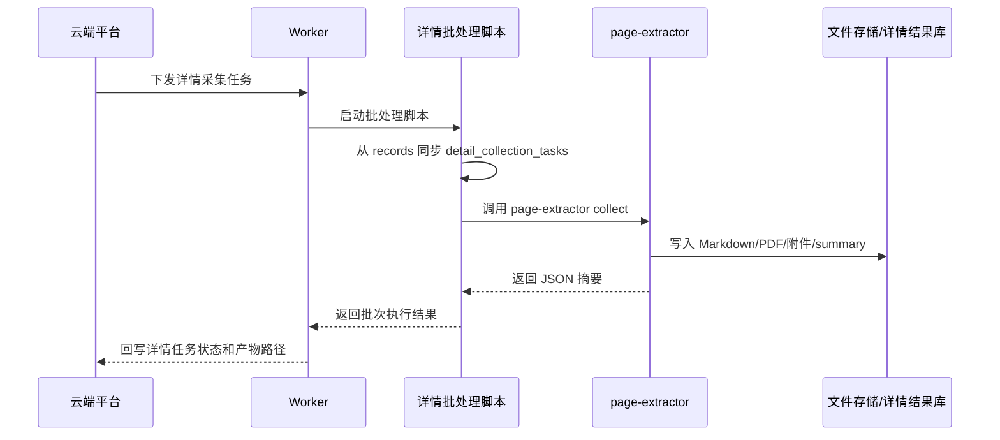

---

## 14. 失败重试与异常治理

完整产品线如果没有异常治理，就无法进入稳定生产。

### 14.1 异常分类

| 异常类型 | 示例 | 建议处理方式 |
| --- | --- | --- |
| 输入错误 | URL 无效、字段缺失 | 终态失败 |
| 页面结构变化 | 选择器失效、分页失效 | 告警并进入人工修复 |
| 临时网络问题 | 请求超时、连接失败 | 自动重试 |
| 运行资源问题 | Worker 退出、浏览器崩溃 | 平台重试与转移执行环境 |
| 详情页异常 | PDF 失败、附件下载失败 | 记录部分成功或可重试失败 |

### 14.2 重试流程图

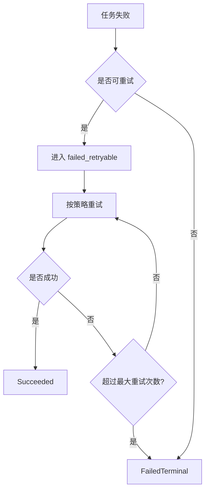

### 14.3 平台应具备的治理能力

- 失败原因分类
- 自动重试策略
- 人工介入机制
- 版本回滚机制
- 站点级异常监控

---

## 15. 数据落盘与数据资产模型

数据落盘是这条产品线的最终核心目标之一。

### 15.1 数据落盘分层

| 数据层 | 内容 |
| --- | --- |
| 列表结果层 | `records`、运行元数据 |
| 详情任务层 | `detail_collection_tasks` |
| 详情内容层 | 正文、Markdown、PDF、附件 |
| 运行审计层 | 任务状态、日志、执行轨迹 |

### 15.2 推荐的数据沉淀结构

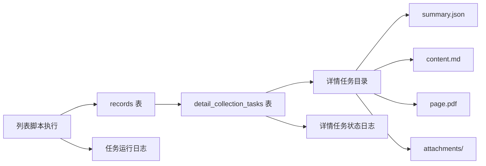

### 15.3 数据模型建议

#### 列表结果表

建议包含：

- 业务字段
- `record_id`
- `source_url`
- `detail_url`
- `run_id`
- `asset_version_id`
- `emitted_at`

#### 详情任务表

建议包含：

- `task_id`
- `record_id`
- `detail_url`
- `status`
- `attempt_count`
- `batch_run_id`
- `started_at`
- `completed_at`
- `error_code`
- `error_message`
- `result_summary_path`
- `content_markdown_path`
- `pdf_snapshot_path`
- `attachments_dir`

#### 详情结果文件

建议沉淀：

- 结构化摘要
- 可阅读正文
- 可审计附件
- 任务级日志

---

## 16. 下游数据消费链路

完整产品线的终点不是“脚本成功执行”，而是“数据可被真正使用”。

### 16.1 数据消费方向

| 消费方 | 使用方式 |
| --- | --- |
| 业务系统 | 读取结构化数据 |
| 分析平台 | 做统计、报表、监控 |
| 人工运营 | 查看详情正文、附件、PDF |
| 质量审计人员 | 检查日志、状态、异常样本 |
| 二次处理系统 | 继续做清洗、归一化、入仓 |

### 16.2 消费链路图

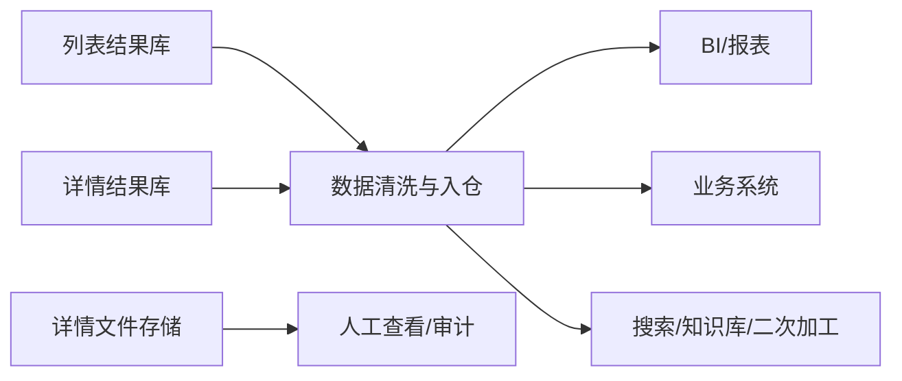

---

## 17. 当前已实现能力与目标产品线能力的关系

### 17.1 当前已实现

当前基于代码已经具备的能力：

- 端侧工作流设计与 DSL 管理
- 选择器、字段、分页辅助能力
- 节点级/子流级验证
- 列表脚本生成
- 列表输出到 SQLite/JSON
- 详情批处理脚本生成
- `page-extractor` 详情页采集 CLI

### 17.2 目标产品线中的补齐部分

为形成完整产品线，还需要云端平台补齐：

- 脚本资产版本管理
- 脚本发布与回滚
- 任务定义与调度
- 运行监控与告警
- 结果回流与统一审计
- 多任务与多环境治理

### 17.3 现状与目标态关系图

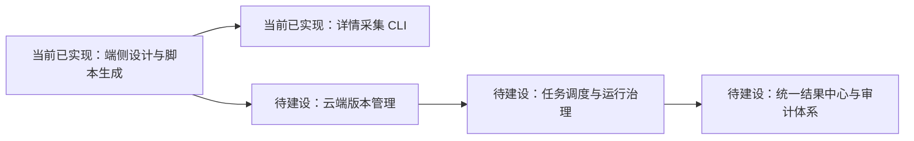

---

## 18. 完整产品线的建议分工

### 18.1 责任矩阵

| 能力 | 本应用 | 云端平台 | 执行环境 | 数据层 |
| --- | --- | --- | --- | --- |
| 采集逻辑设计 | 负责 | 不负责 | 不负责 | 不负责 |
| 工作流验证 | 负责 | 不负责 | 不负责 | 不负责 |
| 列表脚本生成 | 负责 | 不负责 | 不负责 | 不负责 |
| 详情批处理脚本生成 | 负责 | 不负责 | 不负责 | 不负责 |
| 脚本版本管理 | 输出资产 | 负责 | 不负责 | 不负责 |
| 任务调度 | 不负责 | 负责 | 配合执行 | 不负责 |
| 任务运行 | 不负责 | 编排 | 负责 | 不负责 |
| 结果落盘 | 定义契约 | 追踪 | 执行写入 | 负责承载 |
| 结果消费 | 不负责 | 提供入口 | 不负责 | 支撑消费 |

### 18.2 最推荐的协同原则

1. 本应用不要演化成调度平台
2. 云端平台不要重建一套工作流设计器
3. 采集资产必须同时保留“脚本”和“设计上下文”
4. 任务实例状态必须能回溯到脚本版本
5. 数据结果必须能回溯到任务实例与资产版本

---

## 19. 推荐的产品定义

如果要对整条产品线做统一对外表达，建议定义为：

> 一套覆盖采集需求建模、端侧工作流设计、脚本资产生成、云端任务治理、执行落盘与数据消费的完整网页采集产品线。

其中：

- 本应用是“设计与资产生成入口”
- 云端平台是“版本与任务治理中枢”
- 执行环境是“任务执行引擎”
- 数据层是“结果沉淀与消费底座”

---

## 20. 文档结论

这条完整产品线的真正价值，在于把采集过程拆解成一条清晰、可治理、可追踪的生产链：

1. 需求被结构化表达
2. 方案在本应用中被设计和验证
3. 脚本在云端平台中成为可管理资产
4. 任务在平台中被调度与治理
5. 数据在执行后稳定落盘并进入后续消费链路

从这个角度看，本应用并不是独立产品的终点，而是整条采集产品线的起点与设计中枢；云端平台不是简单的执行壳，而是脚本资产管理与任务治理的核心；而最终目标也不是“生成了脚本”，而是“稳定地产出可消费的数据资产”。

这也是完整产品线规划的核心结论。
