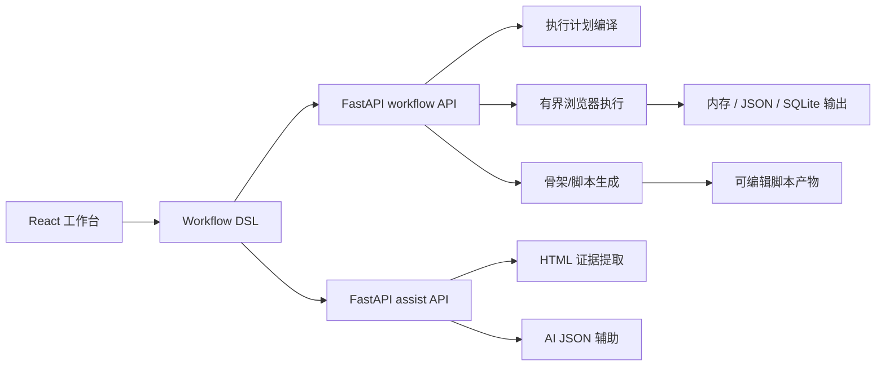
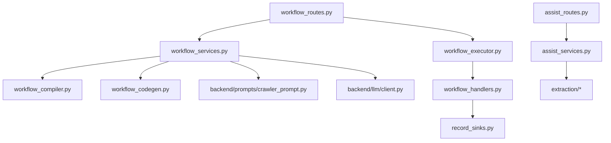
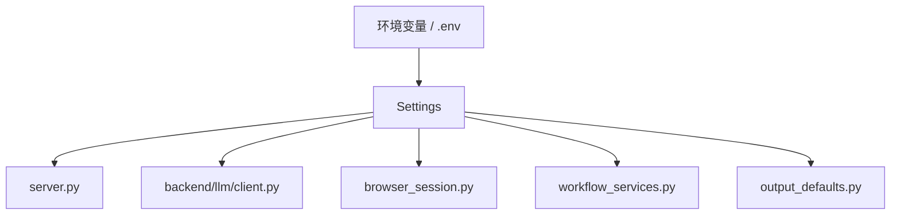
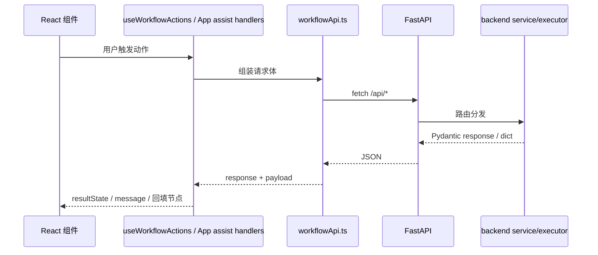
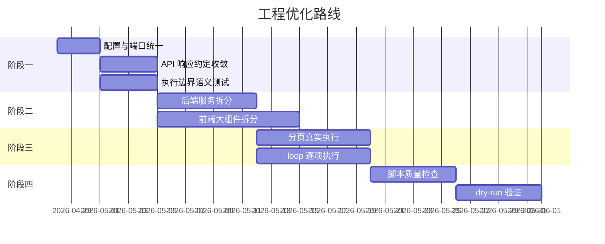

# 工程精细复盘诊断与优化规划

## 1. 复盘口径

本文基于当前工作区文件与代码实现进行诊断，覆盖以下维度：

- 项目文件架构
- 功能模块拆解
- 可配置项归集
- 前后端通讯设计
- 运行时执行模型
- 测试与质量保障
- 文档与工程治理
- 自上而下的优化方案

当前工作区存在较多未提交改动，因此本文只评价“当前文件系统中的工程状态”，不尝试判断这些改动是否已经进入某个稳定分支。

## 2. 总体判断

`crawler-workflow` 已经从早期原型演进为一个功能闭环较完整的“可视化爬虫工作流工作台”。它的主链路清晰：



当前工程的优势是“功能链路已经跑通，关键能力已有测试托底”；主要短板是“模块体量与职责仍偏重，配置入口分散，部分产品语义尚未完全落到运行时”。因此它不是一个需要推倒重来的项目，而是一个进入“架构收敛、契约固化、运行语义补齐”阶段的项目。

## 3. 综合评分

| 维度 | 评分 | 判断 |
| --- | ---: | --- |
| 项目文件架构 | 7.2 / 10 | 分层已形成，但仍有大文件和历史残留 |
| 功能模块拆解 | 6.8 / 10 | 主职责拆开了，服务层与辅助层仍偏重 |
| 可配置项治理 | 6.0 / 10 | 配置可用，但来源分散且缺少统一配置模型 |
| 前后端通讯设计 | 7.3 / 10 | API 面清晰，前端请求封装仍可进一步类型化 |
| 运行时执行模型 | 6.7 / 10 | 有界执行、安全意识较好，但分页和循环语义未闭环 |
| 脚本生成链路 | 7.5 / 10 | compile plan、skeleton、LLM 生成链路完整 |
| 测试与质量保障 | 7.4 / 10 | 后端测试较厚，前端以状态/service 测试为主 |
| 可观测性与诊断 | 6.6 / 10 | 已有审计日志，但缺少结构化运行报告与日志治理策略 |
| 文档与上手体验 | 8.0 / 10 | 文档已收敛，仍需随代码继续维护 |
| 生产化成熟度 | 5.8 / 10 | 适合设计、验证、导出脚本，距离生产调度平台仍有距离 |

综合评分：**6.9 / 10**

一句话结论：当前工程已经具备继续迭代的坚实基础，但下一阶段的核心不是继续堆功能，而是把“图、执行、配置、产物、通讯契约”稳定下来。

## 4. 文件架构诊断

### 4.1 当前结构

```text
crawler-workflow/
├── server.py
├── backend/
├── frontend/
├── docs/
├── tests/
├── static/
├── templates/
└── logs/
```

### 4.2 结构优点

- 后端已按 workflow、assist、executor、compiler、codegen、sink 拆分。
- 前端已从单文件原型演进为 `components / hooks / services / state` 结构。
- `extraction/` 与 `prompts/` 已从后端服务中独立出来，边界意识较好。
- `docs/` 已经重新整理为当前文档、示例资产与历史归档。
- 测试目录覆盖了 API、service、executor、assist、record sink、前端状态等关键点。

### 4.3 结构问题

| 问题 | 证据 | 影响 |
| --- | --- | --- |
| 大文件仍较多 | `App.tsx` 985 行、`workflow_services.py` 962 行、`assist_services.py` 930 行、`ResultDetails.tsx` 845 行、`PropertyPanel.tsx` 721 行 | 局部改动容易影响整条链路，新人阅读成本高 |
| 历史目录仍有存在感 | `templates/`、`static/`、`guide.md` 仍在根目录；`.factory/` 已确认移除 | 容易让人误判系统形态，需继续说明或清理 |
| 生成物与运行物容易进入工作区 | `logs/`、`__pycache__/`、`tests/.tmp/` 在文件系统中可见 | 虽然 `.gitignore` 已覆盖部分路径，但仍会干扰仓库感知 |
| `pyproject.toml` 仍引用 `demo` | `py-modules = ["llm_client", "server", "demo"]`，而当前根目录已无 `demo.py` | 包配置与真实文件不一致 |

## 5. 功能模块拆解诊断

### 5.1 后端模块图



### 5.2 模块拆解优点

- `workflow_executor.py` 已经不再独自承担全部逻辑，图遍历、orchestration、handler 和 response helper 已拆出。
- `record_sinks.py` 将持久化输出从节点处理器中隔离出来，方向正确。
- `workflow_compiler.py` 将 graph 转 plan 的职责集中起来，为脚本生成提供了稳定中间层。
- `workflow_codegen.py` 负责确定性骨架生成，避免所有脚本产物都依赖 LLM。
- `assist_routes.py` 与 `workflow_routes.py` 分面清楚，用户操作路径易理解。

### 5.3 模块拆解问题

| 模块 | 当前问题 | 优化方向 |
| --- | --- | --- |
| `workflow_services.py` | 同时包含校验、legacy 转换、prompt 组装、脚本格式化、保存、LLM draft/review/revision | 拆成 `validation`、`prompting`、`script_artifacts`、`generation_pipeline` |
| `assist_services.py` | JSON repair、启发式分页恢复、HTML 解析、LLM 调用、session 获取混在同一文件 | 拆成 `assist/json_protocol.py`、`assist/pagination_recovery.py`、`assist/orchestrator.py` |
| `App.tsx` | 顶层状态、布局、assist 联动、prompt 草稿、节点操作仍集中 | 继续下沉到 hooks，如 `useAssistActions`、`usePromptWorkspace`、`useWorkbenchLayout` |
| `PropertyPanel.tsx` | 8 类节点配置表单堆在一个组件中 | 拆为 `node-editors/OpenPageEditor` 等节点编辑器 |
| `ResultDetails.tsx` | 脚本工作区、prompt 工作区、记录、日志、诊断集中 | 拆为 artifact view 组件 |

## 6. 可配置项归集诊断

### 6.1 当前配置来源

| 配置类型 | 当前位置 | 示例 |
| --- | --- | --- |
| 后端启动端口 | `server.py` | 默认 `8000` |
| 前端开发代理 | `frontend/vite.config.ts`、`frontend/.env.development` | 默认代理到 `8090` |
| LLM 配置 | `.env`、环境变量、`backend/llm/client.py` | `API_BASE_URL`、`API_TOKEN`、`MODEL_NAME` |
| 脚本生成 token | `workflow_services.py` | `SCRIPT_GENERATION_MAX_TOKENS=12000` |
| 输出默认值 | `backend/output_defaults.py` | `memory`、`output/crawler_output.json` |
| 浏览器 session TTL | `backend/browser_session.py` | `600s` |
| 执行边界 | `workflow_executor.py`、前端 action payload、节点配置 | `max_steps`、`max_items`、`max_pages` |
| 前端本地状态 | `App.tsx`、`promptDrafts.ts` | layout、prompt drafts |

### 6.2 主要问题

1. 前端代理默认 `8090`，后端默认 `8000`，新同学按 README 启动后可能遇到请求打不到后端。
2. LLM provider、模型、base URL、token 的读取集中在 `backend/llm/client.py`，但仍应继续通过统一 settings 对象约束边界。
3. 执行边界同时存在于节点数据、前端 action payload、后端 `ExecutionContext`，缺少统一优先级说明。
4. 输出默认值已有独立模块，但脚本生成 prompt 中仍有局部 fallback 字符串，需要继续收敛。
5. `.env` 仅被自定义加载器读取，没有 Pydantic settings 或类似结构来做类型校验。

### 6.3 建议配置模型

建议引入 `backend/core/settings.py`，把配置收束为明确对象：



优先收敛字段：

- `BACKEND_HOST`
- `BACKEND_PORT`
- `BROWSER_HEADLESS`
- `BROWSER_SESSION_TTL_SECONDS`
- `LLM_PROVIDER`
- `API_BASE_URL`
- `API_TOKEN`
- `MODEL_NAME`
- `SCRIPT_GENERATION_MAX_TOKENS`
- `SCRIPT_REVIEW_MAX_TOKENS`
- `DEFAULT_OUTPUT_MODE`
- `DEFAULT_OUTPUT_DIR`

## 7. 前后端通讯设计诊断

### 7.1 当前通讯路径

前端通过 `frontend/src/services/workflowApi.ts` 统一封装基础 `fetch`，再由 `useWorkflowActions.ts` 和 `App.tsx` 调用不同 API。



### 7.2 设计优点

- API 路径分为 `/api/workflows/*` 和 `/api/assist/*`，职责清晰。
- 前端有统一的 `postWorkflowAction` / `postAssistAction`，不是散落在每个组件中。
- workflow action 的结果统一归入 `ResultState`，结果区能根据 action 自动选择脚本、prompt、记录、日志或诊断。
- 后端大多数接口都有 Pydantic request/response 模型。

### 7.3 通讯问题

| 问题 | 影响 | 建议 |
| --- | --- | --- |
| 前端请求体在 `useWorkflowActions.ts` 中通过条件表达式拼装 | action 增多后难以维护 | 建立 action registry：`action -> path + buildPayload + preferredTab` |
| 前端只手写了 TS 类型，未由后端 schema 生成 | 前后端契约可能漂移 | 中期引入 OpenAPI type generation 或共享 schema 生成 |
| 成功/失败状态混合 `HTTP status` 与 `success=false` | 前端分类需要同时判断 response.ok、payload.success、partial、session_expired | 统一响应 envelope |
| assist 回填逻辑集中在 `App.tsx` | AI 辅助动作扩展时会继续膨胀 | 下沉为 `useAssistActions` |
| 前端代理端口与 README 后端端口不一致 | 开箱启动体验受影响 | 统一默认端口或在 README 明确代理配置 |

## 8. 运行时执行模型诊断

### 8.1 当前优势

- 使用 `run_blocking()` 将 Playwright sync API 串行到固定线程，避免页面对象跨线程使用。
- session 已经是“共享 browser 进程 + 独立 context”，隔离语义较清晰。
- `ExecutionContext` 有 `max_steps`、`max_items`、`max_pages` 等边界。
- 循环图通过 fingerprint 判断状态是否推进，减少死循环风险。
- `test-node` 与 `test-subflow` 面向调试场景，返回结构化 logs、node_results、records。

### 8.2 当前短板

| 短板 | 说明 |
| --- | --- |
| `paginate` 还不是完整翻页执行器 | 当前只检查 selector 是否存在 |
| `loop` 还不是 item 级调度器 | 当前只写入 loop 状态，未驱动下游逐项执行 |
| `condition advanced` 暂无真实高级表达式引擎 | 前端可选项比后端能力更超前 |
| `max_pages` 没有贯穿真实翻页执行 | 目前更多影响 plan、prompt、配置展示 |
| 执行结果没有 run store | 当前更像一次性调试响应，不是可查询的任务记录 |

## 9. 测试与质量保障诊断

### 9.1 当前测试亮点

- `tests/test_workflow_api.py` 和 `tests/test_workflow_services.py` 覆盖面较广。
- `tests/test_workflow_executor.py` 覆盖了有界执行、循环、防重入、emit_record、SQLite 输出等关键路径。
- `tests/test_assist_services.py` 覆盖了 LLM JSON 输出修复与分页启发式回退。
- 前端已有 `workflowState`、`workflowApi`、`promptDrafts`、`workflowNodePlacement` 等纯逻辑测试。

### 9.2 测试缺口

| 缺口 | 风险 |
| --- | --- |
| 前端组件交互测试较少 | PropertyPanel、ResultsPanel、ResultDetails 的复杂交互缺少直接保障 |
| 端到端 smoke 测试缺少固定入口 | 无法自动验证“启动前后端 -> 点击主流程”的真实链路 |
| 脚本生成的结构化质量检查仍偏薄 | 生成脚本是否可运行、是否满足输出约束，主要靠局部测试和 prompt 约束 |
| 配置一致性测试缺失 | 端口、代理、默认输出、LLM 配置容易漂移 |
| 大文件拆分没有配套边界测试 | 重构时容易破坏隐含行为 |

## 10. 待优化项总表

| 编号 | 优先级 | 待优化项 | 主要收益 |
| --- | --- | --- | --- |
| O-01 | P0 | 统一后端端口与前端代理默认值 | 改善开箱体验，减少启动误判 |
| O-02 | P0 | 修正 `pyproject.toml` 中已不存在的 `demo` 引用 | 消除包配置漂移 |
| O-03 | P0 | 明确并测试 `max_items / max_pages / max_steps` 优先级 | 稳定执行边界语义 |
| O-04 | P0 | 建立统一 API response envelope 约定 | 降低前端结果分类复杂度 |
| O-05 | P0 | 清理或归位运行生成物：`logs/`、`__pycache__/`、`tests/.tmp/` | 保持仓库整洁 |
| O-06 | P1 | 拆分 `workflow_services.py` | 降低后端主服务复杂度 |
| O-07 | P1 | 拆分 `assist_services.py` | 降低 AI 辅助链路复杂度 |
| O-08 | P1 | 下沉 `App.tsx` 中的 assist、layout、prompt hooks | 降低前端顶层组件体量 |
| O-09 | P1 | 拆分 `PropertyPanel.tsx` 为节点编辑器 | 提升节点配置迭代效率 |
| O-10 | P1 | 拆分 `ResultDetails.tsx` 为产物视图组件 | 提升脚本/prompt/记录/日志工作区可维护性 |
| O-11 | P1 | 引入 `backend/core/settings.py` | 统一配置读取和校验 |
| O-12 | P1 | 为 workflow action 建立前端 action registry | 统一 path、payload、结果偏好 |
| O-13 | P1 | 补齐前端组件级测试 | 防止 UI 复杂交互回归 |
| O-14 | P2 | 将 `paginate` 落实为真实翻页执行器 | 让 DSL 执行语义与产品语义一致 |
| O-15 | P2 | 将 `loop` 落实为 item 级 orchestration | 支持更真实的列表逐项流程 |
| O-16 | P2 | 引入 OpenAPI 类型生成或契约测试 | 降低前后端契约漂移 |
| O-17 | P2 | 建立脚本产物质量检查管线 | 提升生成脚本可交付性 |
| O-18 | P2 | 引入运行记录 store | 支持结果复查、失败定位、未来任务化 |
| O-19 | P3 | 完整 checkpoint / resume | 支持生产运行恢复 |
| O-20 | P3 | 多浏览器 worker / 队列化调度 | 支持更高并发与生产执行 |

## 11. 自上而下优化方案

### 阶段一：工程基线收敛

目标：先消除最容易影响开发体验和契约判断的问题。

建议任务：

1. 统一前后端默认端口。
2. 修正 `pyproject.toml` 中的历史引用。
3. 建立统一配置对象。
4. 固化 API response envelope。
5. 增加配置一致性测试。
6. 明确执行边界优先级。

验收标准：

- 按 README 启动前后端即可直接请求成功。
- 所有 workflow / assist API 的错误形态可被前端统一分类。
- `max_items / max_pages / max_steps` 在文档和测试中有一致语义。

### 阶段二：模块复杂度治理

目标：把高频变更区从大文件拆成稳定小模块。

建议任务：

1. 拆分 `workflow_services.py`。
2. 拆分 `assist_services.py`。
3. 拆分 `App.tsx` 的 layout、assist、prompt hooks。
4. 拆分 `PropertyPanel.tsx` 的节点编辑器。
5. 拆分 `ResultDetails.tsx` 的产物视图。

验收标准：

- 新增一个节点时，不再需要同时阅读多个 700 行以上文件。
- 新增一个 assist action 时，不再继续扩大 `App.tsx`。
- 前端主要复杂组件有组件级或行为级测试。

### 阶段三：执行语义补齐

目标：让产品语义、DSL 语义和执行器语义真正一致。

建议任务：

1. 将 `paginate` 从 selector smoke check 升级为真实翻页执行。
2. 将 `loop` 从状态节点升级为 item 级调度节点。
3. 明确 `condition advanced` 是否要支持；若支持，建立表达式 AST 或安全解释器。
4. 将 `max_pages` 与真实翻页绑定。
5. 为分页、循环、条件补集成测试。

验收标准：

- `test-subflow` 能真实执行多页列表采集。
- `loop` 下游节点能按 item 上下文执行。
- 条件分支行为可预测、可测试、可文档化。

### 阶段四：脚本产物生产化

目标：让生成脚本从“可预览”走向“可交付”。

建议任务：

1. 建立生成脚本语法检查。
2. 建立 skeleton 与 LLM 脚本的结构一致性检查。
3. 建立 SQLite / JSON 输出契约检查。
4. 增加低页数、低条数的 dry-run 验证。
5. 将 `pro` 模式的 review 结果展示得更结构化。

验收标准：

- 生成脚本至少能通过语法检查。
- 输出模式为 SQLite 时，脚本中确实保留 SQLite helper 与 upsert 逻辑。
- 结果区能明确展示生成质量、警告、review 摘要。

### 阶段五：生产运行能力

目标：从工作台式设计与验证，逐步走向可恢复、可追踪、可调度的运行平台。

建议任务：

1. 引入 run store。
2. 引入 checkpoint 表和 resume 策略。
3. 区分调试 session 与生产 run。
4. 引入队列或 worker 模型。
5. 增加运行报告与审计查询。

验收标准：

- 可以查看历史 run 的状态、日志、产物与错误。
- 中断后可基于 checkpoint 恢复。
- 浏览器资源可控，不依赖单个同步执行线程承担所有任务。

## 12. 推荐优先级路线图



日期只是相对排期锚点，真正执行时应按团队节奏调整。

## 13. 最建议先做的 10 件事

1. 把前端代理默认端口从 `8090` 对齐到后端默认 `8000`，或在启动文档中明确 `8090` 的服务来源。
2. 移除 `pyproject.toml` 中的 `demo` 模块引用。
3. 新建 `backend/core/settings.py`，先承接 LLM、端口、session TTL、脚本 token 上限。
4. 给 `workflowApi.ts` 增加 action registry，替代 `useWorkflowActions.ts` 中的长条件表达式。
5. 给 API 响应定义统一 envelope，并给前端结果分类补测试。
6. 拆出 `useAssistActions`，把 `App.tsx` 中的 assist 逻辑移走。
7. 拆出 `PropertyPanel` 的 8 个节点编辑器。
8. 为 `ResultDetails` 拆出 `ScriptArtifactView` 与 `PromptArtifactView`。
9. 给 `paginate` 真实执行前先补一个“当前只 smoke check”的锁定测试。
10. 建一个 `tests/test_configuration_contract.py`，锁定端口、输出默认值、支持节点类型和 action path 的一致性。

## 14. 结论

当前工程的主线是健康的：产品心智已经明确，后端 API 和前端工作台已经形成闭环，测试也足够支撑下一轮重构。真正需要警惕的是“功能继续增长时，大文件和隐式契约会放大成本”。下一阶段应优先做配置、契约和模块边界治理，再补齐分页、循环、产物质量和生产运行能力。

只要按阶段推进，这个项目可以比较自然地从“可视化设计与验证工具”升级为“可交付脚本生成平台”，再逐步走向“可运行、可恢复、可审计的采集系统”。
