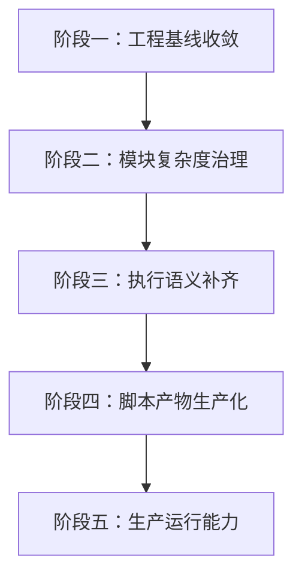

# 优化改造实施细案

## 1. 实施原则

本计划承接 `engineering-diagnosis-and-optimization-plan.md`，把其中的优化项拆成可执行批次。执行时遵循四个原则：

1. 先稳工程基线，再动核心语义。
2. 先做可测试的小改动，再做大模块拆分。
3. 每个阶段都要有明确验收命令。
4. 文档、测试、代码一起推进，避免新一轮漂移。

## 2. 总体阶段



## 3. 阶段一：工程基线收敛

目标：让项目启动、配置、契约和基本验证路径稳定下来。

### 任务 1：统一配置入口

状态：已完成并验收。

当前改动：

- 新增 `backend/core/settings.py`
- 将后端默认端口、浏览器 headless、session TTL、LLM provider、模型配置、脚本生成 token 上限统一收束到 `CrawlerWorkflowSettings`
- 保持“环境变量优先，其次 `.env`，最后内置默认值”的读取顺序

验收：

```bash
.venv\Scripts\python.exe -m pytest tests\test_configuration_contract.py -q
```

### 任务 2：统一前后端默认端口

状态：已完成并验收。

当前改动：

- 后端默认端口仍为 `8000`
- 前端 Vite 代理默认值改为 `http://127.0.0.1:8000`
- `frontend/.env.development` 同步改为 `8000`

验收：

```bash
python server.py
cd frontend
npm run dev -- --host 127.0.0.1 --port 3101
```

### 任务 3：清理失效包配置

状态：已完成并验收。

当前改动：

- 移除 `pyproject.toml` 中已不存在的 `demo` 模块引用

验收：

```bash
.venv\Scripts\python.exe -m pytest tests\test_configuration_contract.py -q
```

### 任务 4：统一 API 响应约定

状态：已完成并验收。

当前落地：

1. 新增 `backend/core/api_response.py`，统一 `success`、`error_code`、`error`、`data`、`warnings`、`meta`。
2. workflow / assist 业务接口均返回纯 envelope，不再在顶层混放领域字段。
3. `RequestValidationError` 也进入统一 envelope，校验明细放入 `meta.detail`。
4. 前端 `frontend/src/services/workflowApi.ts` 作为唯一拆包层，业务组件接收 `data` 内 payload。
5. 新增 `tests/test_api_envelope_contract.py`，并更新前端 service 测试。

验收：

```bash
.venv\Scripts\python.exe -m pytest tests\test_workflow_api.py tests\test_assist_services.py -q
cd frontend
npm run test -- services/workflowApi.test.ts
```

### 任务 5：明确执行边界优先级

状态：已完成并验收。

建议优先级：

1. 用户本次运行请求中的 boundary / request limit
2. 节点 data 中显式配置的 limit
3. 后端 settings 默认值

当前落地：

- `backend/core/settings.py` 新增 `default_max_steps`、`default_max_items`、`default_max_pages`
- `workflow_executor_helpers.py` 新增 test-node / test-subflow limit 解析 helper
- `test-subflow`：`boundary.max_*` > 节点 data limit > settings default
- `test-node`：请求显式 limit > 目标节点 data limit > settings default
- 多节点同类 limit 取最小正整数
- 已增加 `tests/test_workflow_executor.py` 边界优先级测试
- 已更新 `docs/product-guide.md` 与 `docs/technical-guide.md`

## 4. 阶段二：模块复杂度治理

目标：把高频变更区从大文件拆成职责明确的小模块。

状态：已开始实施。当前已完成领域支撑模块分层：

- 将 workflow 校验规则从 `workflow_services.py` 抽出到 `backend/workflows/validation.py`
- 将脚本格式化与保存从 `workflow_services.py` 抽出到 `backend/workflows/script_artifacts.py`
- 将 prompt 组装从 `workflow_services.py` 抽出到 `backend/workflows/prompting.py`
- 将 LLM 脚本生成 draft/review/revision 流水线从 `workflow_services.py` 抽出到 `backend/workflows/generation_pipeline.py`
- 将 assist JSON 协议基础工具从 `assist_services.py` 抽出到 `backend/assist/json_protocol.py`
- 将 assist 分页 prompt 与启发式恢复从 `assist_services.py` 抽出到 `backend/assist/pagination_recovery.py`
- 将配置、日志、统一 API envelope 归入 `backend/core/`

### 后端拆分顺序

1. `workflow_services.py`
2. `assist_services.py`
3. `workflow_handlers.py`

建议拆分目标：

- `backend/workflows/validation.py`（已落地）
- `backend/workflows/prompting.py`（已落地）
- `backend/workflows/generation_pipeline.py`（已落地）
- `backend/workflows/script_artifacts.py`（已落地）
- `backend/assist/json_protocol.py`（已落地）
- `backend/assist/pagination_recovery.py`（已落地）

### 前端拆分顺序

1. `App.tsx`
2. `PropertyPanel.tsx`
3. `ResultDetails.tsx`

建议拆分目标：

- `frontend/src/workbenchDefaults.ts`（已落地，承接 palette、初始 graph、默认节点数据和 layout 读取）
- `hooks/useWorkbenchLayout.ts`（已落地）
- `hooks/useAssistWorkbenchActions.ts`（已落地）
- `hooks/usePromptWorkspace.ts`（已落地）
- `components/node-editors/BasicNodeEditors.tsx`（已落地）
- `components/node-editors/ExtractFieldEditor.tsx`（已落地）
- `components/node-editors/*`（继续承接 condition、emit_record 等后续拆分）
- `components/result-artifacts/*`

## 5. 阶段三：执行语义补齐

目标：让产品语义、DSL 语义和运行时语义一致。

优先级建议：

1. 补齐 `paginate` 真实翻页执行。
2. 补齐 `loop` 逐项执行上下文。
3. 决定 `condition advanced` 是否真正支持。
4. 将 `max_pages` 与真实翻页绑定。

验收重点：

- 多页子流程能真实采集记录。
- loop 下游节点拿到明确的 item 上下文。
- 条件分支有可预测、可测试的表达式语义。

## 6. 阶段四：脚本产物生产化

目标：让生成脚本从“可预览”走向“可交付”。

建议任务：

1. 对生成脚本执行 Python 语法检查。
2. 检查脚本是否保留执行计划中的字段 schema。
3. 检查 JSON / SQLite 输出约束。
4. 增加低页数 dry-run 验证。
5. 将 `pro` 模式 review 结果结构化展示。

## 7. 阶段五：生产运行能力

目标：从工作台式验证走向可恢复、可追踪、可调度的运行系统。

建议任务：

1. 引入 run store。
2. 引入 checkpoint / resume。
3. 区分调试 session 与生产 run。
4. 增加运行报告与审计查询。
5. 规划 worker / queue 模型。

## 8. 当前第一批改造清单

本轮已经启动以下改造：

- 新增统一 settings 入口
- 接入 `server.py`
- 接入 `browser_session.py`
- 接入 `workflow_services.py`
- 接入 `llm_client.py`
- 前端代理默认端口对齐到 `8000`
- 清理 `pyproject.toml` 的 `demo` 引用
- 新增配置契约测试
- 按当前工程约定移除 `.factory` 本地自动化目录及其过期测试契约
- 收紧 assist JSON 默认 token 边界，同时为分页分析保留独立大证据包额度
- 修正显式 `session_id` 找不到时被静默新建 session 的问题
- 补齐 selector prompt 对 Playwright-only locator / XPath 的禁止约束
- 统一 workflow / assist API envelope，并将前端 service 作为唯一拆包层
- 明确执行边界优先级：请求 > 节点配置 > settings 默认值

当前验收结果：

```bash
.venv\Scripts\python.exe -m pytest tests -q
# 128 passed, 1 warning

cd frontend
npm run test -- workflowState.test.ts services/workflowApi.test.ts promptDrafts.test.ts workflowNodePlacement.test.ts
# 21 passed

cd frontend
npm run build
# build passed; Vite reports an existing large react-vendor chunk warning
```

后续推荐紧接着处理：

1. API 响应 envelope。
2. 执行边界优先级测试。
3. `App.tsx` 中 assist 逻辑拆出 `useAssistActions`。
