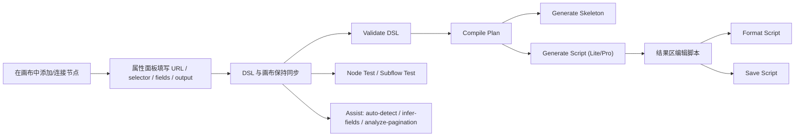
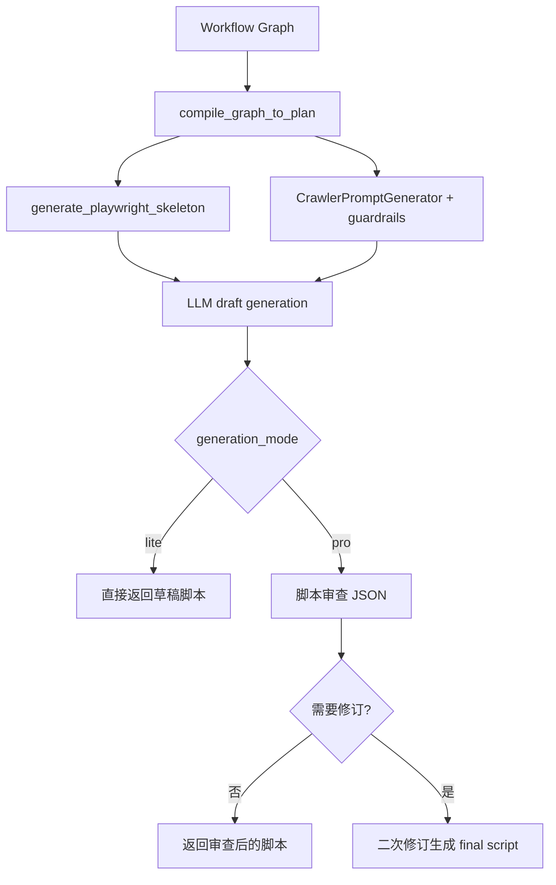

# Crawler Workflow 产品说明与快速掌握指南

## 1. 文档定位

这份文档面向两类读者：

- 想快速理解当前产品能力、知道这个系统今天能做什么的人
- 即将接手迭代开发、需要先建立正确产品心智模型的工程同学

本文**严格以当前代码实现为准**，不把历史规划稿和未来设想混进现状说明。

## 2. 当前产品一句话定义

`crawler-workflow` 是一个面向**列表型网页采集**的可视化工作台：用户用 DSL 图和 React 画布描述采集流程，后端提供受控浏览器测试、HTML/选择器辅助、执行计划编译，以及 Python Playwright 爬虫脚本生成。

## 3. 当前产品范围

### 已实现能力

- 可视化编辑工作流节点和连线
- DSL JSON 与画布双向同步
- 后端校验工作流图结构
- 生成确定性的执行计划（compile plan）
- 生成确定性的 Python Playwright 骨架脚本（generate skeleton）
- 通过 LLM 生成完整脚本（generate crawler）
- 在后端浏览器会话中执行 `test-node` / `test-subflow`
- 提供 `auto-detect`、`extract-html`、`infer-fields`、`optimize-selector`、`analyze-pagination`、`clean-data` 六类辅助能力
- 支持将 `emit_record` 输出到内存、JSON 文件或 SQLite
- 支持在前端结果区编辑、格式化、保存脚本
- 支持保存提示词草稿到浏览器本地存储

### 明确未完成或仅部分实现的能力

- 运行时分页目前只做**分页控件存在性检查**，不会在 `test-subflow` 中真实翻到下一页
- `loop` 节点当前只写入循环相关状态，并没有在执行器中形成真正的“逐条 item 驱动的子流程展开”
- 没有任务调度器、批量作业中心、分布式执行器
- 没有完整的 checkpoint resume 断点续跑体系
- 没有登录流程编排、账号池管理、代理池管理等生产级 crawler orchestration 能力

## 4. 用户完成一次采集设计的真实路径



## 5. 工作台结构

当前前端工作台是一个固定的多区工作台，而不是单页表单：

| 区域 | 当前职责 |
| --- | --- |
| 顶部工具栏 | 切换模式、打开工作区、发起验证/生成/测试动作 |
| 左侧节点面板 | 添加 8 种工作流节点 |
| 中央画布 | React Flow 图编辑、连线、自动布局、图健康提示 |
| 右侧属性面板 | 编辑节点配置，触发 AI 辅助动作 |
| 底部工作区 | 查看执行结果、日志、记录、诊断、脚本、提示词、DSL |

## 6. 当前支持的 8 种节点

### 节点总览

| 节点类型 | 产品含义 | 当前运行时真实行为 |
| --- | --- | --- |
| `open_page` | 打开目标入口页 | 调用浏览器会话导航到 URL |
| `select_list` | 定位页面上的重复列表项 | 统计匹配数并抽取样本 |
| `loop` | 配置循环上限与容错策略 | 当前仅设置循环相关状态 |
| `extract_field` | 从列表项中抽取字段 | 基于当前 `item_selector` 批量抽取记录 |
| `condition` | 条件分支 | 根据表达式结果选择 true/false/default 分支 |
| `paginate` | 分页节点 | 当前只检查分页选择器是否存在 |
| `emit_record` | 输出记录 | 返回新记录，并可写入内存/JSON/SQLite |
| `end` | 显式结束路径 | 设置结束标记，阻止继续入队后继节点 |

### `open_page`

当前主要配置项：

- `url`
- `max_pages`
- `max_steps`

产品含义是“采集从哪里开始”。当前后端验证要求必须存在且只能存在一个 `open_page` 节点。

### `select_list`

当前主要配置项：

- `item_selector`
- `max_items`

配套辅助动作：

- 自动检测列表
- 优化选择器
- 测试选择器

运行结果会包含：

- 匹配数量
- 样本项摘要

### `loop`

当前主要配置项：

- `max_items`
- `on_error` (`skip` / `stop`)

重要说明：

- 当前代码已经支持 `loop` 节点进入执行器
- 但它目前只把 `loop_bound`、`loop_on_error`、`loop_current_index` 写入执行上下文
- 当前 `extract_field` 仍然按 `item_selector` 对整批元素做抽取，所以 `loop` 还没有变成真正的逐项子流程控制器

这意味着：`loop` 现在更像是一个“已预留但未完全落地的控制节点”。

### `extract_field`

当前主要配置项：

- `fields[]`
  - `name` / `field_name`
  - `selector` / `css`
  - `type` / `extraction_type`
  - `sample_value`
  - `clean_data_type`
  - `normalized_sample`
- `html_fragment`

配套辅助动作：

- AI 推断字段
- 对每个字段执行样例值清洗

当前常见 `type` 值：

- `text`
- `attr:href`
- `attr:src`
- `attr:href:abs`
- `html`
- `all(text)`
- `all(@href)`

### `condition`

当前主要配置项：

- `condition`
- `expression_mode`

当前连线还支持编辑以下元数据：

- `branch`：`true` / `false` / `default`
- `label`
- `order`

重要说明：

- 当前执行器按**操作符在前**的格式解析表达式
- 可用操作符包括：`exists`、`not_exists`、`contains`、`not_contains`、`equals`、`not_equals`、`gt`、`lt`、`gte`、`lte`

因此当前更可靠的写法应是：

```text
exists title
contains category 仪表
gt price 0
```

而不是自然语言式的“字段在前”写法。

### `paginate`

当前主要配置项：

- `pagination_selector`
- `pagination_strategy`
- `max_pages`

当前前端支持的分页策略选项：

- `click_next`
- `infinite_scroll`
- `load_more`
- `none`

重要说明：

- 这些策略会进入执行计划和脚本生成链路
- 但在后端 `test-node` / `test-subflow` 运行时，`paginate` 当前只做“分页控件是否存在”的 smoke check
- 返回结果会明确标注 `limited to single-page testing`

### `emit_record`

当前主要配置项：

- `output_mode`
- `json_file_path`
- `sqlite_path`
- `sqlite_table`
- `write_mode`
- `dedupe_keys`
- `batch_size`

支持三种输出模式：

| 模式 | 当前行为 |
| --- | --- |
| `memory` | 只在执行结果里返回记录，不做持久化 |
| `json_file` | 写入项目目录内的 JSON 文件 |
| `sqlite` | 写入项目目录内的 SQLite 数据库 |

### `end`

`end` 节点没有复杂配置。它的作用是让路径显式结束，执行器收到后会把 `ctx.state["ended"]` 设为 `True`。

## 7. 前端动作与它们真正对应的后端能力

所有 workflow / assist 业务接口都返回统一 envelope：顶层包含 `success`、`error_code`、`error`、`data`、`warnings`、`meta`；实际业务结果在 `data` 内。前端 `workflowApi.ts` 统一拆包，因此画布、属性面板和结果区仍按领域 payload 工作。

| 前端动作 | 后端接口 | 作用 |
| --- | --- | --- |
| 校验 DSL | `/api/workflows/validate` | 校验图结构和节点必要字段 |
| 预览 Prompt | `/api/workflows/to-prompt` | 生成可编辑 prompt 和最终发送 prompt |
| 编排计划 | `/api/workflows/compile-plan` | 生成确定性执行计划 |
| 生成骨架 | `/api/workflows/generate-skeleton` | 生成非 LLM 的 Playwright 骨架脚本 |
| 生成爬虫脚本 | `/api/workflows/generate-crawler` | 用 LLM 生成完整脚本 |
| 节点测试 | `/api/workflows/test-node` | 执行前置节点 + 当前节点 |
| 子流测试 | `/api/workflows/test-subflow` | 有界执行指定子流程 |
| 自动检测列表 | `/api/assist/auto-detect` | 从页面自动推断列表、字段、分页候选 |
| 提取 HTML | `/api/assist/extract-html` | 提供字段推断、选择器优化、分页分析的 HTML 证据 |
| AI 推断字段 | `/api/assist/infer-fields` | 让模型返回字段列表 |
| 优化选择器 | `/api/assist/optimize-selector` | 让模型返回优化后的 CSS 选择器 |
| 分析分页 | `/api/assist/analyze-pagination` | 让模型判断分页策略和 next selector |
| 清洗样例值 | `/api/assist/clean-data` | 把样例值标准化成结构化值 |

## 8. 脚本生成链路

当前产品里，脚本生成并不是“只有一个按钮”这么简单，而是三层能力叠加：



### `lite` 模式

- 生成增强后的脚本草稿
- 不走 review / revision 阶段
- 返回速度更快

### `pro` 模式

- 先生成脚本草稿
- 再让模型输出结构化 review JSON
- 如果 review 认为仍需修订，再执行一次 revision pass

这也是当前“产品规划已经部分落到代码里”的一个关键点。

## 9. AI 辅助链路如何工作

前端的辅助操作并不是直接把 DOM 发给模型，而是先经过页面会话和 HTML 片段提取。


当前前端还维护一个 `assistSessionId`，用于在多次辅助操作之间复用最近一次辅助浏览器会话。

## 10. 输出与持久化

当前项目里有两类“产物输出”：

### 运行时记录输出

来自 `emit_record` 节点：

- `memory`
- `json_file`
- `sqlite`

### 脚本文件输出

来自结果区脚本工作区：

- 前端可编辑生成脚本
- 可调用后端格式化
- 可保存到项目内相对路径

## 11. 当前最适合的使用场景

- 商品列表页抓取
- 新闻/文章列表抓取
- 企业名录页抓取
- 分类页 + 翻页 + 字段抽取场景
- 需要先通过图形化工作台快速试错，再导出脚本的场景

## 12. 当前不宜高估的能力边界

下面这些点非常重要，接手开发时需要避免误判：

1. `paginate` 现在更像“分页配置节点 + 分页 smoke check 节点”，还不是完整翻页执行器。
2. `loop` 已被纳入模型、前端和执行器，但语义尚未闭环成真正的 per-item orchestration。
3. `condition` 节点可用，但表达式格式必须遵循当前解析器，而不是注释或自然语言想象。
4. SQLite 输出已经可用，但 resume / checkpoint 体系还没有真正实现到运行时。
5. 工作台适合“设计 + 验证 + 导出脚本”，还不是完整生产调度平台。

## 13. 执行边界如何生效

`test-node` 和 `test-subflow` 都是调试型、有界执行能力，不是无限制 crawler run。当前执行上限按以下顺序生效：

1. 用户本次测试请求里的 `max_items` / `max_steps` 或 `boundary.max_*`
2. 节点配置里的 `max_items` / `max_steps` / `max_pages`
3. 后端 settings 默认值

当多个节点声明同一种上限时，执行器采用最小正整数，优先保证测试过程可控。

## 14. 新同学的最短熟悉路径

建议按下面顺序进入项目：

1. 先读本文，建立当前产品边界。
2. 再读 `technical-guide.md`，理解 API、执行器、前端状态和脚本生成实现。
3. 打开 `docs/examples/workflows/eworldship_product_1772.json`，把它导入当前心智模型。
4. 运行前后端，实际点一遍 `Validate -> Compile Plan -> Generate Skeleton -> Test Subflow -> Generate Script`。
5. 若要改节点语义，再从技术文档的“迭代入口”部分进入代码。
