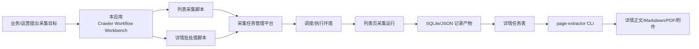
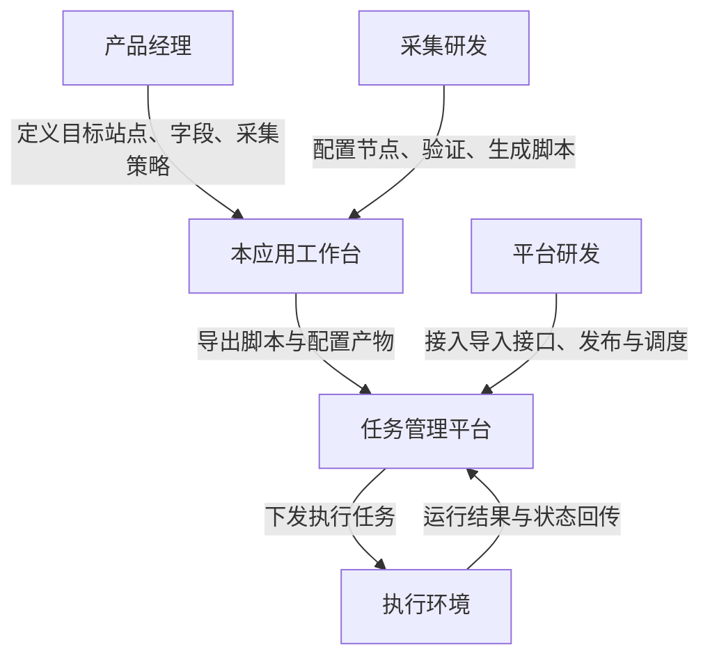
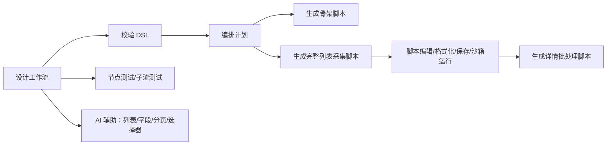
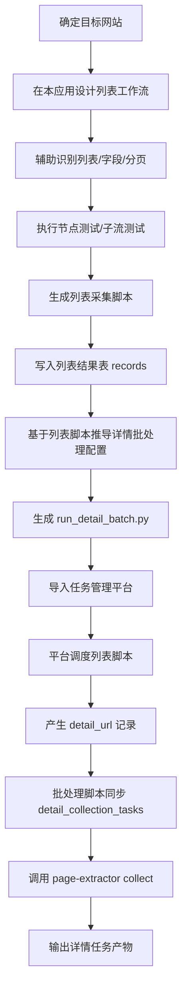
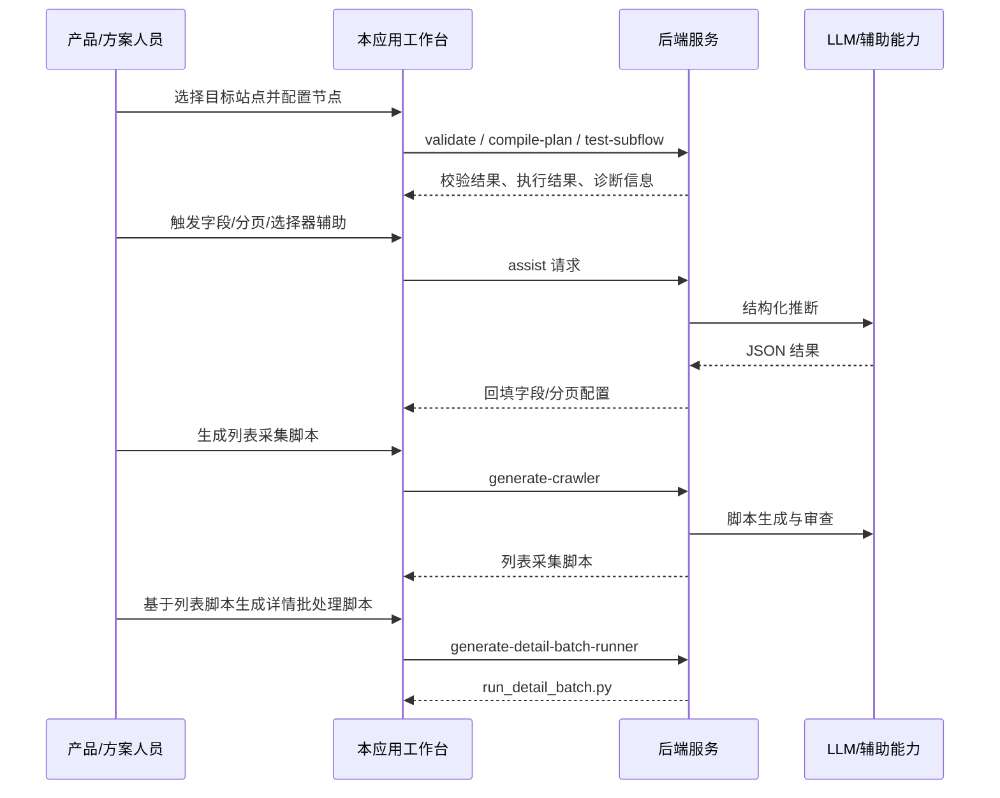
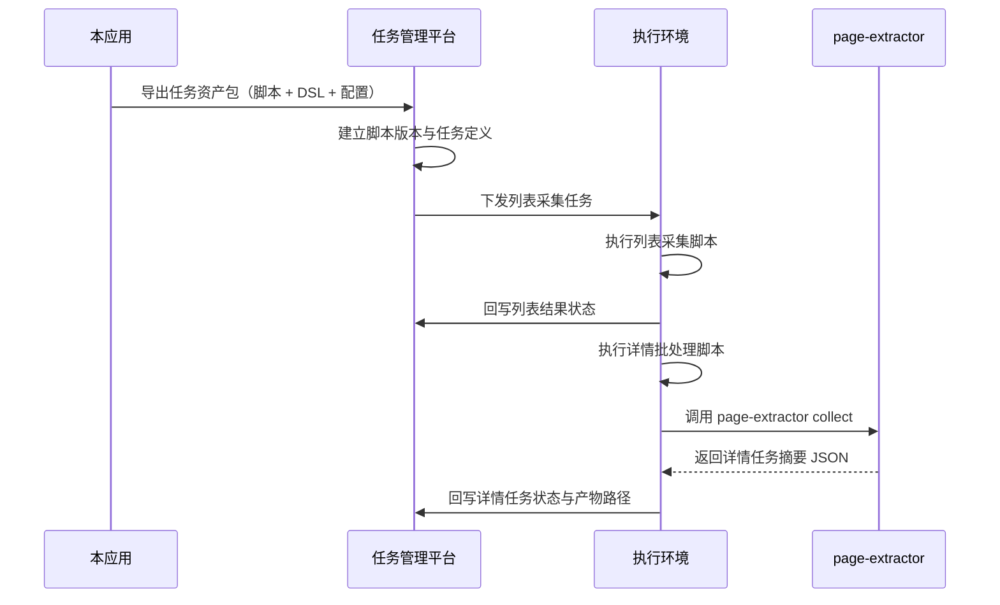

# 爬虫工作流产品规划说明

## 1. 文档定位

本文面向产品人员、项目协同方与技术团队，目标不是单纯介绍某个页面怎么点，而是把本工程放回完整产品线里，说明它承担的职责、上下游边界、当前能力闭环，以及未来与采集任务管理平台的协同方式。

本文有两个原则：

- 现状描述以当前代码实现为准
- 规划内容只讨论“本工程在整条产品线中的定位与协同边界”，不展开版本路线图

配套技术说明见：

- [技术开发说明](./technical-development-guide.md)

---

## 2. 一句话定义

`crawler-workflow` 是产品线中的“采集设计与脚本生成工作台”。

它不是最终的调度平台，也不是单纯的脚本仓库，而是把“目标站点理解、采集流程设计、局部验证、脚本生成、详情采集编排生成”集中在一个可视化端侧应用里，承担从采集意图到可执行脚本产物的转换职责。

---

## 3. 产品线全景

### 3.1 产品线中的核心环节

根据当前工程实现，可以把整条产品线理解为 5 个协作层：

1. 采集设计层：由本工程承担，负责工作流设计、辅助推断、脚本生成与验证
2. 产物交付层：由本工程产出列表采集脚本、详情批处理脚本及相关配置
3. 任务管理层：目标中的采集任务管理平台，负责管理目标网址、脚本版本、任务状态与执行策略
4. 执行编排层：由下游运行环境承担，负责执行列表脚本、触发详情任务、调用详情 CLI
5. 详情采集层：由 `page-extractor` 承担，负责单个详情页正文、PDF、附件等采集

### 3.2 产品线全局结构图

这张图里，本工程既不是末端执行器，也不是任务中台，而是把“采集需求”转成“可运行资产”的关键中间层。

---

## 4. 本工程在产品线中的定位

### 4.1 核心定位

本工程当前最适合定义为：

> 面向采集方案设计人员与研发协同人员的“采集工作流编排与脚本产物工厂”。

它解决的是三个问题：

1. 把网站采集逻辑从口头描述转成结构化工作流
2. 在真正进入任务平台前，先在受控环境里完成局部验证
3. 把工作流转成可交付给下游平台和执行环境的脚本产物

### 4.2 它在产品线里负责什么

本工程当前负责：

- 定义列表页采集流程
- 维护采集 DSL 与可视化画布
- 提供选择器、字段、分页等 AI 辅助
- 对工作流做结构校验与局部执行验证
- 生成列表页采集脚本
- 生成详情任务批处理脚本
- 为详情采集 CLI 提供上游编排脚本

### 4.3 它明确不负责什么

本工程当前不负责：

- 长周期任务调度
- 多任务队列管理
- 任务版本审批流
- 执行节点资源调度
- 代理池、账号池、验证码平台等生产运行体系
- 统一的任务监控大盘
- 多租户平台能力

也就是说，本工程是“设计与产出中心”，而不是“生产任务中台”。

---

## 5. 目标用户与角色分工

### 5.1 主要使用角色

| 角色 | 核心诉求 | 在本工程中的操作重点 |
| --- | --- | --- |
| 产品经理/采集策略人员 | 快速定义站点采集方案，明确可采字段和执行边界 | 关注工作流、字段、分页、导出产物 |
| 采集研发 | 把方案落成脚本并验证运行可行性 | 关注 DSL、执行结果、脚本生成与保存 |
| 平台研发 | 接收本工程产物并接入任务管理平台 | 关注接口、数据契约、产物结构 |
| 运营/实施人员 | 理解采集链路的责任归属 | 关注任务流转、输出物和异常边界 |

### 5.2 角色协同图

---

## 6. 当前产品能力全景

### 6.1 当前工作台已经覆盖的主链路

从当前前后端实现看，本工程已经形成一条相对完整的工作链：

这意味着本工程已经不是“只做 Prompt 调用的脚本生成器”，而是具备工作流建模、证据提取、执行验证和二级脚本生成能力的完整工具。

### 6.2 前端工作台的五个操作区

| 区域 | 产品职责 |
| --- | --- |
| 顶部工具栏 | 发起校验、编排、测试、脚本生成、布局整理 |
| 左侧节点面板 | 添加采集节点 |
| 中央画布 | 以工作流方式组织采集逻辑 |
| 右侧属性面板 | 编辑节点参数，触发 AI 辅助动作 |
| 底部结果工作区 | 查看脚本、提示词、记录、日志、诊断，并继续生成详情批处理脚本 |

### 6.3 已支持的核心节点

| 节点类型 | 业务含义 | 当前价值 |
| --- | --- | --- |
| `open_page` | 采集入口页 | 定义从哪个页面开始 |
| `select_list` | 列表项定位 | 定义采集对象集合 |
| `loop` | 列表循环控制 | 预留 item 级控制语义 |
| `extract_field` | 字段抽取 | 形成结构化记录 |
| `condition` | 条件分支 | 支撑简单规则判断 |
| `paginate` | 翻页控制 | 支撑分页配置与有限验证 |
| `emit_record` | 记录输出 | 把结果写入内存、JSON、SQLite |
| `end` | 显式终止 | 保证路径边界清晰 |

### 6.4 当前已内置的辅助能力

| 能力 | 作用 |
| --- | --- |
| 自动检测列表 | 自动识别列表选择器、字段候选、分页候选 |
| 提取 HTML 证据 | 为字段推断、分页分析、选择器优化提供上下文 |
| 推断字段 | 生成字段名、选择器和抽取类型建议 |
| 优化选择器 | 改善列表选择器质量 |
| 分析分页 | 推断分页策略与 next selector |
| 测试选择器 | 在当前页面上临时高亮匹配元素 |

---

## 7. 从业务目标到产品链路的完整串联

### 7.1 典型业务场景

最典型的场景是：

1. 业务方希望采集某个列表站点
2. 需要先抓取列表字段，例如标题、链接、价格、时间
3. 列表记录里包含详情页 URL
4. 还需要对详情页继续抓取正文、附件、PDF 等深层信息

对于这类场景，本工程不只是产出一段列表脚本，而是产品线中“列表采集设计入口 + 详情采集编排上游”。

### 7.2 完整业务链路图

### 7.3 用户操作链路

---

## 8. 产品链路中的关键产物

本工程最重要的价值，不是“保存了一个页面状态”，而是持续地产出可传递的资产。

### 8.1 产物类型

| 产物 | 来源 | 下游用途 |
| --- | --- | --- |
| Workflow Graph / DSL | 画布与 DSL 编辑器 | 复盘采集逻辑、二次编辑、版本化 |
| Compile Plan | 后端编译 | 作为生成脚本和审查的确定性中间层 |
| Prompt / Effective Prompt | Prompt 预览与草稿工作区 | 人工审阅、复用模型上下文 |
| 列表采集脚本 | `generate-crawler` | 交付任务平台执行 |
| 详情批处理脚本 | `generate-detail-batch-runner` | 交付任务平台进行详情任务编排 |
| 运行记录样本 | `test-node` / `test-subflow` | 验证字段与分页逻辑 |
| 输出记录表 | `emit_record` 的 JSON/SQLite | 作为详情采集任务的输入数据集 |

### 8.2 产物生命周期

---

## 9. 本工程与任务管理平台的协同边界

这是本文最重要的部分。

### 9.1 当前已实现的边界

当前代码层面，本工程与下游平台的实际边界是：

- 可以生成列表采集脚本
- 可以保存列表采集脚本到项目目录
- 可以生成详情批处理脚本
- 可以保存详情批处理脚本到项目目录
- 可以通过 SQLite 输出定义下游详情任务输入数据结构
- 可以提供详情采集 CLI 作为下游调用对象

但**当前尚未实现**：

- 直接把脚本推送到任务管理平台
- 平台侧的任务创建 API
- 脚本版本发布/回滚流程
- 平台执行状态回传到本工程

所以当前更准确的表述是：

> 本工程已经完成“可交付资产生成”，尚未完成“对任务平台的系统级发布集成”。

### 9.2 推荐的协同分工

| 环节 | 建议责任方 | 说明 |
| --- | --- | --- |
| 工作流设计 | 本工程 | 负责把采集方案转成 DSL 与脚本 |
| 脚本与配置产物生成 | 本工程 | 负责生成列表脚本和详情批处理脚本 |
| 脚本资产入库 | 任务平台 | 负责脚本版本、状态、发布策略 |
| 任务调度 | 任务平台 | 负责目标站点执行、批次控制、失败重试 |
| 详情 CLI 调用 | 执行环境/平台 | 调用 `page-extractor collect` |
| 结果归档 | 平台与存储层 | 负责统一管理执行记录与详情产物 |

### 9.3 推荐的交接对象

本工程导出到任务平台时，建议以“任务资产包”而不是“单纯脚本文本”作为交接对象。

建议至少包含：

| 字段 | 说明 |
| --- | --- |
| `asset_type` | `list_crawler` 或 `detail_batch_runner` |
| `asset_name` | 资产名称 |
| `entry_url` | 目标站点入口 URL |
| `workflow_graph` | 原始 DSL JSON |
| `compile_plan` | 编译计划 |
| `script_content` | 可执行脚本内容 |
| `script_filename` | 脚本文件名 |
| `generation_mode` | `lite` / `pro` / `skeleton_enhancement` |
| `output_contract` | 输出表名、字段名、SQLite/JSON 配置 |
| `detail_contract` | 详情任务表、详情 URL 字段、CLI 配置 |
| `warnings` | 已知限制或生成警告 |
| `created_from` | 来源工作流标识、时间戳、生成信息 |

### 9.4 推荐的集成闭环

### 9.5 最清晰的边界原则

为了避免系统边界混乱，建议坚持三条原则：

1. 本工程负责“设计正确”
2. 任务平台负责“投放正确”
3. 执行环境负责“运行正确”

这样可以避免把调度逻辑过早堆回本工程，也避免任务平台重新发明一套工作流设计器。

---

## 10. 当前能力闭环与能力缺口

### 10.1 当前已经闭环的部分

当前已形成闭环的能力：

- 列表页工作流建模
- 选择器、字段、分页辅助分析
- 节点级与子流级验证
- 列表页脚本生成
- 列表输出到 SQLite/JSON
- 详情批处理脚本生成
- 详情页单任务 CLI 采集

### 10.2 当前仍存在的缺口

当前仍未闭环的部分：

- 脚本直接导出到任务管理平台
- 任务资产版本化与审核
- 平台级任务状态反馈
- 生产级断点续跑体系
- 完整多页稳定翻页与复杂循环语义
- 大规模站点的运行治理能力

### 10.3 对产品认知非常关键的边界提示

以下几点需要在沟通中明确：

- 当前系统已经是“产品线中的前置设计器”，不是“生产调度平台”
- 当前详情采集已经有独立运行时 `page-extractor`，不是未来概念
- 当前详情批处理脚本已经能生成，但平台导入还需要额外建设
- 当前分页和循环语义已具备产品表达能力，但部分运行时能力仍在增强中

---

## 11. 为什么本工程是产品线中的关键一环

如果没有本工程，整条产品线会面临三个高成本问题：

1. 采集方案只能靠人工写脚本，需求理解和脚本实现之间没有结构化中间层
2. 平台只能接收脚本黑盒，缺少工作流、字段、分页等可解释资产
3. 列表采集与详情采集之间很难形成统一的设计与交付标准

本工程的真正价值，在于把“采集需求”沉淀成可复用、可验证、可交付的中间资产，进而让任务平台接收的是“被设计过的任务”，而不是“未经抽象的脚本片段”。

---

## 12. 建议的产品定义

如果要对外统一描述，建议把本工程定义为：

> 一个面向采集业务的可视化工作流设计与脚本生成工作台，负责将目标站点的列表采集逻辑、详情采集编排逻辑沉淀为可交付给任务管理平台的执行资产。

这个定义能同时覆盖：

- 它是端侧应用
- 它服务于采集脚本生成
- 它是完整产品线中的前置设计环节
- 它与任务平台之间是“资产交接关系”，不是“功能替代关系”

---

## 13. 文档结论

从产品线视角看，本工程承担的是“采集设计中枢”的角色：

- 向上承接业务采集目标
- 向内完成工作流建模、验证与脚本生成
- 向下向任务平台交付可运行资产
- 向详情采集运行时提供编排上游

因此，本工程的规划重点不应是把自己做成另一个调度平台，而应持续增强三类能力：

1. 采集方案表达能力
2. 产物标准化与可交付能力
3. 与任务平台之间的接口与边界清晰度

这三点一旦稳定，本工程就能长期作为整条采集产品线的设计入口和资产源头存在。
