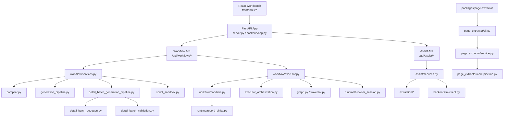
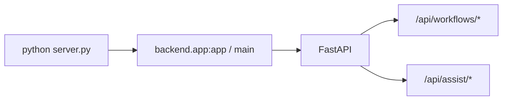
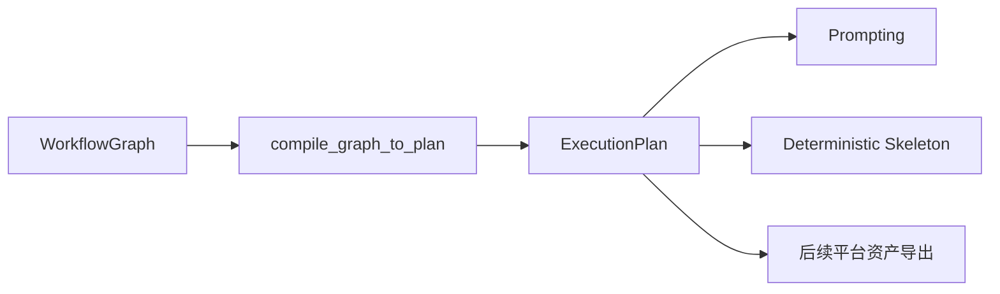
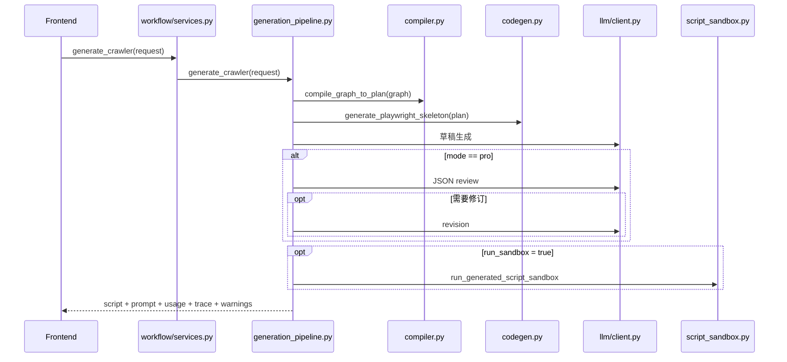
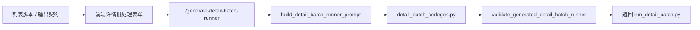
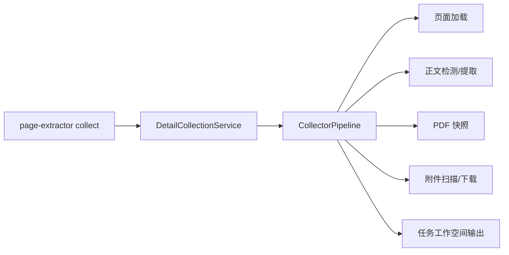

# 爬虫工作流技术开发说明

## 1. 文档定位

> 状态说明（2026-05-08 之后）：
> 本文部分章节仍保留旧执行器与后端浏览器会话描述，作为历史实现记录参考。
> 当前活跃架构以“前端直连 Browser Bridge 扩展 + 后端纯计算/LLM 接口”为准；
> `test-node` / `test-subflow`、后端 relay/session 中介链路已经退出主应用路径。

本文面向技术开发人员，目标是把当前工程的真实实现、模块职责、主链路时序、对外集成落点与扩展边界梳理清楚，帮助研发快速回答三个问题：

1. 这个工程现在到底做到了什么
2. 关键能力分别落在哪些模块里
3. 如果要接入任务管理平台，技术上应该从哪里衔接

本文同样遵循两个原则：

- 当前能力描述以代码实现为准
- 规划内容只讨论与产品线协同相关的技术落点，不写泛化路线图

配套产品说明见：

- [产品规划说明](./product-planning-guide.md)

---

## 2. 技术总览

### 2.1 当前系统的一句话架构

当前工程是一个“React 工作台 + FastAPI 服务 + 本地 Browser Bridge 扩展 + LLM 生成链 + 独立详情 CLI 子包”的采集工作流系统。

### 2.2 全局架构图



---

## 3. 工程目录与职责映射

### 3.1 顶层目录

| 路径 | 当前职责 |
| --- | --- |
| `server.py` | 根级兼容启动入口 |
| `backend/app.py` | FastAPI 应用创建、路由挂载、生命周期清理 |
| `backend/api/` | HTTP 路由层 |
| `backend/workflow/` | 工作流编译、执行、脚本生成、详情批处理生成 |
| `backend/assist/` | AI 辅助任务、JSON 协议、分页恢复策略 |
| `backend/extraction/` | 已移除；相关浏览器侧职责已迁移到前端与扩展 |
| `backend/runtime/` | 浏览器会话、阻塞桥接、记录落盘 |
| `backend/prompts/` | Prompt 规则、任务模板、组装器 |
| `backend/llm/` | OpenAI 兼容客户端 |
| `frontend/` | React 工作台 |
| `packages/page-extractor/` | 详情页采集 CLI 独立 workspace 包 |
| `tests/` | 后端与关键链路测试 |

### 3.2 一个容易忽视但很重要的事实

详情采集运行时不再是仓库根目录下的松散模块，而是已经进入 `uv workspace`：

- 根项目通过 `page-extractor` 依赖引用它
- 实际包路径在 `packages/page-extractor`

这意味着从技术边界上看，当前工程已经天然分成两层：

1. 主应用：工作流设计、验证、脚本生成
2. 子运行时：详情页 CLI 执行器

---

## 4. 服务入口与生命周期

### 4.1 启动入口

当前启动链路为：



`backend/app.py` 做了几件关键事情：

- 初始化日志
- 创建 `FastAPI(title="Crawler Workflow API")`
- 挂载 `/static`
- 注册 `workflow_router`
- 注册 `assist_router`
- 在生命周期结束时关闭浏览器会话和浏览器进程

### 4.2 生命周期清理

应用退出时会执行：

- `page_session_mgr.close_all()`
- `stop_browser()`

这保证了 Playwright 浏览器资源不会在服务停止后残留。

---

## 5. 前端工作台实现

### 5.1 工作台结构

前端主入口是 [App.tsx](/D:/WY-DATASETS/sea-data/frontend/src/app/App.tsx:1)。

它把工作台编排成三层：

1. 顶部工具栏
2. 中间三栏工作区
3. 底部抽屉式结果与 DSL 工作区

### 5.2 前端的真实主状态

前端维护的核心状态包括：

- `nodes` / `edges`
- `selectedNodeId`
- `dslText`
- `generationMode`
- `resultState`
- `assistSessionId`
- prompt 草稿状态
- 布局状态

### 5.3 画布与 DSL 双向同步

前端通过：

- `toCanonicalGraph()`
- `applyDslTextChange()`

维护画布图与 DSL 的双向同步关系。

这一层的意义很大，因为它让系统同时支持：

- 可视化编排
- 文本级 DSL 校对与编辑
- 基于 DSL 的后端统一契约

### 5.4 顶部工具栏的动作即系统主能力入口

当前工具栏动作来自 [WorkbenchToolbar.tsx](/D:/WY-DATASETS/sea-data/frontend/src/app/components/WorkbenchToolbar.tsx:1)：

| 动作 | 技术作用 |
| --- | --- |
| `validate` | 调后端校验图结构 |
| `prompt` | 预览 Prompt |
| `compile-plan` | 生成确定性执行计划 |
| `generate-skeleton` | 生成确定性骨架脚本 |
| `generate-script` | 生成完整列表采集脚本 |
| `auto-layout` | 仅前端自动布局 |

### 5.5 结果区已是“产物工作区”

`ResultsPanel.tsx` 和 `ResultDetails.tsx` 并不是简单调试面板，而是已经承载下列产物：

- 列表采集脚本
- Prompt 工作区
- 记录样本
- 执行日志
- 诊断 JSON
- 脚本格式化
- 脚本保存
- 手动脚本沙箱执行
- 详情批处理脚本生成、编辑、格式化、保存

这也是为什么从产品线角度，本工程已经具备“产物工厂”属性。

---

## 6. 后端 API 分层

### 6.1 Workflow API

路径前缀：`/api/workflows`

当前主要接口：

| 路径 | 作用 |
| --- | --- |
| `/validate` | 校验工作流图 |
| `/from-legacy-config` | 已弃用；仅保留旧配置转图兼容入口 |
| `/to-prompt` | 生成 Prompt |
| `/compile-plan` | 输出执行计划 |
| `/generate-skeleton` | 输出确定性骨架脚本 |
| `/generate-crawler` | 生成完整列表采集脚本 |
| `/generate-detail-batch-runner` | 生成详情批处理脚本 |
| `/run-script-sandbox` | 手动执行脚本沙箱 |
| `/format-script` | 格式化脚本 |
| `/save-script` | 保存脚本到项目目录 |

### 6.2 Assist API

路径前缀：`/api/assist`

当前主要接口：

| 路径 | 作用 |
| --- | --- |
| `/infer-fields` | LLM 字段推断 |
| `/optimize-selector` | LLM 选择器优化 |
| `/analyze-pagination` | LLM 分页分析 |

### 6.3 统一响应包装

前后端通过统一 envelope 交互：

```json
{
  "success": true,
  "error_code": null,
  "error": null,
  "data": {},
  "warnings": [],
  "meta": {}
}
```

前端在 [workflowApi.ts](/D:/WY-DATASETS/sea-data/frontend/src/services/workflowApi.ts:1) 中统一拆包。

这带来的好处是：

- 路由层可持续保持稳定
- 前端组件只关心 `data` 领域负载
- 失败类型可通过 `error_code` 稳定识别

---

## 7. Workflow 领域模型

### 7.1 核心图模型

定义位于 [schemas.py](/D:/WY-DATASETS/sea-data/backend/workflow/schemas.py:1)。

基础模型包括：

- `WorkflowGraph`
- `WorkflowNode`
- `WorkflowEdge`
- `NodeData`

支持的节点类型为：

- `open_page`
- `select_list`
- `loop`
- `extract_field`
- `condition`
- `paginate`
- `emit_record`
- `end`

### 7.2 节点数据模型的状态

当前实现处于“过渡中的强类型化”状态：

- 已引入 `OpenPageData`、`SelectListData`、`ExtractFieldData`、`PaginateData` 等专用模型
- 但 `WorkflowNode.data` 仍然使用兼容性较强的 `NodeData`

这意味着当前系统兼顾了：

- 旧 DSL 兼容
- 新字段约束逐步增强

### 7.3 详情批处理专用契约

`GenerateDetailBatchRunnerRequest` 已经把批处理生成所需的关键配置显式结构化：

- 数据库配置
- 详情任务表配置
- CLI 配置
- 执行策略
- 生成策略

这是未来接入任务平台时非常重要的技术资产，因为它已经天然适合变成平台级 API 契约。

---

## 8. 编译与计划生成链路

### 8.1 编译器职责

[compiler.py](/D:/WY-DATASETS/sea-data/backend/workflow/compiler.py:1) 把工作流图编译成确定性执行计划 `ExecutionPlan`。

主要输出：

- `entry_url`
- `node_types`
- `item_selector`
- `field_specs`
- `pagination`
- `output`
- `limits`
- `edges`
- `conditions`

### 8.2 为什么编译层很重要

这个编译层并不是多余中间态，而是后续多条能力线的共同输入：

1. Prompt 生成依赖它
2. 骨架脚本生成依赖它
3. 脚本审查依赖它
4. 未来任务平台资产导出也可以直接依赖它

### 8.3 编译链路图



---

## 9. 列表采集脚本生成链路

### 9.1 两层生成机制

列表脚本生成不是一次性 LLM 直出，而是“确定性骨架 + LLM 增强”的组合模式。

### 9.2 真实流水线



### 9.3 `lite` 与 `pro` 的差异

| 模式 | 行为 |
| --- | --- |
| `lite` | 草稿生成后直接返回 |
| `pro` | 草稿后增加 review；必要时再 revision |

### 9.4 兼容性保护

`generation_pipeline.py` 还做了一个很实用的保护：

- 对生成脚本进行 Playwright `ElementHandle.locator()` 兼容性扫描

这是一个非常产品化的技术细节，说明系统不是盲目生成，而是在主动规避当前平台中常见的错误代码形态。

### 9.5 脚本沙箱

[script_sandbox.py](/D:/WY-DATASETS/sea-data/backend/workflow/script_sandbox.py:1) 提供了受限的本地子进程沙箱：

- 独立运行目录
- 超时控制
- stdout/stderr 捕获
- JSONL 执行日志

它的目标不是做强安全隔离，而是为生成脚本提供快速验证能力。

---

## 10. 详情批处理脚本生成链路

### 10.1 这条链路为什么重要

这是当前工程区别于“普通列表脚本生成器”的关键能力。

系统不只生成列表采集脚本，还能基于列表产物的输出契约生成一个可执行的详情批处理编排脚本 `run_detail_batch.py`。

### 10.2 技术链路



### 10.3 两种生成模式

| 模式 | 说明 |
| --- | --- |
| `skeleton_enhancement` | 直接返回确定性脚本骨架 |
| `llm_skeleton_enhancement` | 先构建 prompt，再走 LLM 增强 |

### 10.4 详情批处理脚本的内部职责

当前 `detail_batch_codegen.py` 生成的脚本包含这些核心结构：

- `Config`
- `TaskRepository`
- `CliInvoker`
- `TaskRunner`
- `BatchExecutor`

脚本行为包括：

- 从列表结果表同步详情任务
- 维护 `detail_collection_tasks`
- 认领待执行任务
- 并发调用 `page-extractor collect`
- 记录成功、可重试失败、终态失败
- 汇总批次执行结果

### 10.5 为什么这条链很适合对接任务平台

因为它已经把“详情任务”抽象成了稳定的数据契约，而不是写死在应用内部逻辑里。

从平台对接角度看，这条链非常适合作为：

- 平台可托管的脚本资产
- 或者平台内部的参考执行器模板

---

## 11. Assist 辅助链路实现

### 11.1 整体思路

Assist 并不是直接把整页 DOM 粗暴丢给模型，而是分成三步：

1. 基于浏览器会话提取证据
2. 构造结构化 JSON 任务
3. 必要时做 JSON 修复与启发式回退

### 11.2 辅助链路图


### 11.3 JSON 协议的工程化处理

`assist/services.py` 做的不只是发请求，还包括：

- 抽取 JSON payload
- repair pass
- 分页语义空结果检测
- 启发式 fallback
- 指标埋点与质量审计

这意味着 Assist 已经不是轻量玩具功能，而是进入了有容错策略的生产前阶段。

### 11.4 会话复用

前端 `useAssistWorkbenchActions.ts` 维护 `assistSessionId`，多次辅助请求可以复用同一浏览器会话。

这带来两个好处：

- 减少重复打开页面
- 保持一次辅助流程中的页面上下文一致

---

## 12. 执行器与运行时语义

### 12.1 执行器模块拆分

当前执行器不是一个单文件，而是拆成多模块协作：

- `executor.py`
- `handlers.py`
- `executor_traversal.py`
- `executor_orchestration.py`
- `executor_helpers.py`
- `graph.py`

### 12.2 运行时上下文

`ExecutionContext` 维护：

- 浏览器会话
- 执行日志
- 节点结果
- 记录样本
- 执行计数
- 各类上限
- 图遍历状态

### 12.3 工作台验证能力的现状

工作台当前已不再通过后端 `test-node` / `test-subflow` 执行图运行验证。

当前保留的验证能力主要是：

| 能力 | 技术目的 |
| --- | --- |
| 选择器测试 | 通过本地扩展直接在当前活动标签页验证选择器与高亮 |
| HTML 证据提取 | 为字段推断、选择器优化、分页分析提供页面证据 |
| 分页分析 | 由前端提取证据，后端仅做纯 LLM 分析 |

### 12.4 节点语义总表

| 节点 | 当前处理行为 |
| --- | --- |
| `open_page` | 导航到 URL |
| `select_list` | 测试列表选择器并记录样本 |
| `extract_field` | 基于 `item_selector` 抽取记录 |
| `paginate` | 做真实但有界的点击/滚动分页推进确认 |
| `emit_record` | 输出到内存、JSON 或 SQLite |
| `loop` | 写入循环上下文 |
| `condition` | 白名单表达式求值 |
| `end` | 设置结束标记 |

### 12.5 关于分页语义的一个重要更新

相较于早期只做存在性检查的实现，当前 `handle_paginate()` 已经支持有限度的真实推进：

- `click_next`
- `load_more`
- `infinite_scroll`

它会：

- 记录分页前快照
- 点击或滚动
- 轮询页面变化
- 通过 URL、item_count、item_signatures 判断是否推进成功

这说明分页能力已经进入“有限真实执行”阶段，但仍然是调试型能力，不等同于生产级长链路翻页调度。

### 12.6 关于 `loop` 的状态

`loop` 节点当前已经能够写入：

- `loop_bound`
- `loop_on_error`
- `loop_current_index`

但 item 级完整子流程展开仍需继续增强，因此它仍属于“语义已建模、执行器仍在完善”的能力。

---

## 13. 浏览器会话与异步桥接

### 13.1 为什么存在 `run_blocking`

项目当前使用 Playwright sync API，因此浏览器相关任务通过 `run_blocking()` 串行化到固定线程执行，避免跨线程操作 page/context。

### 13.2 会话模型

当前浏览器会话特征：

- 浏览器进程级共享
- context 级隔离
- 每个 session 默认有一个 page
- TTL 清理

这非常适合：

- 辅助操作复用页面
- 节点测试复用当前状态
- 避免不同任务互相污染 cookie 和 sessionStorage

---

## 14. 记录输出与数据落盘

### 14.1 `emit_record` 的输出模式

由 [record_sinks.py](/D:/WY-DATASETS/sea-data/backend/runtime/record_sinks.py:1) 负责。

支持模式：

- `memory`
- `json_file`
- `sqlite`

### 14.2 路径安全

所有持久化路径会：

- 解析到项目根目录内
- 阻止越出 workspace
- 自动创建目录

### 14.3 SQLite 落盘特征

SQLite 输出具备：

- 自动推断列类型
- 元数据列补充
- 按 `_identity_key` 做主键级唯一性控制
- `append` / `upsert` 写入模式

### 14.4 为什么这对产品线重要

从产品线角度看，SQLite 输出并不只是“保存结果”。

它同时承担：

- 列表脚本执行结果的结构化存储
- 详情任务脚本的上游输入表
- 平台未来接入时的可观察中间态

---

## 15. `page-extractor` 详情 CLI 子系统

### 15.1 子系统定位

`packages/page-extractor` 是独立 CLI，不依赖主应用 UI。

它的定位是：

- 专注单个详情页采集
- 支持被批处理脚本调用
- 输出稳定的任务目录与 JSON 摘要

### 15.2 详情 CLI 技术结构



### 15.3 输出契约

每个详情任务会输出：

- `summary.json`
- `metadata.json`
- `content.md`
- `page.pdf` 可选
- `attachments/`
- `logs/collect.log`

CLI 标准输出也会打印任务摘要 JSON，这一点非常适合被批处理脚本或平台进程捕获。

### 15.4 技术边界

`page-extractor` 当前不负责：

- 从数据库取任务
- 任务队列调度
- 跨任务状态协调

这也再次印证了产品线边界：

- 任务管理平台负责管任务
- 批处理脚本负责编排任务
- `page-extractor` 负责执行单任务

---

## 16. 面向任务管理平台的技术对接落点

这是从研发协同角度最值得优先明确的部分。

### 16.1 当前可直接利用的技术资产

如果要对接任务平台，当前代码里已经有 4 类成熟资产可以直接利用：

1. 工作流 DSL
2. 编译计划 `ExecutionPlan`
3. 列表采集脚本
4. 详情批处理配置与脚本契约

### 16.2 推荐的对接层次

建议把平台接入拆成三个层次：

| 层次 | 推荐接入对象 | 原因 |
| --- | --- | --- |
| 设计资产层 | `WorkflowGraph` + `ExecutionPlan` | 平台可保留可解释的任务设计信息 |
| 执行资产层 | 列表脚本 + 详情批处理脚本 | 平台可直接发布与调度 |
| 输出契约层 | SQLite 表/字段配置 + CLI 配置 | 平台可理解脚本输出和详情任务依赖关系 |

### 16.3 推荐导出模型

从技术实现角度，建议平台导入接口至少支持：

```json
{
  "asset_type": "list_crawler",
  "entry_url": "https://example.com/list",
  "workflow_graph": {},
  "compile_plan": {},
  "script_content": "python code",
  "script_filename": "crawler.py",
  "output_contract": {
    "mode": "sqlite",
    "sqlite_path": "output/crawler_output.db",
    "sqlite_table": "records"
  },
  "detail_handoff": {
    "detail_url_field": "detail_url",
    "task_table_name": "detail_collection_tasks"
  }
}
```

对于详情批处理脚本，则可补充：

- `database.path`
- `database.list_table_name`
- `database.record_id_field`
- `detail_cli.executable`
- `execution_policy.default_concurrency`

### 16.4 推荐的最小集成顺序

技术上最稳妥的接入顺序是：


原因是：

- 列表脚本资产结构更稳定
- 详情任务表依赖列表输出表
- 状态回写需要平台模型先稳定

---

## 17. 测试分布与质量保障

### 17.1 后端测试重点

当前 `tests/` 已覆盖：

- API contract
- workflow services
- workflow executor
- record sinks
- auto detector
- html extractor
- detail CLI

### 17.2 详情 CLI 的测试意义

`tests/test_detail_cli.py` 已经验证了：

- 正常详情页采集
- 非法 URL 错误分支
- CLI JSON 摘要输出

这说明详情采集链不是纸面设计，而是已经进入可验证状态。

---

## 18. 当前技术边界与扩展入口

### 18.1 新增节点类型

至少需要同步更新：

- 前端类型定义
- 默认数据与属性面板
- 后端 schema
- validation
- compiler
- handler
- prompt 组装
- 测试

### 18.2 增强运行时分页

优先关注：

- `workflow/handlers.py`
- `workflow/executor_orchestration.py`
- `tests/test_workflow_executor.py`

### 18.3 增强详情任务平台集成

优先关注：

- `GenerateDetailBatchRunnerRequest`
- `detail_batch_codegen.py`
- `detail_batch_validation.py`
- 前端 `ResultDetails.tsx` 的详情批处理生成表单

### 18.4 增加平台导出 API

如果要在本工程内直接增加“导出到任务平台”，建议新增一层单独模块，而不是把逻辑混入 `save-script`：

- 新建 `backend/integration/` 或 `backend/platform_exports/`
- 抽象资产包组装器
- 保持 `workflow/services.py` 只负责任务生成，不直接承担平台适配

---

## 19. 研发接手时最容易误判的点

1. 这个项目不只是 LLM 生成脚本，它已经有执行器、持久化和详情 CLI 协同链。
2. 详情批处理脚本生成不是未来想法，而是已经进入前端结果区的真实功能。
3. `page-extractor` 不是主应用的一部分页面，而是独立运行时子包。
4. 当前分页能力已有真实推进检测，但仍然属于调试型受控执行。
5. 任务管理平台并不在当前仓库中，需要按“资产导出”思路接入，而不是把调度能力塞回工作台。

---

## 20. 技术结论

从技术实现角度看，当前工程已经形成四条清晰主链：

1. 工作流建模链：画布与 DSL 双向同步
2. 执行验证链：Playwright 会话 + 节点/子流调试
3. 列表脚本生成链：编译计划 + 骨架生成 + LLM 增强 + 可选沙箱
4. 详情采集编排链：批处理脚本生成 + `page-extractor` CLI 执行

因此，本工程在整条产品线中的技术定位可以定义为：

> 负责把采集设计信息标准化、把执行资产结构化，并为下游任务平台提供可导出的列表脚本资产、详情编排资产与输出契约。

如果后续要增强整条产品线，最值得保护的不是某个按钮或页面，而是这三层技术资产：

1. `WorkflowGraph` 与 `ExecutionPlan`
2. 列表采集脚本与详情批处理脚本
3. 列表输出表与详情任务表之间的契约关系

只要这三层保持稳定，本工程就能持续作为产品线里的设计源头和资产生成中心存在。
