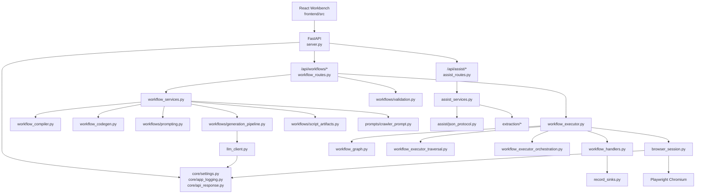
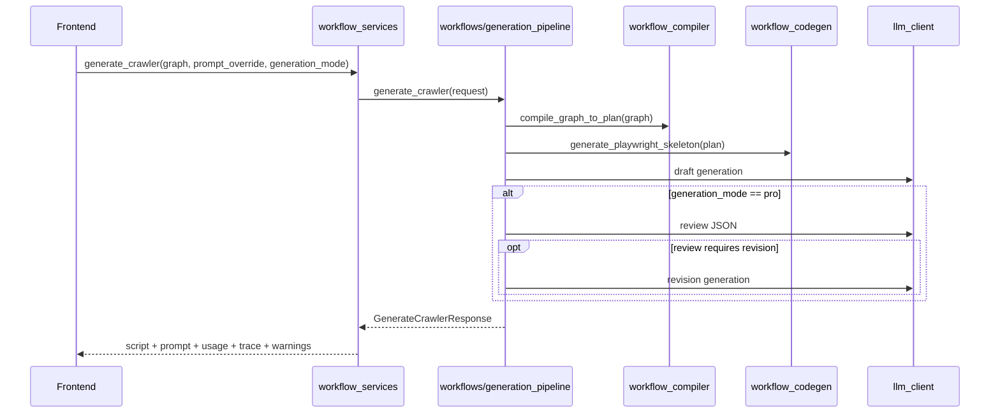

# Crawler Workflow 技术实现与迭代指南

## 1. 文档目标

这份文档描述当前仓库的**真实工程结构**、**模块职责**、**运行时行为**以及**后续迭代应从哪里入手**。它服务于以下场景：

- 新同学快速接手项目
- 需求评估时判断改动会落在哪些模块
- 迭代时避免把“历史规划”误当作“当前实现”

## 2. 工程总览



## 3. 顶层目录与职责

| 路径 | 当前职责 |
| --- | --- |
| `server.py` | FastAPI 入口、静态资源挂载、生命周期清理 |
| `backend/` | 工作流 API、辅助 API、执行器、浏览器会话、编译器、代码生成器、输出落盘 |
| `frontend/` | React 工作台、画布、属性面板、结果区、DSL 编辑器、前端 API 封装 |
| `extraction/` | 自动检测、HTML 片段提取、选择器测试与字段抽取 |
| `prompts/` | Prompt 生成器 |
| `tests/` | 后端与前端关键单测/回归测试 |
| `docs/` | 当前说明文档、示例 DSL、历史归档 |

### 3.1 后端分层约定

当前后端采用“入口稳定、支撑归位”的轻量分层：

| 路径 | 当前职责 |
| --- | --- |
| `backend/core/` | 横切基础设施，包括配置、日志、统一 API envelope |
| `backend/workflows/` | 工作流领域支撑能力，包括 graph 校验、prompt 组装、脚本格式化与保存 |
| `backend/assist/` | 智能辅助领域支撑能力，目前承载 LLM JSON 协议与 repair prompt |
| `backend/*_routes.py` | HTTP 协议层，只负责路由、状态码和统一响应包装 |
| `backend/*_services.py` | 领域编排门面，继续作为路由层和细分模块之间的稳定入口 |

## 4. 服务入口与生命周期

`server.py` 当前做了四件事：

1. 调用 `configure_logging()`
2. 创建 `FastAPI(title="Crawler Workflow API")`
3. 挂载 `/static`
4. 注册 `workflow_router` 和 `assist_router`

生命周期结束时，服务会执行：

- `page_session_mgr.close_all()`
- `stop_browser()`

根路径 `GET /` 当前只返回一段 JSON 消息，而不是旧式模板页面。

## 5. 后端 API 分层

### 5.1 Workflow API

当前挂载前缀：`/api/workflows`

| 路径 | 方法 | 当前实现职责 |
| --- | --- | --- |
| `/validate` | `POST` | 校验 workflow graph |
| `/from-legacy-config` | `POST` | 把旧配置转换成 graph |
| `/to-prompt` | `POST` | 生成 prompt / editable_prompt / effective_prompt |
| `/compile-plan` | `POST` | 生成确定性执行计划 |
| `/generate-skeleton` | `POST` | 生成确定性 Python 骨架 |
| `/generate-crawler` | `POST` | 生成完整 Playwright 脚本 |
| `/format-script` | `POST` | 格式化脚本文本 |
| `/save-script` | `POST` | 保存脚本到项目内相对路径 |
| `/test-node` | `POST` | 执行目标节点及必要前置 |
| `/test-subflow` | `POST` | 有界执行子流程 |

### 5.2 Assist API

当前挂载前缀：`/api/assist`

| 路径 | 方法 | 当前实现职责 |
| --- | --- | --- |
| `/auto-detect` | `POST` | 在活动页面或传入 URL 上做自动检测 |
| `/extract-html` | `POST` | 提取 item HTML 或分页上下文 |
| `/infer-fields` | `POST` | 基于 HTML 证据推断字段 |
| `/optimize-selector` | `POST` | 优化 CSS 选择器 |
| `/analyze-pagination` | `POST` | 识别分页策略与 next selector |
| `/clean-data` | `POST` | 标准化单个样例值 |

### 5.3 统一响应 envelope

当前 workflow / assist 业务接口统一返回传输层 envelope：

```json
{
  "success": true,
  "error_code": null,
  "error": null,
  "data": {},
  "warnings": [],
  "meta": {}
}
```

设计约定：

- 顶层只表达传输与业务执行状态，不再放 `graph`、`prompt`、`result`、`records` 等领域字段。
- 领域结果全部放入 `data`。
- `error_code` 面向机器判断，`error` 面向人类阅读。
- 请求体校验失败的 `422` 也走同一 envelope，Pydantic 明细放在 `meta.detail`。
- 前端 `frontend/src/services/workflowApi.ts` 是唯一拆包层，业务组件拿到的是 `data` 内的领域 payload。

## 6. 为什么会有 `run_blocking`

`backend/async_bridge.py` 用一个单线程 `ThreadPoolExecutor(max_workers=1)` 来串行化浏览器相关同步任务。

原因是：

- 项目当前使用 Playwright 的 **sync API**
- 页面对象和 context 不能安全地在任意线程之间跳转
- 所以浏览器相关工作被统一串到一个固定后台线程中执行

这也是为什么 `assist_routes.py` 和 `workflow_executor.py` 里很多逻辑会包在 `run_blocking(...)` 中。

## 7. 浏览器会话模型

`backend/browser_session.py` 当前的真实语义是：

- **浏览器进程共享**
- **每个会话独立 context**
- **每个会话默认持有一个 page**

### 关键行为

- `get_browser()` 返回进程级单例 Chromium
- `SessionManager.create()` 为每个 session 创建独立 `PageSession`
- `PageSession` 在构造时执行 `browser.new_context(no_viewport=True)` 和 `context.new_page()`
- TTL 默认为 `600s`
- `get(session_id)` 和 `get_most_recent()` 会在读取前清理过期会话

### 这意味着什么

- 不同 session 不共享 cookie / localStorage / sessionStorage
- 关闭单个 session 不会影响其他 session 的 context
- assist 链路和 workflow test 链路都可以基于 session id 复用最近页面状态

## 8. DSL 与数据契约

### 8.1 后端核心模型

`backend/workflow_schemas.py` 定义了：

- `WorkflowGraph`
- `WorkflowNode`
- `WorkflowEdge`
- `NodeData`
- 若干请求/响应模型

其中当前节点类型固定为：

- `open_page`
- `select_list`
- `loop`
- `extract_field`
- `condition`
- `paginate`
- `emit_record`
- `end`

### 8.2 当前节点字段模型

后端已经补上了一层“按节点拆分的数据模型”：

- `OpenPageData`
- `SelectListData`
- `ExtractFieldData`
- `PaginateData`
- `LoopData`
- `ConditionData`
- `EndData`

但 `WorkflowNode.data` 目前仍然使用兼容性的 `NodeData`，因此整体仍处于“半强类型、半兼容”的过渡状态。

### 8.3 Edge 元数据

`WorkflowEdge` 当前支持这些额外字段：

- `branch`
- `label`
- `order`

它们主要服务于 `condition` 分支路由和前端可视化表达。

## 9. 校验逻辑

`workflow_services.validate_graph()` 当前会校验：

实现位置：`backend/workflows/validation.py`。`workflow_services.py` 仍导出 `validate_graph` 与 `WorkflowValidationError`，用于保持 service 层调用入口清晰。

1. `nodes` 不能为空
2. node id 唯一
3. edge id 唯一
4. edge source / target 必须引用存在节点
5. 节点类型必须属于当前支持集合
6. 必须存在且只能存在一个 `open_page`
7. 核心节点的关键字段必须齐全

### 当前会检查的关键字段

| 节点 | 当前校验点 |
| --- | --- |
| `open_page` | `url` 非空 |
| `select_list` | `item_selector` 非空 |
| `extract_field` | `fields` 非空且每个字段都有 name/selector |
| `paginate` | `pagination_selector` 非空 |
| `condition` | `condition` 非空 |

## 10. 编译计划与代码生成

### 10.1 `compile_graph_to_plan`

`backend/workflow_compiler.py` 会从 graph 中提取：

- `entry_url`
- `node_types`
- `item_selector`
- `field_specs`
- `pagination`
- `output`
- `limits`
- `edges`
- `conditions`

重要实现细节：

- `max_items` 会取多个节点显式配置中的**最小值**
- `output` 来自 `emit_record` 节点
- `conditions` 收集 `condition` 节点表达式和模式

### 10.2 `generate_playwright_skeleton`

`backend/workflow_codegen.py` 当前会生成一份可运行的 Python Playwright 骨架，包含：

- Playwright 启动
- 字段抽取
- 基础值归一化
- JSON 输出
- SQLite 输出
- 记录去重
- 批量写入

它是**确定性的代码生成**，不依赖 LLM。

## 11. Prompt 与脚本生成链路

### 11.1 Prompt 生成

`backend/workflows/prompting.py` 会组合出最终 prompt：

1. `Execution Plan (Deterministic)`
2. 输出策略说明
3. 模型 guardrails
4. `CrawlerPromptGenerator` 生成的可编辑主体 prompt

返回结果分三层：

- `editable_prompt`
- `effective_prompt`
- `plan`

### 11.2 `generate-crawler` 的真实流水线



### 11.3 `lite` 与 `pro`

| 模式 | 当前行为 |
| --- | --- |
| `lite` | 只做草稿生成，直接返回 |
| `pro` | 草稿生成后再做 review；必要时再走 revision |

### 11.4 返回值中的附加信息

`GenerateCrawlerResponse` 当前可能包含：

- `generation_mode`
- `generation_trace`
- `warnings`
- `review_summary`

这些字段已经是当前前后端联动的一部分，不是预留字段。

## 12. 运行时执行器

`backend/workflow_executor.py` 现在已经从“大单文件”拆成了几个协作模块：

- `workflow_executor.py`
- `workflow_handlers.py`
- `workflow_graph.py`
- `workflow_executor_traversal.py`
- `workflow_executor_orchestration.py`
- `workflow_executor_helpers.py`
- `workflows/validation.py`

### 12.1 `test-node`

真实行为：

1. 找到目标节点
2. 获取或创建 session
3. 构造 `ExecutionContext`
4. 找出从入口到目标节点的最短前置路径
5. 先执行前置节点，再执行目标节点
6. 返回单个 `NodeResult` 和日志

特点：

- 前置节点失败时记录 warning，但不一定中断
- 目标是“方便调试当前节点”
- 执行上限解析顺序为：本次请求显式 `max_items/max_steps` > 目标节点 data 中的 limit > `backend/core/settings.py` 默认值

### 12.2 `test-subflow`

真实行为：

1. 找到入口节点或边界起点
2. 获取或创建 session
3. 构造 `ExecutionContext`
4. 建立邻接图
5. 有界地执行 pending queue
6. 遇到 step limit 等情况时返回 `partial=True`

执行上限解析顺序：

1. 本次请求 `boundary.max_steps/max_items/max_pages`
2. graph 内节点 data 显式配置的 `max_steps/max_items/max_pages`
3. `CrawlerWorkflowSettings.default_max_steps/default_max_items/default_max_pages`

如果多个节点声明了同一种 limit，执行器取最小正整数，以免下游节点无意扩大上游边界。

### 12.3 `ExecutionContext`

当前上下文包含：

- `session`
- `state`
- `logs`
- `node_results`
- `records`
- `executed_nodes`
- `node_state_fingerprints`
- `steps_executed`
- `max_steps`
- `max_items`
- `max_pages`
- 子流边界信息

### 12.4 防止图循环失控

当前执行器不是简单靠 `visited` 去截断循环，而是：

- 记录节点执行后的 fingerprint
- 如果节点 revisit 后没有带来状态推进，则跳过后继节点重新入队
- 同时仍受 `max_steps` 约束

## 13. 每类节点在执行器里的真实语义

| 节点 | 处理器 | 真实执行语义 |
| --- | --- | --- |
| `open_page` | `handle_open_page` | 导航到 URL |
| `select_list` | `handle_select_list` | 通过 `SelectorTester.test_selector()` 获取匹配数和样本 |
| `extract_field` | `handle_extract_field` | 调用 `SelectorTester.extract_fields_from_items()` 批量抽取记录 |
| `paginate` | `handle_paginate` | 仅检查分页选择器存在与否 |
| `emit_record` | `handle_emit_record` | 计算未发射记录区间，调用 `emit_records()` |
| `loop` | `handle_loop` | 写入循环边界状态 |
| `condition` | `handle_condition` | 解析表达式并写入 `condition_result` |
| `end` | `handle_end` | 设置 `ended=True` |

### 13.1 `condition` 分支选择规则

`workflow_executor_orchestration.py` 当前优先按 edge 元数据选分支：

1. `edge.branch == true/false`
2. `edge.branch == default`
3. 如果都没有，再退回旧的“按后继顺序”逻辑

### 13.2 `paginate` 的当前限制

虽然 DSL、计划、prompt、脚本生成都支持分页配置，但运行时执行器里的 `paginate` 目前不会执行点击、滚动、加载更多，只会返回：

- `selector`
- `strategy`
- `found`
- `message`

所以不要把 `test-subflow` 的分页结果误读为“真实翻页已完成”。

## 14. 记录落盘与输出约束

`backend/record_sinks.py` 负责 `emit_record` 的持久化输出。

### 14.1 输出模式

- `memory`
- `json_file`
- `sqlite`

### 14.2 路径安全

所有落盘路径都会解析到 `WORKSPACE_ROOT` 下，并检查：

- 不能越出项目根目录
- 目录不存在时会自动创建

### 14.3 SQLite 表行为

当前 SQLite 输出会：

- 自动推断用户字段列类型
- 补充元数据列：
  - `_sea_identity_key`
  - `_sea_run_id`
  - `_sea_source_url`
  - `_sea_emitted_at`
  - `_sea_record_hash`
  - `_sea_payload_json`
- `write_mode=upsert` 时，按 `_sea_identity_key` 建唯一索引并执行 upsert

### 14.4 当前没有的能力

当前 `record_sinks.py` 没有：

- `_sea_runs` / `_sea_checkpoints` 任务级 checkpoint 表
- 断点续跑状态恢复
- 按页面进度恢复采集

这也是为什么相关“resume plan”文档被移入 archive。

## 15. Assist 能力的实现方式

### 15.1 `auto-detect`

- 借助 `extraction.auto_detector.AutoDetector`
- 在活动页面上分析列表、字段候选、分页候选

### 15.2 `extract-html`

- 借助 `HtmlExtractor`
- 可输出 item 样本
- 也可输出分页区域和分页控制摘要

### 15.3 LLM JSON 任务

`assist_services.py` 里三类智能推断共用一套模式：

1. 约束模型只返回 JSON
2. 尝试直接解析
3. 必要时做一次 JSON repair
4. 某些场景下再做启发式回退

JSON 协议基础工具已经拆入 `backend/assist/json_protocol.py`：包括 JSON 对象提取、assist system prompt、JSON repair prompt。分页分析的证据 prompt、截断 JSON 恢复、语义空结果判断和控件摘要 fallback 已拆入 `backend/assist/pagination_recovery.py`。`assist_services.py` 继续负责业务编排、LLM 调用、repair/retry 调度和各 assist endpoint 的领域响应。

这套机制当前用于：

- `infer-fields`
- `optimize-selector`
- `analyze-pagination`
- `clean-data`

## 16. 前端架构

### 16.1 当前模块切分

| 路径 | 当前职责 |
| --- | --- |
| `frontend/src/App.tsx` | 顶层编排、节点/边管理、画布与结果区装配 |
| `workbenchDefaults.ts` | 节点 palette、初始 graph、默认节点数据、layout 读取、数字边界与清洗类型推断 |
| `workflowState.ts` | DSL 校验、画布图与 canonical graph 转换 |
| `workflowContracts.ts` | 前端工作流类型定义 |
| `hooks/useWorkbenchLayout.ts` | 工作台布局状态、dock tab、可见性刷新和 localStorage 持久化 |
| `hooks/useWorkflowActions.ts` | workflow 动作请求和结果状态 |
| `hooks/usePromptWorkspace.ts` | prompt 草稿、系统 prompt 基线、保存/恢复和脚本生成 override |
| `hooks/useAssistWorkbenchActions.ts` | assist 操作状态、session 复用、自动检测/选择器优化/字段推断/分页分析/样例清洗 |
| `services/workflowApi.ts` | 前端 fetch 封装 |
| `components/WorkflowCanvas.tsx` | 画布、节点卡片、图健康提示 |
| `components/PropertyPanel.tsx` | 节点配置和辅助操作 |
| `components/node-editors/BasicNodeEditors.tsx` | open_page、select_list、paginate、loop、end 的轻量节点编辑器 |
| `components/node-editors/ExtractFieldEditor.tsx` | extract_field 字段列表、字段校验提示、AI 清洗与选择器测试入口 |
| `components/ResultsPanel.tsx` | 结果视图切换 |
| `components/ResultDetails.tsx` | 脚本/日志/记录/诊断/prompt 明细 |
| `components/DslEditorPanel.tsx` | DSL Monaco 编辑器 |
| `components/WorkbenchToolbar.tsx` | 顶部动作和工作区开关 |

### 16.2 前端状态上的几个关键点

- 画布与 DSL 通过 `toCanonicalGraph()` 和 `applyDslTextChange()` 同步
- DSL 应用时会先过前端 shape 校验，再调后端 `/validate`
- prompt 草稿以 graph hash 为 key 存在 localStorage，由 `usePromptWorkspace.ts` 统一管理
- 布局开关状态通过 `workbenchDefaults.ts` 中的 layout key 持久化到 localStorage
- 底部 dock 在页面加载时总是默认收起
- Assist 操作的忙碌状态、session_id 复用和节点回填由 `useAssistWorkbenchActions.ts` 统一管理

### 16.3 结果区并不只是“看 JSON”

`ResultDetails.tsx` 现在已经支持：

- prompt workspace
- effective prompt 预览
- script workspace
- format script
- save script
- copy / download
- records / logs / diagnostics 视图

所以它已经是一个“结果工作区”，而不只是简单调试面板。

## 17. 测试分布

### 后端

| 文件 | 当前覆盖重点 |
| --- | --- |
| `tests/test_workflow_api.py` | API 路径与返回结构 |
| `tests/test_workflow_services.py` | service 层行为与异常 |
| `tests/test_workflow_executor.py` | 执行器、分页 smoke、emit_record、循环/条件支持 |
| `tests/test_record_sinks.py` | JSON/SQLite 输出 |
| `tests/test_assist_services.py` | assist JSON 合同、修复、启发式回退 |
| `tests/test_auto_detector.py` | 自动检测 |
| `tests/test_html_extractor.py` | HTML 提取 |

### 前端

| 文件 | 当前覆盖重点 |
| --- | --- |
| `frontend/src/workflowState.test.ts` | DSL 校验与应用 |
| `frontend/src/services/workflowApi.test.ts` | 前端 API 封装 |
| `frontend/src/promptDrafts.test.ts` | prompt 草稿持久化 |
| `frontend/src/workflowNodePlacement.test.ts` | 新节点命名和布局位置 |
| `frontend/src/components/workflowEdgeDecorators.test.ts` | 语义边装饰 |

## 18. 新功能迭代入口

### 18.1 如果要新增一个节点类型

当前至少要检查这些位置：

- `frontend/src/workflowContracts.ts`
- `frontend/src/workflowState.ts`
- `frontend/src/App.tsx` 的默认节点和 palette
- `frontend/src/components/PropertyPanel.tsx`
- `frontend/src/components/WorkflowCanvas.tsx`
- `backend/workflow_schemas.py`
- `backend/workflows/validation.py`
- `backend/workflow_compiler.py`
- `backend/workflow_handlers.py`
- `backend/workflows/prompting.py`
- `backend/workflows/generation_pipeline.py`
- `backend/workflow_services.py` 的生成入口门面
- 对应测试文件

### 18.2 如果要增强运行时分页

优先关注：

- `backend/workflow_handlers.py` 的 `handle_paginate`
- `backend/workflow_executor_orchestration.py`
- `backend/workflow_executor.py`
- `tests/test_workflow_executor.py`

### 18.3 如果要真正落地 loop 逐项语义

优先关注：

- `handle_loop`
- `handle_extract_field`
- `ExecutionContext.state` 的 item 级上下文结构
- orchestration 如何在每个 item 上重复下游节点

### 18.4 如果要增强脚本生成

优先关注：

- `workflow_compiler.py`
- `workflow_codegen.py`
- `workflow_services.py`
- `workflows/generation_pipeline.py`
- `workflows/prompting.py`
- `workflows/script_artifacts.py`
- `prompts/crawler_prompt.py`
- `llm_client.py`

## 19. 目前最容易踩坑的认知偏差

1. 看到 DSL 有 `paginate` 就以为运行时已经完整翻页，这不准确。
2. 看到有 `loop` 节点就以为已经完成 item 级 orchestration，这也不准确。
3. 看到 archive 里的 roadmap / plan 就把它当现状说明，这会误导开发判断。
4. 看到 `expression_mode=advanced` 就以为已有复杂表达式引擎，当前代码里并没有对应的高级解析实现。

## 20. 推荐阅读顺序

1. 先读 `product-guide.md`
2. 再读本文
3. 然后从以下三条真实主链路进入代码：
   - `frontend/src/App.tsx`
   - `backend/workflow_services.py`
   - `backend/workflow_executor.py`
4. 最后配合 `tests/` 反向验证自己对系统的理解
