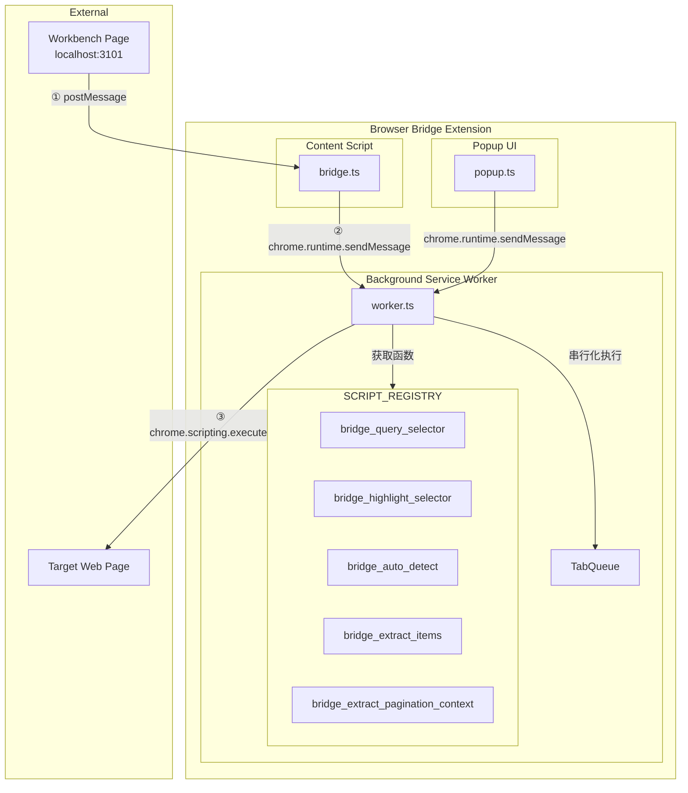
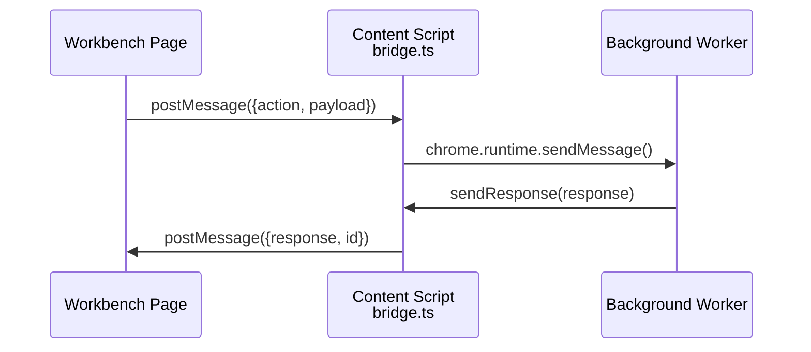
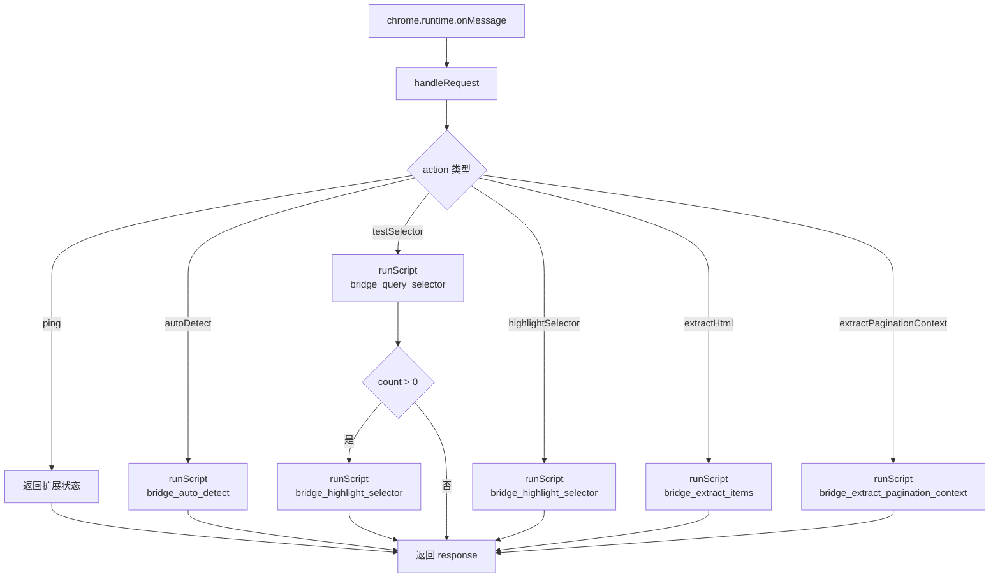
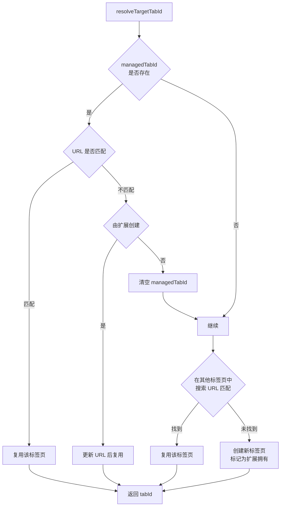
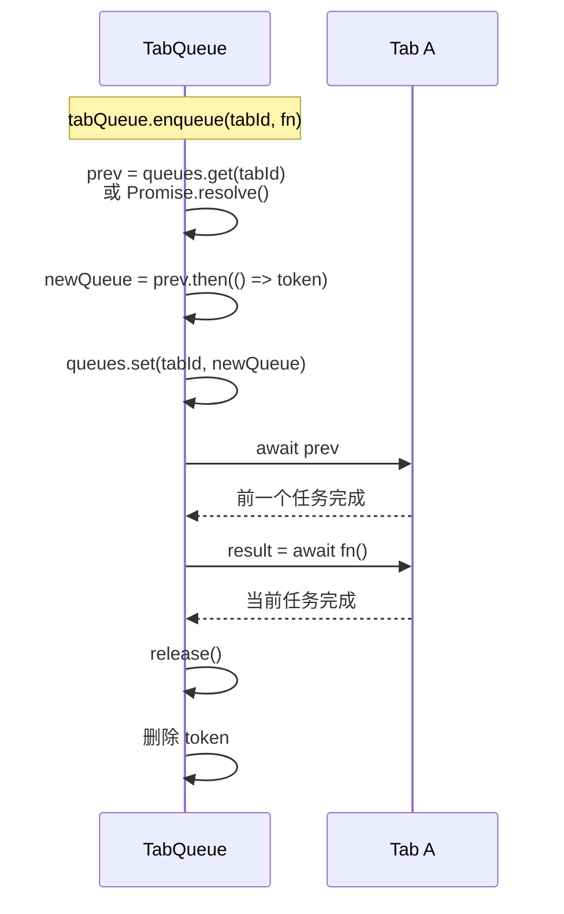
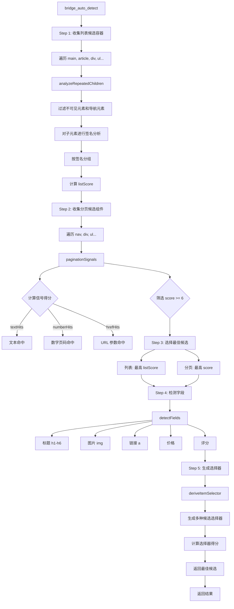
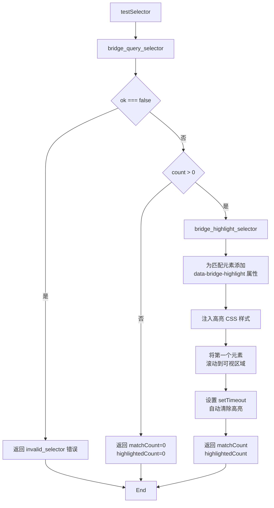
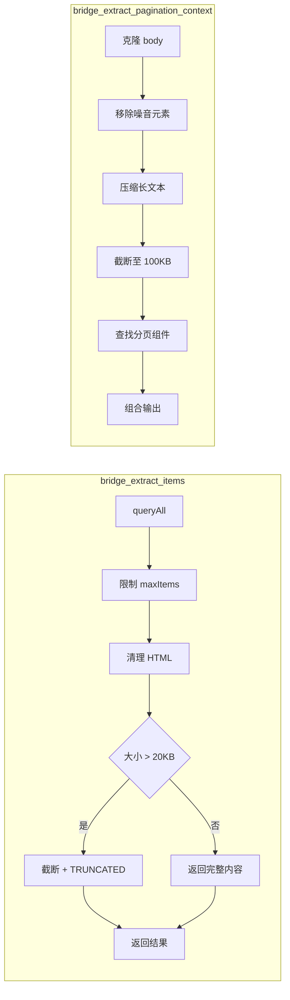
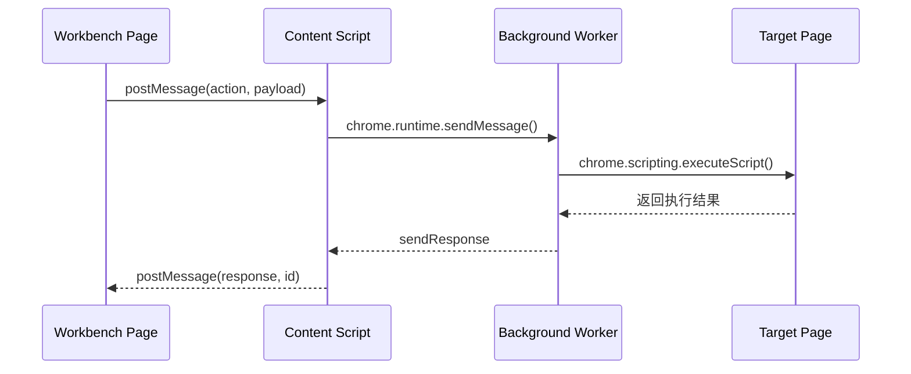

# Browser Bridge Extension

`browser-bridge-extension` 是工作台使用的 Chromium 扩展包，负责在真实标签页内执行选择器测试、高亮、列表自动检测、HTML 片段提取与分页上下文提取。

## 设计原则

- 扩展源码、构建脚本、打包脚本全部放在当前目录内。
- 构建扩展不再依赖 backend 抽取脚本。
- 工作台页面通过 content script 中转与扩展通信，不依赖固定 extension ID。
- 产物分为两类：
  - `release/unpacked`：用于 Chrome / Edge 的"加载已解压的扩展程序"
  - `release/browser-bridge-extension.zip`：用于 Chrome Web Store / Edge Add-ons 上传

## 核心架构



**关键路径说明**：

| 路径 | 通信方式 | 说明 |
|------|----------|------|
| Workbench → Content Script | `window.postMessage` | 工作台发起请求，Content Script 监听消息 |
| Content Script → Background Worker | `chrome.runtime.sendMessage` | Content Script 转发请求到 Service Worker |
| Background Worker → Target Page | `chrome.scripting.executeScript` | Service Worker 将脚本注入目标页面执行 |
| Popup → Background Worker | `chrome.runtime.sendMessage` | Popup 检查扩展状态 |
| Background Worker → Content Script | `sendResponse` 回调 | Background Worker 处理完成后，通过 `sendResponse` 返回结果；Chrome 消息系统调用 Content Script 注册的回调函数 |
| Content Script → Workbench | `window.postMessage` | Content Script 回传响应到工作台 |

**信任边界**：Content Script 仅接受来自 `http://127.0.0.1:3101` 和 `http://localhost:3101` 的请求（`TRUSTED_WORKBENCH_ORIGINS`），其他来源的 `postMessage` 会被忽略。

## 技术实现详解

### 1. Content Script 桥接层

Content Script (`src/content/bridge.ts`) 是扩展与工作台页面之间的**双向消息通道**，运行在目标页面上下文中：



**关键设计**：
- 使用 `window.postMessage` 而非直接 `chrome.runtime.sendMessage`
- `TRUSTED_WORKBENCH_ORIGINS` 白名单校验消息来源
- 统一请求 ID 追踪，确保响应与请求一一对应

### 2. Background Service Worker

Background Worker (`src/background/worker.ts`) 是扩展的**中央调度器**：



**标签页解析策略**：



### 3. 脚本注册表与隔离执行

所有可注入脚本注册在 `SCRIPT_REGISTRY` (`src/scripts/registry.ts`)。当前通过桥接层暴露的脚本（对应 6 个 action）：

| 函数名 | 桥接 Action | 来源文件 | 说明 |
|--------|------------|----------|------|
| `bridge_query_selector` | `testSelector` | builtins.ts | 查询选择器匹配的元素 |
| `bridge_highlight_selector` | `testSelector` / `highlightSelector` | highlight.ts | 高亮选择器匹配的元素 |
| `bridge_auto_detect` | `autoDetect` | auto_detect.ts | 自动检测列表和分页 |
| `bridge_extract_items` | `extractHtml` | html_extract.ts | 提取 HTML 片段 |
| `bridge_extract_pagination_context` | `extractPaginationContext` | html_extract.ts | 提取分页上下文 |

以下脚本注册在表中但**未通过桥接层暴露**（供内部或未来扩展使用）：

```typescript
// 仅在 SCRIPT_REGISTRY 中注册，Worker 未处理对应 action
bridge_extract_fields   // 从元素中提取字段
bridge_click_element    // 点击元素
bridge_scroll_to_bottom // 滚动到底部
bridge_clear_highlight  // 清除高亮
__eval__               // 执行任意 JS 代码
```

**关键约束**：每个导出的函数必须**完全自包含**。

> 原因：`chrome.scripting.executeScript({ func })` 只序列化函数体 via `toString()`，丢弃周围模块作用域的变量和函数引用。

### 4. TabQueue 队列管理

`TabQueue` (`src/background/tab_queue.ts`) 确保同一标签页上的脚本**串行执行**：



```
时间线 ────────────────────────────────────────────────────────▶

Tab A:  [任务1           ][任务2           ][任务3           ]
Tab B:       [任务A][任务B][任务C           ]

说明：同一标签页的任务串行执行，不同标签页的任务互不影响
```

### 5. 自动化检测引擎

`bridge_auto_detect` (`src/scripts/auto_detect.ts`) 自动检测网页中的**列表容器**和**分页组件**：



**listScore 计算公式**：

```
listScore = items.length × 3
          + (avgLinks / samples) × 2
          + dateHits × 1.5
          + min(avgTextLength / 50, 4)
```

**paginationSignals 得分公式**：

```
score = textHits × 3
      + numberHits × 2
      + hrefHits × 2
      + currentHits
      + classHint
      + renderedBonus
      + standaloneNextBonus
```

### 6. 选择器测试与高亮

`bridge_highlight_selector` 和 `bridge_query_selector` 协同测试选择器并可视化结果：



**XPath 兼容处理**：所有接受用户输入选择器的函数（`bridge_query_selector`、`bridge_extract_fields`、`bridge_click_element`、`bridge_highlight_selector`、`bridge_extract_items`）都支持 CSS 选择器和 XPath 双模式，使用相同的检测正则：

```typescript
// 支持的 XPath 格式
if (/^(\/\/|\.\/\/|\(\/\/|\(\/|xpath=)/.test(selector)) {
  const xpath = selector.replace(/^xpath=/, "")
  const result = document.evaluate(xpath, document, null, 7, null)
  // 遍历 snapshot 获取所有匹配元素
}
```

> 注：`bridge_auto_detect` 和 `bridge_extract_pagination_context` 内部使用 CSS 选择器，不接受外部选择器输入，因此不涉及 XPath。

### 7. HTML 提取与裁剪

`bridge_extract_items` 和 `bridge_extract_pagination_context` 提取和裁剪 HTML 内容：



## 通信协议

### 请求格式

工作台页面通过 `postMessage` 发送请求：

```typescript
type PageBridgeRequest = {
  source: 'BROWSER_BRIDGE_PAGE'
  requestId: string
  action: ExtensionAction
  payload?: Record<string, unknown>
}

type ExtensionAction =
  | 'ping'
  | 'autoDetect'
  | 'testSelector'
  | 'highlightSelector'
  | 'extractHtml'
  | 'extractPaginationContext'
```

### 响应格式

```typescript
type ExtensionResponse<T> =
  | { ok: true; data: T }
  | { ok: false; error: { code: ExtensionErrorCode; message: string } }

type ExtensionErrorCode =
  | 'extension_not_installed'
  | 'extension_unreachable'
  | 'no_active_tab'
  | 'script_execution_failed'
  | 'invalid_selector'
  | 'timeout'
```

### 完整通信时序图



## 环境要求

- Node.js 20+
- npm 10+
- Windows 下默认使用 PowerShell 打包 zip
- macOS / Linux 下默认使用系统 `zip` 命令打包

## 安装依赖

```bash
npm install
```

## 稳定扩展 ID

扩展 ID 由公钥决定。为避免每次重新打包后 ID 变化，当前包会在构建前执行：

```bash
npm run prepare:key
```

行为如下：

- 若 `keys/browser-bridge-extension.pem` 已存在，则复用该私钥
- 若不存在，则自动生成新的本地私钥
- 自动把对应公钥写入 `manifest.json` 的 `key` 字段

注意：

- `keys/browser-bridge-extension.pem` 不入库
- `keys/browser-bridge-extension.pem.template` 只作为占位说明
- 如果要在不同机器上保持同一个扩展 ID，必须安全分发并复用同一份私钥

## 构建命令

### 仅编译 dist

```bash
npm run build
```

### 生成解压版扩展

```bash
npm run build:unpacked
```

产物目录：

```text
release/
└── unpacked/
    ├── manifest.json
    └── dist/
```

### 生成商店上传 zip 包

```bash
npm run build:zip
```

产物文件：

```text
release/browser-bridge-extension.zip
```

## 在 Chrome / Edge 中加载

1. 打开 `chrome://extensions/` 或 `edge://extensions/`
2. 开启"开发者模式"
3. 点击"加载已解压的扩展程序"
4. 选择 `packages/browser-bridge-extension/release/unpacked`

加载成功后，应看到 `Scraper Flow Studio Bridge`。

加载或升级扩展后，请刷新工作台页面，让 content script 重新注入。

## 如何得到"可安装"的浏览器扩展

对 Chromium 系浏览器，需要区分两种"安装"方式：

### 1. 本地开发 / 内部调试

使用 `unpacked` 目录加载，这是最稳定的本地方式：

```bash
npm run build:unpacked
```

### 2. 商店或托管分发

使用 zip 上传到商店：

```bash
npm run build:zip
```

说明：

- `zip` 适合 **Chrome Web Store / Edge Add-ons** 上传
- `zip` 不是 Chromium 本地"直接双击安装"格式
- 如果需要真正的离线安装包，下一步应增加 **签名后的 `.crx` 构建流程**

## 日常发布建议

1. `npm install`
2. `npm run build:zip`
3. 检查 `release/unpacked` 是否可正常加载
4. 将 `release/browser-bridge-extension.zip` 用于商店上传或发布归档
